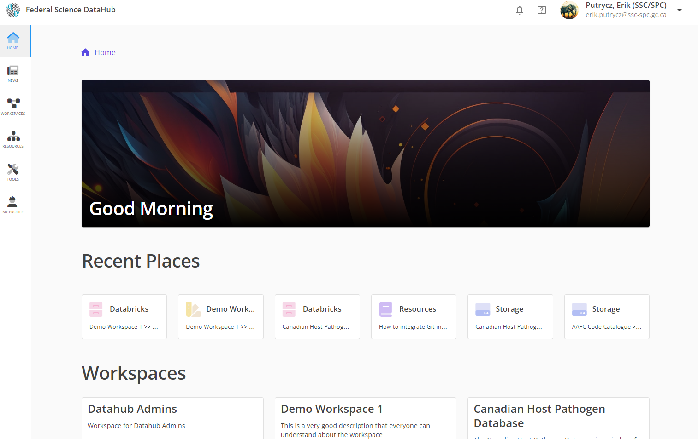
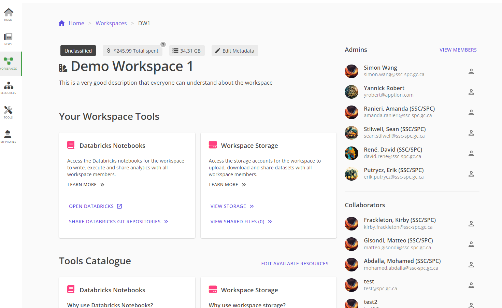
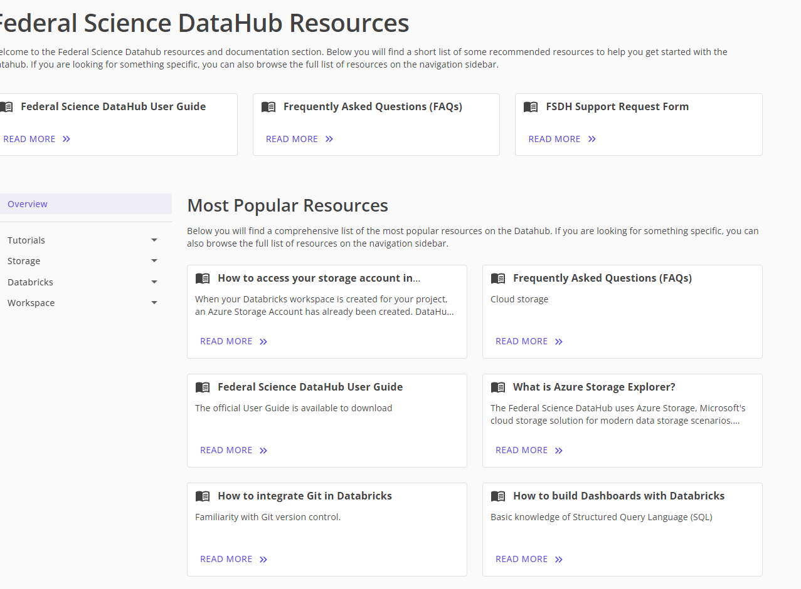
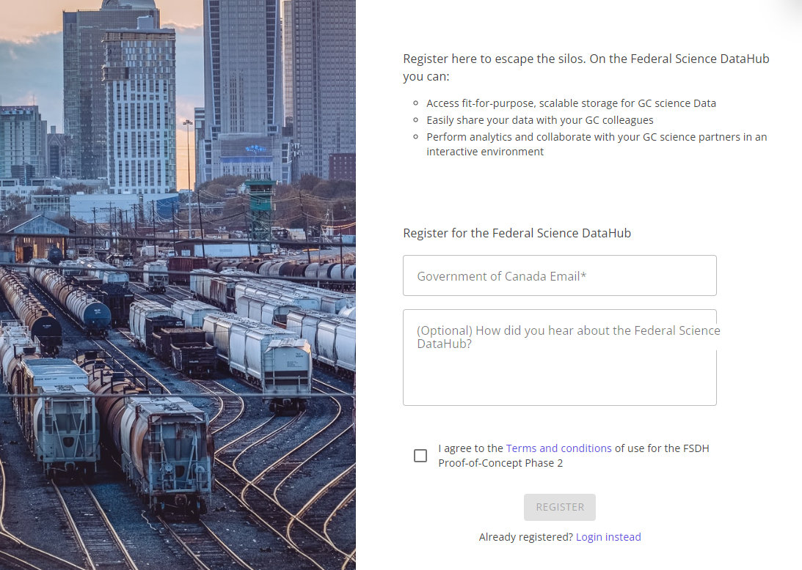
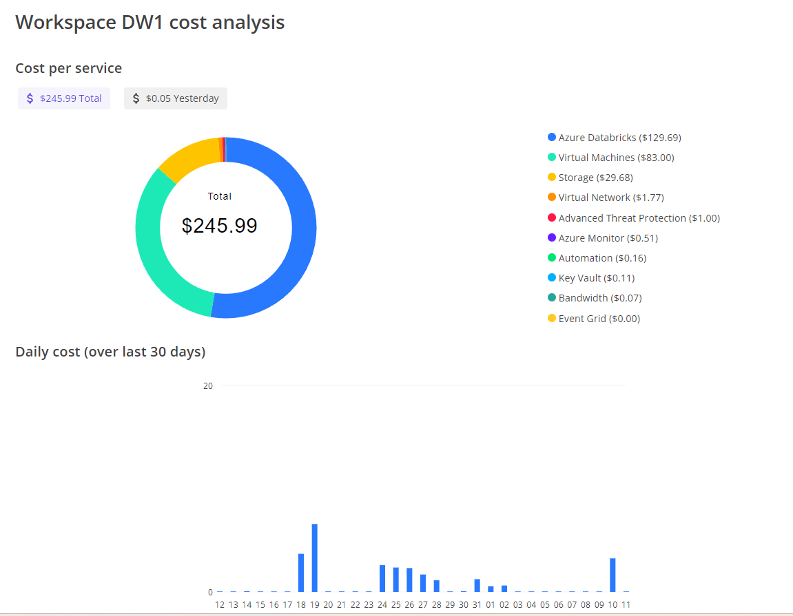
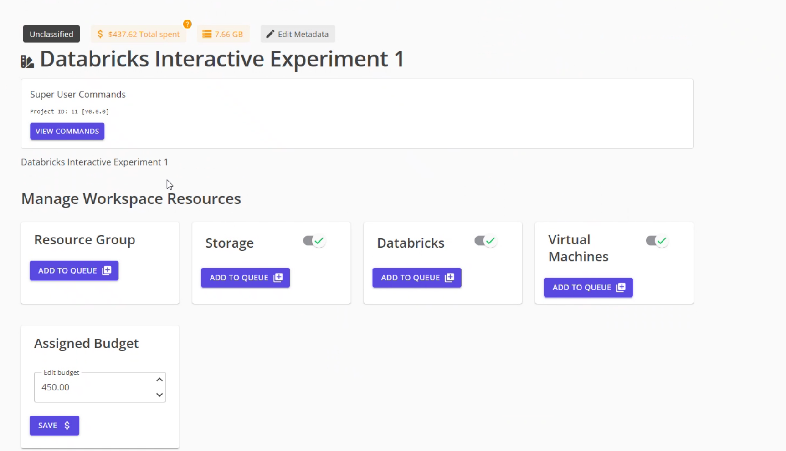

# Demo Script

## What is DataHub?
- Platform to help scientists collaborate 
- Cloud infrastructure to run experiments

## What are the key components

- Portal = Workspaces + Resources + Support
- Workspaces = Access to cloud resources (Storage, Docker, Databricks) + Cost management

- Resources = Tutorials to cover geospatial data processing, large data set processing, dashboards

- Onboarding = Simple form for anyone to join + process to add collaborators

- Connect users with DataHub team = streamlined and user friendly user system

## Use Cases

What we want to communicate with use cases:
- Breath of application types and scientific domains supported by Databricks 
- Demonstrate DataHub infrastructure for Scientific applications
- Collaborative features that would not be possible otherwise

Preferred
- Canadian Host Pathogen Database:
    - System = Database + Forms
    - Access Form accessed by other depts
    - Access file was exchanged through email in the past
    - 2 weeks to build initial version / $100
- Use case from Richard?
- Use case from Anthony?
- Use case from Yvan?

Alternative
- Google Earth integration demo
    - Geospatial capabilities
- R Shiny web app
- Databricks Dashboards
    
## Backend

- Cost and capacity management. All underlying costs are tracked per workspace

- Automation framework for resource provisioning for workspaces,comparable to commercial solutions
- Open source portal, extensible
    - Mostly based on Azure
    - AWS and GCP storage connections
    - Bring your own code with Git integration

