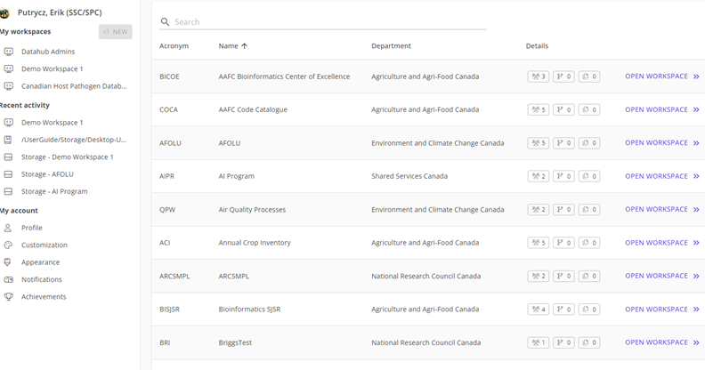
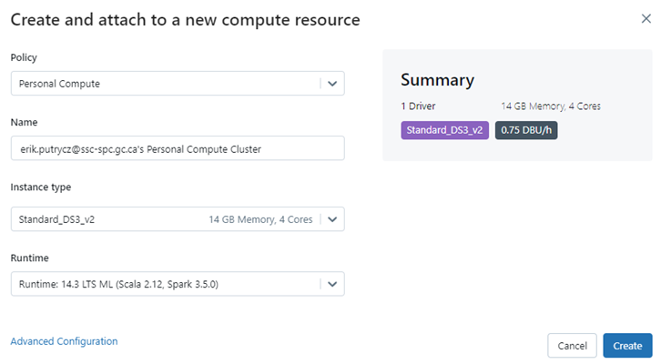

# Demo Script 

## User Experience Slide

Before jumping into the demo, I want to highlight that agility for the end users is our primary driver for both the technical and business side.  Within minutes you can get access to cloud-based resources available and able to collaborate with your colleagues across GC.
 
So, let us start with the onboarding process.
 
## Show registration page https://federal-science-datahub.canada.ca/register 

We have an easy onboarding process:
- Click on the registration link and enter their email address.  
- they will receive an email to confirm their email address
- they can immediately access the portal.
 
## Show home page

 
Once logged in, you arrive at the home page, where you can access your Workspace. A workspace is a private area where you can access services (analytics, compute), store data, and invite collaborators

## Show Explore page – other work of interest
 

All resources are available through the workspaces. This view lets you browse all workspaces and researchers can see if there is other work of interest taking place 

## What is a workspace? Go into the Demo workspace DW1

What we call a workspace is a private area where you can 
- access services (analytics, compute, storage), 
- open “View Members” invite collaborators, to either contribute to the analytics or simply read your data as a guest. 

## Storage

- Open __Storage explorer__ Store data: common interface where collaborators can work independently to upload, download, share and access data across departments

The tool box in datahub supports analytics, compute and working with data (long term storage not in scope yet).
 
Main tool we provide for Analytics & Compute is DataBricks
- [Open Example notebook](https://adb-1078013913864941.1.azuredatabricks.net/?o=1078013913864941#notebook/3052776818088804/command/3052776818088818)

Databricks is an industry standard tool where users can
•	work on structured & unstructured data to do advanced analytics, 
•	co-develop python scripts,
•	Conduct data engineering, 
•	and machine learning
 
## Show cluster config screen

 
To give more flexibility to users, in Databricks, you can choose the size and configuration of the cluster, and set guardrails on how long it runs for, and incurred costs.

__With great power comes great responsibility__ (Spiderman quote) - Show costing page
To prevent unexpected costs running away, FSDH provides near real-time costing reports on costs incurred as well as budget limits and usage warnings. 

## Learn Section

How to use the resources efficiently? How to use all the databricks or SQL capabilities? Make a dashboard? Show resources page
-	Showcase ML section
-	ML tools are available for exploration or also more advanced users
-	Covers ML Flow – make experiments, provides traceability 
 
## Examples

To illustrate how the DataHub can be used in scientific applications, we are going to quickly show two examples of projects hosted in DataHub:
1. The first Project is Host Pathogen dashboard: AAFC approached the DataHub for a solution to share a Pathogen database. Database has provincial data on all pathogens and maintaining and sharing it is a key to their research. They are currently using an MS Access database, exchanging it through email with no straightforward way to share it or modernize it.  We were able to convert & migrate the data into datahub.  Using modern python tools in Databricks, we developed forms that let users search through to existing database. Proof of Concept was developed in two weeks of effort and costs about $100/month
1. Show web app: NRC collaboration with Canadian Transportation Agency. To illustrate solutions to a text analytics problem, the team developed their own web application to provide interactive results. Application was developed R Shiny (widely used tool in the data science community).  They could not collaborate with it.  We can host it in FSDH and they can now collaborate, upload datasets and update dashboards when they could not before.  This is all in a secure environment.
 
## New features

-	Databases

## Stop screen share 

To summarize, Datahub provides 3 key features
- access to modern cloud-based toolsets, 
- access to storage in an agile manner.  
- ability to collaborate broadly across GC
 

