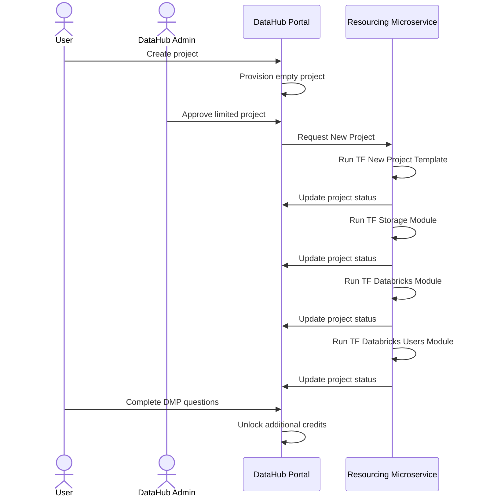
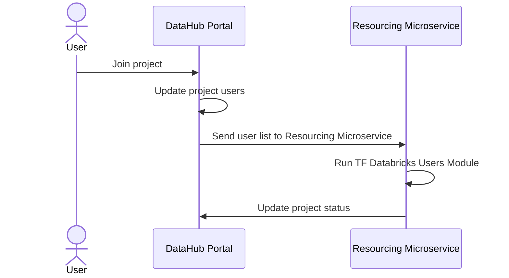

# Terraform File Storage

- Holds TF files with details of the configuration for each project
- Example
  ```
    PROJECT1/
       storage.tf
       databricks.tf
           o databricks-worspace.tf
           o databricks-users.tf
       sqlserver.tf
           o sqlserver-instance.tf
           o sqlserver-users.tf
  ```

# Terraform Generator

## Input

- Parameters from DataHub resource
  `<sample JSON from DataHub>`

## Output

- Terraform module parameters
- TF Files

## Trigger

- Add/remove users in DataHub

## Examples

`<TF Databricks Provider>`

# Terraform Runner

## Objectives

- Executes execution of TF resources for all projects
- Needs read access to TF Storage Account
- Needs resource group level (owner?) permissions to create resources
- E.g. Databricks provider will synchronize list of users from Data Project with TF Databricks provider
- E.g. Synchronize ACLs on Gen 2 storage account

- Input:
  - TF files
  - TF Parameters
  - List of project users
- Output:
  - ???

## Trigger

## Validation

- Needs manual validation of changes
- Failsafe to avoid issues

# Full Example: Create Databricks + synchronize users

1. User requests Databricks in DataHub portal in Project PRJ1
1. Create Databricks Instance in Azure `databricks-worspace.tf` - input: name of workspace, tags, tier - output: name of instance
1. Terraform generator generates
   - `{ 'resource-type':'databricks-workspace', 'workspace' : 'Project 1', 'tags' :'datahub-prj1', 'databricks-tier':'premium', 'users': [{ email: me@me.com, role: user},{ email: me1@me.com, role: admin }] }`
   - Generator outputs
   ```
     PRJ1/
        databricks-worspace.tf
   ```
1. Terraform runner executes `databricks-worspace.tf` - JSON output is stored in DataHub resource table

   - Terraform generates output file 'output.json'

   ```
     PRJ1/
        databricks-worspace.tf
        output.json
   ```

   - Terraform runner loads output.json
   - Content of `output.json` is stored inside Project resource table

1. Terraform generator generates

   - `{ 'resource-type':'databricks-workspace', 'workspace' : 'Project 1', 'tags' :'datahub-prj1', 'tier':'premium', 'users': [{ email: me@me.com, role: user},{ email: me1@me.com, role: admin }] }`
   - Generator outputs

   ```
     PRJ1/
        databricks-worspace.tf
        databricks-users.tf
        output.json
   ```

1. Synchronize project users with databricks instance `databricks-users.tf` - input: list of users (emails + roles)
   - `{ 'resource-type':'databricks-users', 'workspace' : 'Project 1', 'tags' :'datahub-prj1', 'tier':'premium', 'users': [{ email: me@me.com, role: user},{ email: me1@me.com, role: admin }], 'databricks-url':'databricks12345.azuredatabricks.net' }`

## Diagrams

### New Project



### Add Users


