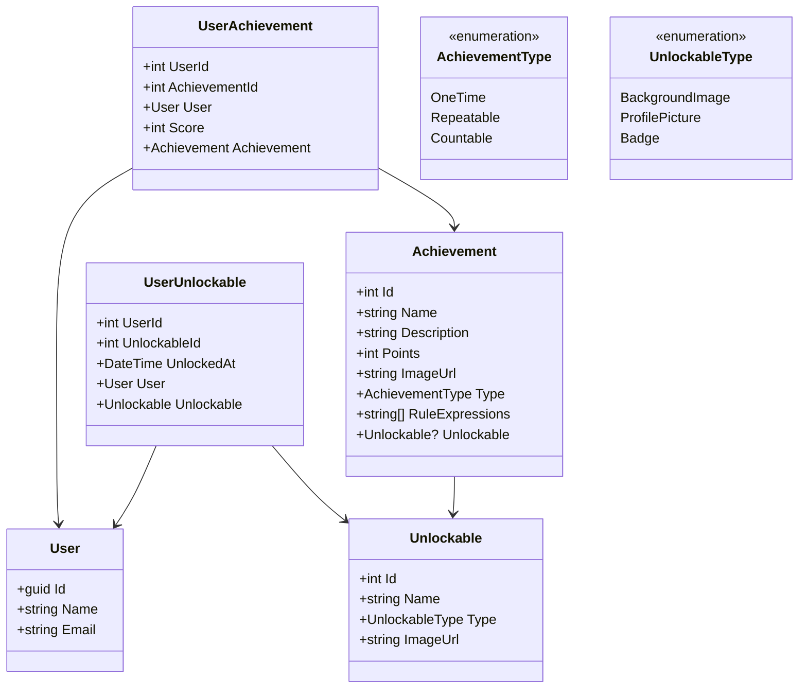

# User Achievements and Profile personalization

# Overview

This document describes the design of the User Achievements and Profile personalization feature.

# User Achievements

## Achievement Types

Achievements are divided into three types:

- **One-time**: Achievements that are awarded once, and never again.
- **Repeatable**: Achievements that are awarded multiple times.
- **Countable**: Achievements that are awarded based on a count or collection.

## User Profile Levels

The user's profile level is calculated based on the total score of all the user's achievements. The level is calculated based on the following formula:

```csharp
int level = (int)Math.Floor(Math.Log(score, 2));
```

The score is calculated based on the achievement type:

- **One-time**: The score is usually 1, but can be any value.
- **Repeatable**: The score is usually 1, but can be any value.
- **Countable**: The score is usually the number of items in the collection, but can be any value.

## Achievement Unlockables

Achievements can be unlocked by the user, and can be used to personalize the user's profile. Unlockables are divided into two types:

- **Background Images**: Background images that can be used to personalize the user's profile.
- **Profile Pictures**: Profile pictures that can be used to personalize the user's profile.

## Data Model

The following diagram shows the data model for the User Achievements feature:


