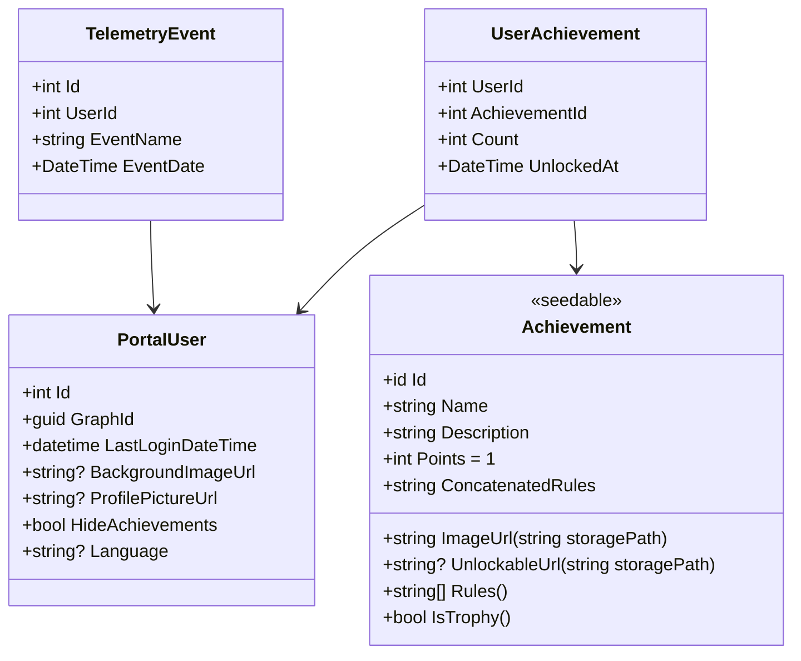

# User Achievements and Profile personalization

# Overview

This document describes the design of the User Achievements and Profile personalization feature.

# User Achievements

## Achievement Types

Achievements are divided into two types:

- **Achievement**: Achievements that are awarded when a user completes a task.
- **Trophy**: Achievements that are awarded after a user has completed a set of achievements.

## User Profile Levels

The user's profile level is calculated based on the total score of all the user's achievements. The level is calculated based on the following formula:

```csharp
# this was generated, might need some manual tweaking
int level = (int)Math.Floor(Math.Log(score, 2));
```

## Achievement Unlockables

Achievements can be unlocked by the user, and can be used to personalize the user's profile. Unlockables are divided into two types:

- **Background Images**: Background images that can be used to personalize the user's profile.
- **Profile Pictures**: Profile pictures that can be used to personalize the user's profile.
- **Trophies**: Trophies that can be showcased on the user's profile.

## Data Model

The following diagram shows the data model for the User Achievements feature:


