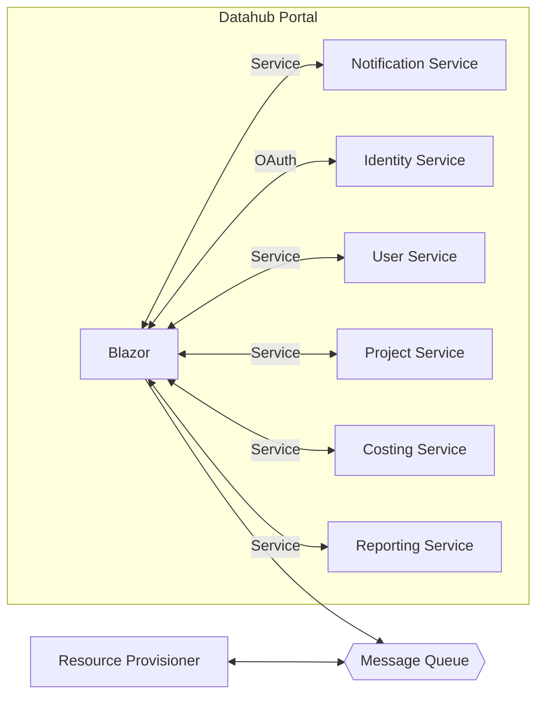
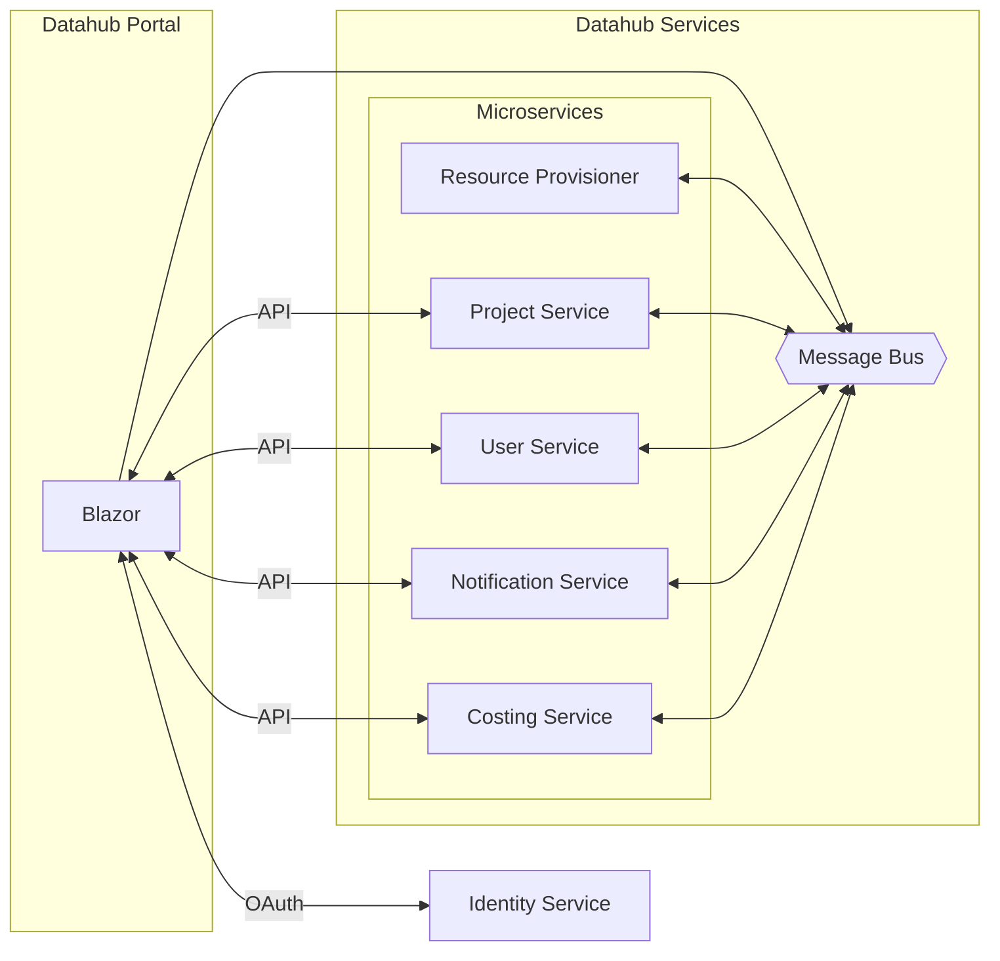

# Next Step Overview

```mermaid
flowchart LR
    B[Blazor]
    N[Notification Service]
    I[Identity Service]
    U[User Service]
    P[Project Service]
    C[Costing Service]
    Re[Reporting Service]
    R[Resource Provisioner]
    M{{Message Queue}}


    B <--> |OAuth| I
    B <--> |Service| U
    B <--> |Service| P
    B <--> |Service| N
    B <--> |Service| C
    B <--> |Service| Re

    B --> M

    R <--> M

    subgraph Datahub Portal
        B
        I
        U
        P
        N
        C
        Re

        end

    R

```

# Target State Overview

```mermaid
flowchart LR
    B[Blazor]
    N[Notification Service]
    I[Identity Service]
    U[User Service]
    P[Project Service]
    R[Resource Provisioner]
    C[Costing Service]
    M{{Message Bus}}


    B <--> |OAuth| I
    B <--> |API| U
    B <--> |API| P
    B <--> |API| N
    B <--> |API| C

    B --> M

    R <--> M
    P <--> M
    U <--> M
    N <--> M
    C <--> M

    subgraph Datahub Portal
            B
        end

    subgraph Datahub Services
        M
        subgraph Microservices
            U
            P
            R
            N
            C
        end
    end

```
