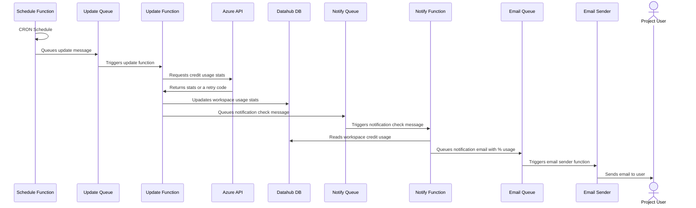

# Overview of Project Costs and Notification

## Failsafe at 100% budget usage based

Azure Action groups will be used to lock or disable the account. Leverage the alert system.

## Project credit usage update and notification diagram

A CRON scheduled function will run every morning (2:00am) and will trigger the credit usage process.

The project credits are retrived using the Azure Management API. An Azure Function will be responsible for collecting the costs and usage per service daily.

Another function will check the credits used and will notify the workspace stakeholders (via email) at 25%, 50%, 80% and 100% of the assigned budget.

To safely implement this process a set of queues and functions will be used:

## Queues
- project-usage-update
- project-usage-notification
- email-notification

## Functions
- ProjectUsageScheduler
- ProjectUsageUpdater
- ProjectUsageNotifier
- EmailNotificationHandler

### Credits usage update and notification diagram


## Function configuration

### Queue links

All the function will link to the respective queues via the ConnectionString named __StorageConnectionString__

The queue name is not hardcoded in the implementation of the function, the name is stored in using an ENV VARIABLE. E.g.:

```

    [Function("EmailNotificationHandler")]
    public async Task Run([QueueTrigger("%QueueEmailNotification%", Connection = "DatahubStorageConnectionString")] string requestMessage)
    {
      ...
    }
```


**Email Notification**

Queue Var Name: __%QueueEmailNotification%__

**ProjectUsageUpdater**

Queue Var Name: __%QueueProjectUsageUpdate%__

(More coming...)

## Manually updating costs

To Update a WS costs info in a rush drop a message like this in the `project-usage-update` queue:

```json
{
    "ProjectId": 11,
    "ResourceGroup": "fsdh_proj_die1_dev_rg"
}
```


