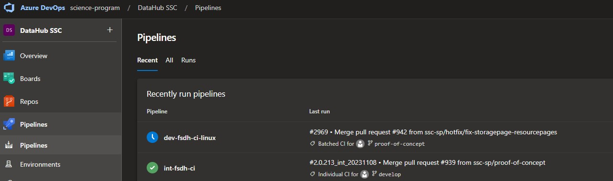
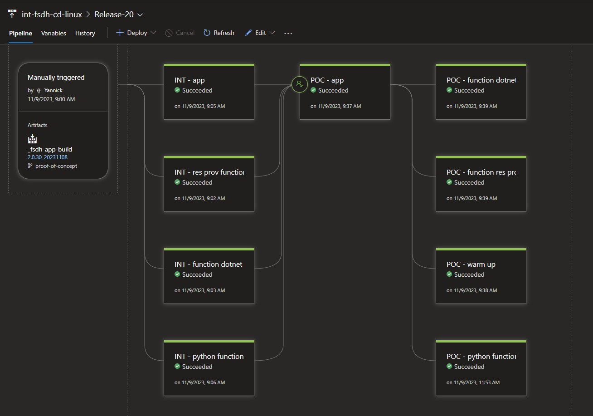

# Deploying Hotfixes in PoC environment

## What’s a hotfix?

Hotfixes are applied to the PoC environment to fix an issue:

- Immediately
- Without creating system downtimes or outages.
Hotfixes are also known as QFE updates, short for quick-fix engineering updates.

Normally, hotfixes are created as an urgent measure against issues that need to be fixed immediately and outside of your normal development flow. 

Hotfixes address specific issues like:

- Adding a new feature, bug, or security fix
- Correcting data or translations

## Git process

- checkout `proof-of-concept` and create a new `hotfix/<name>` branch for the changes
- validate the fix locally in `hotfix/<name>`
- create a pull request from `hotfix/<name>` into `proof-of-concept`

## Deploying code from `proof-of-concept` branch into INT

- Pipeline is similar to dev environment
- Changes from `proof-of-concept` branch will trigger a build in the DevOps pipeline

- Successful builds will deploy a successful build from the pipeline into the PoC environment

## Push changes from INT to POC

- Changes needs to validated and regression testing needs to be done in INT
- Once regression testing is completed, the Devops approvers need to be notified
- The approvers will approve the Devops pipeline and it will trigger deployment of the code from `proof-of-concept` into the PoC environment
