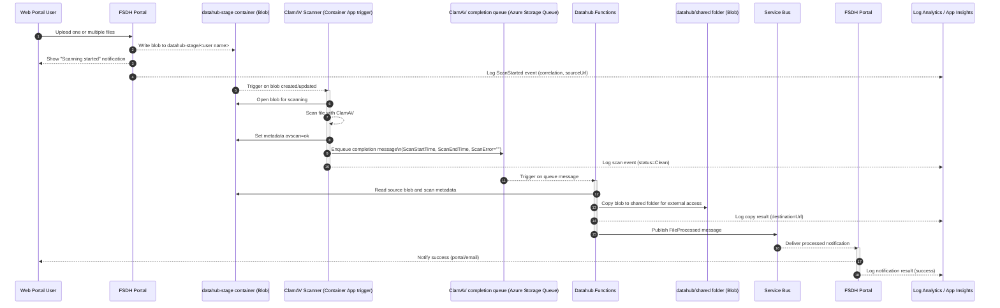
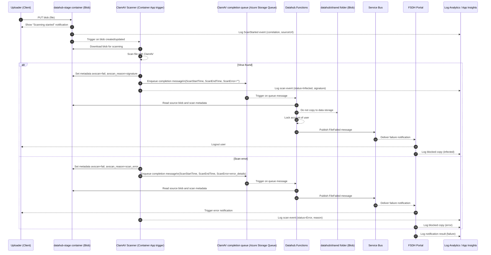
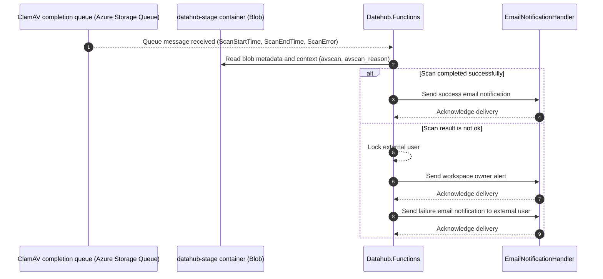

# Antivirus scanning for non‑managed devices

Uploading from non-managed computers is a common malware entry point. To protect workspaces, every file must land in a staging area, be scanned by ClamAV, and only then become accessible or move into workspace storage.

See [requirements](./requirements.md) for overview.

This page documents the virus scanning workflow for FSDH. It explains the actors, the sequence of operations, the key events (including queue messages) and blob metadata used across the process, and important operational notes.

## Containers

Containers are described in Terraform in [data.tf](https://github.com/ssc-sp/datahub-resource-modules/blob/sw/v6.2-databricks-uc/modules/azure-storage-blob/data.tf)

- `datahub-stage` is the upload staging container where files are scanned
- `datahub` is the shared container used for external file exchange

## Metadata Result on Scan Completion

- `avscan`: `ok`
  - Scan is successful
- `avscan`: `fail`
  - Issue has been found by ClamAV
  - `avscan_reason`: `
`
    - Details of the issue. This should be recorded for FSDH team to understand and identify false positives

## ClamAV Completion Queue (Azure Storage Queue)

Because function triggers cannot rely on blob metadata changes, scan completion events are sent to an Azure Storage Queue. `Datahub.Functions` consumes this queue as the trigger and then reads blob metadata/context to determine clean, infected, or error handling.

Queue name: `clamav-scan-completion`

Message contract:

| Field | Type | Required | Description |
| --- | --- | --- | --- |
| `ScanStartTime` | `string` (ISO 8601 UTC) | Yes | Timestamp when ClamAV scan started. |
| `ScanEndTime` | `string` (ISO 8601 UTC) | Yes | Timestamp when ClamAV scan completed. |
| `ScanError` | `string` | Yes | Empty string when scan execution is successful; populated with error details when scan execution fails. |

## Folder structure

This section is the naming reference for other documents in this folder.

### Pre-scanning

- `datahub-stage`
  - `<user name>`
    - dataset1.csv
  - `john_doe`
    - dataset2.csv
  
### After scan and file copy

In `datahub`, the `shared` folder is used for files shared with external users.

- `datahub`
  - `shared`
    - `<user name>`
      - dataset1.csv
    - `john_doe`
      - dataset2.csv
  
## Copy function

The copy function is in the `datahub-images` repository:
[scan_blob.py](https://github.com/ssc-sp/datahub-images/blob/main/managed-containers/clamav-blobavscan/app/scan_blob.py)

### How it works

`scan_blob.py` performs scanning and post-scan actions on blobs in the staging container.

**Trigger — Azure Storage Queue message on scan completion**

After each scan completes, the scanner sends a message to the ClamAV completion Azure Storage Queue with `ScanStartTime`, `ScanEndTime`, and `ScanError`. `Datahub.Functions` is triggered by this queue message and then reads blob metadata (`avscan`, `avscan_reason`) to execute clean, infected, or error handling.

**Chunk-based scanning**

Large files are downloaded and scanned in 1 GB chunks. Each chunk is written to a temporary file and passed to ClamAV via a Unix socket (`pyclamd.ClamdUnixSocket()`). Scanning stops early if a threat is found in any chunk.

**Clean result**

The blob metadata is updated with `avscan=ok`, leaving the file in place for the portal or a downstream copy step to make it accessible.

**Infected result**

1. If `ENABLE_QUARANTINE=true`, the blob is copied to the quarantine container (`datahub-quarantine`) before the original is deleted.
2. A record is written to the `infectedfiles` Azure Table Storage table containing: original URL, quarantine URL, file size (MB), detected threat names, scan duration, and copy duration.
3. The original blob is deleted from the staging container.

### Configuration (environment variables)

| Variable                    | Default              | Description                                          |
| --------------------------- | -------------------- | ---------------------------------------------------- |
| `storage_connection_string` | _(required)_         | Connection string for the storage account            |
| `container_name`            | `datahub-stage`      | Comma-separated list of containers to scan           |
| `quarantine_container_name` | `datahub-quarantine` | Destination for infected blobs                       |
| `ENABLE_QUARANTINE`         | `false`              | Set to `true` to copy infected blobs before deletion |
| `WORK_DIR`                  | `/datahub-temp`      | Working directory for temporary files                |

## Sequence (No virus detected)

## Sequence (Infected or Error)

## Notifications

- Notifications are coordinated by a new function in `Datahub.Functions` that monitors ClamAV completion queue messages after scanning completes
- The function calls `EmailNotificationHandler` directly when a file has been processed successfully or when the scan result is not `ok`
- For non-`ok` scan results, the function locks the external user and sends an alert to the workspace owner before sending the failure notification
- Required notifications are detailed in [requirements document](./requirements.md#notifications)

### Service Bus Queues

The virus scanning workflow uses service bus queues to separate scan result handling from user status updates and email delivery. `virus-scan-notification` carries the processed or failed scan result for notification handling, `virus-scan-user-status` carries external-user lock or status changes, and `email-notification` is consumed by `EmailNotificationHandler` for the email delivery step. See [Message Bus Overview](../ServiceBus/README.md) for the queue reference.

### Notification workflow through Datahub.Functions

> This document was developed with the assistance of generative AI tools to support drafting, diagram generation and structuring activities. No Protected B or sensitive Government of Canada information was entered into these tools. All content has been reviewed, validated, and approved by the author to ensure accuracy, completeness, and compliance with Government of Canada security policies, standards, and applicable Treasury Board guidance.
