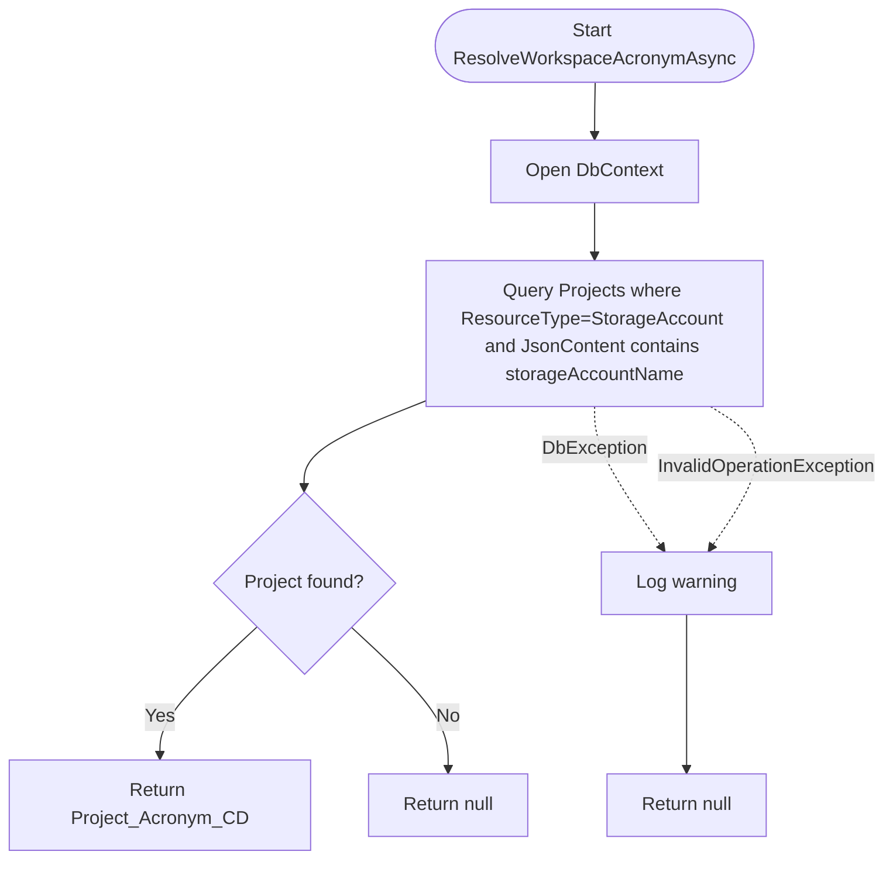

# VirusScanNotificationHandler Activity Diagrams

This document describes the runtime logic of `ServerlessOperations/src/Datahub.Functions/VirusScanNotificationHandler.cs` using Mermaid activity diagrams.

## 1) `RunAsync` main flow (`ClamAVNotificationHandler`)

```mermaid
flowchart TD
    A([Start]) --> B[Log: Processing ClamAV scan result message]
    B --> C[Deserialize Service Bus message into ClamAVMessage]
    C --> D[Read DatahubStorageQueue:ConnectionString]
    D --> E[ExtractStorageAccountName(connectionString)]

    E --> F{storageAccountName empty?}
    F -- Yes --> G[Log warning]
    F -- No --> H[ResolveWorkspaceAcronymAsync(storageAccountName)]

    G --> I[workspaceAcronym = "unknown"]
    H --> J{workspace acronym found?}
    J -- Yes --> K[workspaceAcronym = resolved]
    J -- No --> L[workspaceAcronym = storageAccountName]

    I --> M[Derive scanStatus from ScanError]
    K --> M
    L --> M

    M --> N[fileName = Path.GetFileName(ScannedFile)]
    N --> O[blobPath = ScannedFile]
    O --> P[uploader = OriginalBlobMetadata.CreatedBy or ExtractUserFromPath]
    P --> Q[correlationId = new Guid]

    Q --> R{ScanError empty?}

    R -- Yes (Clean) --> S[MoveBlobToUsersContainerAsync(ScannedFile, connectionString)]
    S --> T[Build VirusScanStatusMessage]
    T --> U[QueueUserStatusAsync to VirusScanStatusQueueName]
    U --> V[Log success]
    V --> W([Return])

    R -- No (Failed) --> X[scanCompletedOn = ScanEndTime.ToString("g")]
    X --> Y[SendInfectedFileNotification(DEFAULT_MAILBOX,...)]
    Y --> Z[ResolveWorkspaceLeadEmailAsync(workspaceAcronym)]
    Z --> AA{owner email exists?}
    AA -- Yes --> AB[SendInfectedFileNotification(owner,...)]
    AA -- No --> AC[Skip owner notification]
    AB --> AD{uploader empty?}
    AC --> AD

    AD -- Yes --> AE[Log warning: uploader missing]
    AE --> AF([Return])

    AD -- No --> AG[LockExternalUserAsync(fileName, workspaceAcronym, storageAccountName, scanStatus, uploader)]
    AG --> AH[Log user blocked]
    AH --> AI([End])

    C -. Exception .-> EX[Catch Exception]
    D -. Exception .-> EX
    S -. Exception .-> EX
    AG -. Exception .-> EX
    EX --> EY[Log error and rethrow]
```

## 2) Clean path helper: `MoveBlobToUsersContainerAsync`

```mermaid
flowchart TD
    A([Start MoveBlobToUsersContainerAsync]) --> B{connectionString empty?}
    B -- Yes --> C[Throw InvalidOperationException]
    B -- No --> D[Parse scannedFileUri]

    D --> E[AbsolutePath split into sourceContainerName and blobName]
    E --> F{split length < 2?}
    F -- Yes --> G[Throw InvalidOperationException]
    F -- No --> H{sourceContainerName == "users"?}

    H -- Yes --> I([Return - already in users])
    H -- No --> J[Create BlobServiceClient(connectionString)]
    J --> K[Get source and destination container clients]
    K --> L[Get sourceBlob and destinationBlob for same blobName]

    L --> M[Create destination container if missing]
    M --> N[Delete destination blob if exists]
    N --> O[StartCopyFromUriAsync(sourceBlob.Uri)]
    O --> P[WaitForCompletionAsync]
    P --> Q[Get destination blob properties]

    Q --> R{CopyStatus == Success?}
    R -- No --> S[Throw InvalidOperationException]
    R -- Yes --> T[Delete source blob]
    T --> U([End])
```

## 3) Failed path helper: `LockExternalUserAsync`

```mermaid
flowchart TD
    A([Start LockExternalUserAsync]) --> B[Build lock details string]
    B --> C[Open DbContext]
    C --> D[Find portal user by EntraUsers.GraphGuid == uploader]

    D --> E{Found?}
    E -- No --> F[Find portal user by PortalUsers.Email == uploader]
    E -- Yes --> G[Use found portal user]

    F --> H{Found by email?}
    H -- No --> I[SendDataHubErrorNotification: cannot lock user]
    I --> J([Return])

    H -- Yes --> G
    G --> K[lockedUserManagementService.LockUserAsync(portalUser.Id, details, null)]
    K --> L([End])
```

## 4) Workspace resolution helper: `ResolveWorkspaceAcronymAsync`



## Notes

- Clean scan is determined strictly by `string.IsNullOrWhiteSpace(scanResult.ScanError)`.
- For failed scans, notification to `IGCNotifyService.DEFAULT_MAILBOX` is always sent.
- If uploader cannot be determined in failed scans, lock operation is skipped after warning.
- If `storageAccountName` cannot be extracted, processing continues with `workspaceAcronym = "unknown"`.
