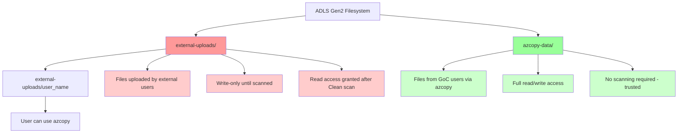
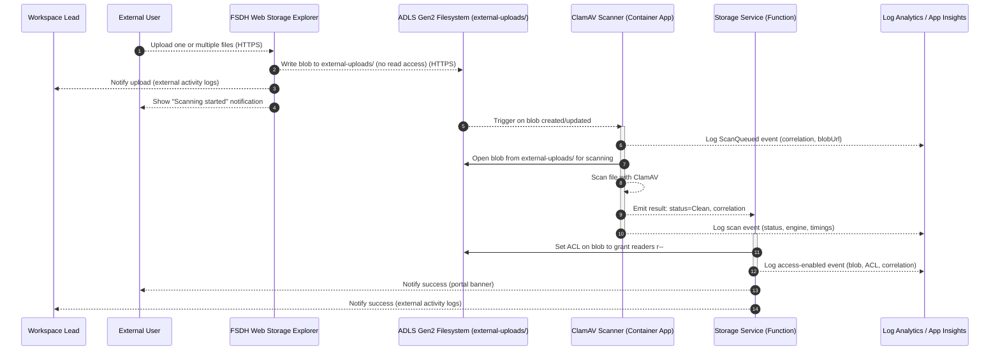
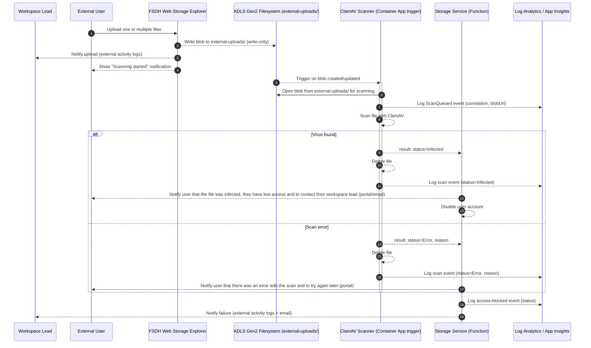
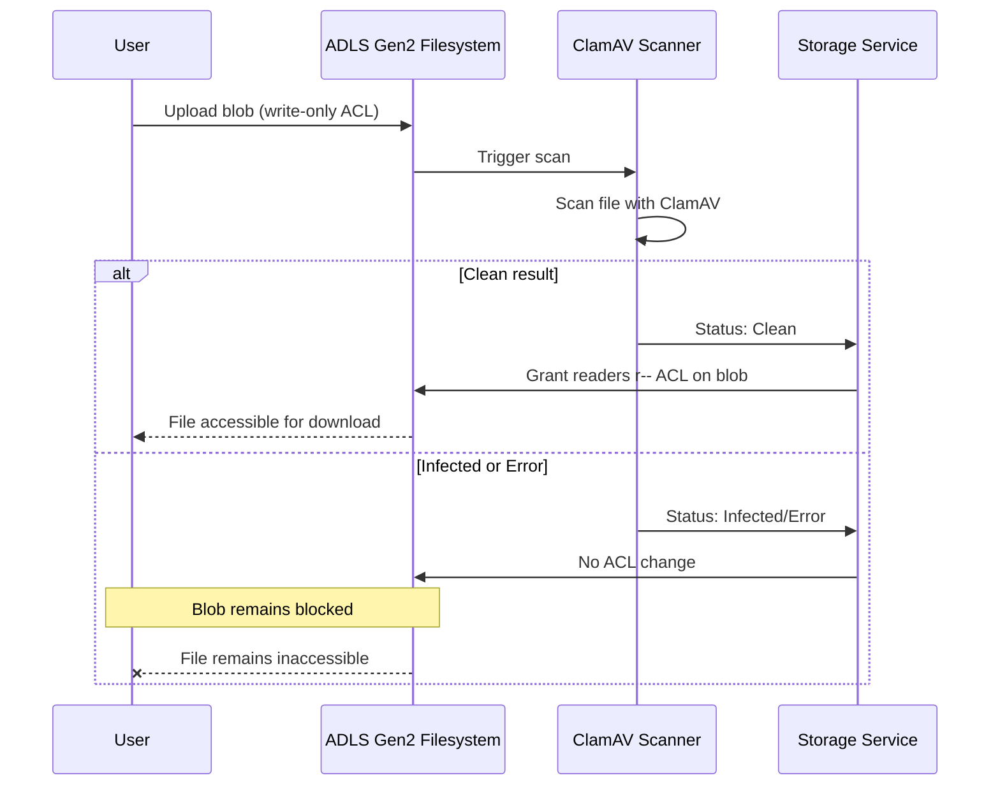

## FSDH AV Staging Workflow with ACLs for External Users

This page describes the antivirus workflow variant that relies on ADLS Gen2 ACLs (Azure Storage v2 with hierarchical namespace enabled) to gate access. Users can upload files, but cannot read or download them until a scan marks them Clean. No copy to a separate data container is required; access is enabled by updating ACLs on the uploaded blob within a single folder. Azure Container Apps listens for blob created/updated events and kicks off the scan automatically.

## Goals

- Ensure all uploaded files are scanned before becoming accessible or downloadable.
  - Files are uploaded and accessed via the storage explorer in the workspaces, web apps connected to storage accounts as well as in Databricks.
- Gate read access using ACLs instead of copying files between containers.
- Container Apps is triggered directly by new/updated blobs
- While files are being scanned, they need to be inaccessible by databricks/web app mounted drives
- Provide clear events for scan result and user notification.
- Notify the user immediately for scan events
- Disable external user account if scan finds a virus
- Notify workspace lead if user disabled

## Assumptions

- Unless specified, the term 'users' in this document refers to external non GoC users
- A single ADLS Gen2 filesystem (container) is used
- A folder called `external-uploads/<user name>` is used by the web portal to let external users upload files
- Read access in `external-uploads/<user name>` is granted only after the scan returns Clean by updating the blob ACL to include a readers group with `r--`.
- Files are not accessible or downloadable until the scan is complete and status is Clean.
- `Storage Service` features will be added to existing Function project in `Datahub.Functions`
- A folder called `azcopy-data` is used to restrict the folders where the GoC users can upload and download data via `azcopy`
- SAS Tokens for `azcopy` (GoC users) will use `azcopy-data` prefix

## Security: ACL-based Access Control

This workflow prevents users from accessing unscanned files through ACL-based permissions:

- Files uploaded to `external-uploads/` are created with **write-only** permissions—no immediate read access
- Users cannot download files until ClamAV scan completes with Clean status
- Storage Service grants read (`r--`) permissions only after successful scan
- Infected files are deleted; error files remain blocked (no read ACL granted)
- `azcopy-data/` folder is separate—used by trusted internal GoC users with full access

## Directory Structure

The ADLS Gen2 filesystem is organized into two main folders with different security models:

## Sequence (Clean result — enable access)

## Sequence (Infected or Error — keep blocked)

### ACL state on scan errors

If the scanner reports an error (or infection), ACLs stay unchanged and the blob remains unreadable until a clean re-scan succeeds.

### Actions

- Workspace owners receive an email with details (user email, date, virus)
- User receives an email to indicate that one or multiple files were flagged with a virus
- User expiry date is updated to lock the external account out of FSDH
   - External user needs to confirm machine is virus free
- Portal shows badges or alerts (TBD)

## Data Elements

The following tables define a compact, canonical schema for storage-queue messages and blob metadata used across the workflow. Names are suggestions and can be adapted to your environment.

### Scan result event (from ClamAV to Storage Service)

| Key             | Type                             | Description                                                                 |
| --------------- | -------------------------------- | --------------------------------------------------------------------------- |
| status          | enum("Clean","Infected","Error") | Result of scanning.                                                         |
| signature       | string                           | Virus signature when status=Infected.                                       |
| engineVersion   | string                           | ClamAV engine/definitions version used.                                     |
| scanStartedAt   | datetime                         | When scanning began.                                                        |
| scanCompletedAt | datetime                         | When scanning finished.                                                     |
| blobUrl         | string                           | Original blob URL under `external-uploads/`.                                |

### Blob metadata

| Key                | Example                              | Description                                                          |
| ------------------ | ------------------------------------ | -------------------------------------------------------------------- |
| dh:scanStatus      | Clean                                | Clean, Infected, or Error.                                           |
| dh:scanSignature   | Win.Test.EICAR_HDB-1                 | Virus signature when infected.                                       |
| dh:scanEngine      | ClamAV 1.3.0 (defs: 2025‑11‑03)      | Scanner and definitions version.                                     |
| dh:scanStartedAt   | 2025-11-03T15:04:59Z                 | UTC timestamps for auditing.                                         |
| dh:scanCompletedAt | 2025-11-03T15:05:01Z                 |                                                                      |
| dh:sourceContainer | uploads                              | Name of the original container.                                      |
| dh:accessEnabledAt | 2025-11-03T15:05:01Z                 | Timestamp when read access was granted.                              |

## Observability: Log Analytics / Application Insights

Both the ClamAV scanner (Container App) and the Notification Service emit structured telemetry for operations and results. The examples below assume:

- Telemetry is sent to Application Insights connected to a Log Analytics workspace.
- Events are tracked as customEvents with the following names and dimensions:
  - **name:** "ClamAVScan" with customDimensions: correlationId, status, engineVersion, scanStartedAt, scanCompletedAt, durationMs, blobUrl, workspaceId, container, path
  - **name:** "AccessEnabled" or "AccessBlocked" from the Storage Service with customDimensions: correlationId, status, blobUrl
  - **name:** "ScanQueued" emitted by the upload flow with customDimensions: correlationId, blobUrl, fileName, sizeBytes, uploader
