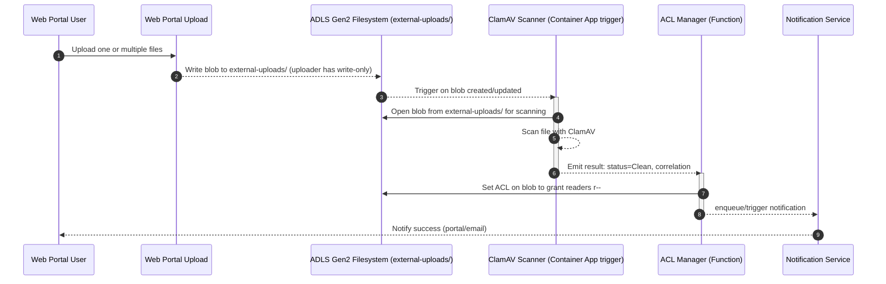
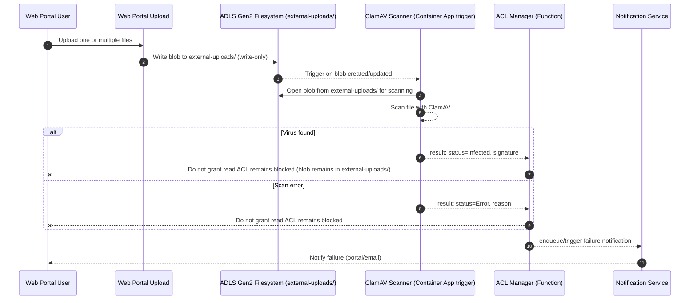

## FSDH AV Staging Workflow with ACLs

This page describes the antivirus workflow variant that relies on ADLS Gen2 ACLs (Azure Storage v2 with hierarchical namespace enabled) to gate access. Users can upload files, but cannot read or download them until a scan marks them Clean. No copy to a separate data container is required; access is enabled by updating ACLs on the uploaded blob within a single folder. Azure Container Apps listens for blob created/updated events and kicks off the scan automatically (no Storage Queue).

## Goals

- Ensure all uploaded files are scanned before becoming accessible or downloadable.
- Gate read access using ACLs instead of copying files between containers.
- Container Apps is triggered directly by new/updated blobs (no Storage Queue).
- Provide clear events for scan result and user notification.

## Assumptions

- A single ADLS Gen2 filesystem (container) is used with a folder called `external-uploads/`.
- Read access is granted only after the scan returns Clean by updating the blob ACL to include a readers group with `r--`.
- Files are not accessible or downloadable until the scan is complete and status is Clean.

## Sequence (Clean result — enable access)

## Sequence (Infected or Error — keep blocked)

## Data Elements

The following tables define a compact, canonical schema for storage-queue messages and blob metadata used across the workflow. Names are suggestions and can be adapted to your environment.

### Scan result event (from ClamAV to ACL Manager)

| Key             | Type                             | Required | Description                                                                 |
| --------------- | -------------------------------- | :------: | --------------------------------------------------------------------------- |
| correlationId   | string                           |          | Optional correlation assigned by the portal; useful for end-to-end tracing. |
| status          | enum("Clean","Infected","Error") |    ✓     | Result of scanning.                                                         |
| signature       | string                           |          | Virus signature when status=Infected.                                       |
| engineVersion   | string                           |          | ClamAV engine/definitions version used.                                     |
| scanStartedAt   | datetime                         |    ✓     | When scanning began.                                                        |
| scanCompletedAt | datetime                         |    ✓     | When scanning finished.                                                     |
| durationMs      | number                           |          | Total scan duration in milliseconds.                                        |
| blobUrl         | string                           |    ✓     | Original blob URL under `external-uploads/`.                                |

### Notification event

| Key            | Type                                     | Required | Description                                            |
| -------------- | ---------------------------------------- | :------: | ------------------------------------------------------ |
| correlationId  | string                                   |    ✓     | Correlates back to the upload and scan events.         |
| status         | enum("AccessEnabled","Infected","Error") |    ✓     | Outcome for the user.                                  |
| destinationUrl | string                                   |          | URL to the readable blob (same path with updated ACL). |
| occurredAt     | datetime                                 |    ✓     | Time of the event emission (UTC).                      |

### Blob metadata

| Key                | Example                              | Description                                                          |
| ------------------ | ------------------------------------ | -------------------------------------------------------------------- |
| dh:correlationId   | 2c75b4c1-3ee3-4a62-9f2a-a3b5f8b1a0e5 | Correlation identifier stamped on both source and destination blobs. |
| dh:scanStatus      | Clean                                | Clean, Infected, or Error.                                           |
| dh:scanSignature   | Win.Test.EICAR_HDB-1                 | Virus signature when infected.                                       |
| dh:scanEngine      | ClamAV 1.3.0 (defs: 2025‑11‑03)      | Scanner and definitions version.                                     |
| dh:scanStartedAt   | 2025-11-03T15:04:59Z                 | UTC timestamps for auditing.                                         |
| dh:scanCompletedAt | 2025-11-03T15:05:01Z                 |                                                                      |
| dh:sourceContainer | uploads                              | Name of the original container.                                      |
| dh:accessEnabledAt | 2025-11-03T15:05:01Z                 | Timestamp when read access was granted.                              |
