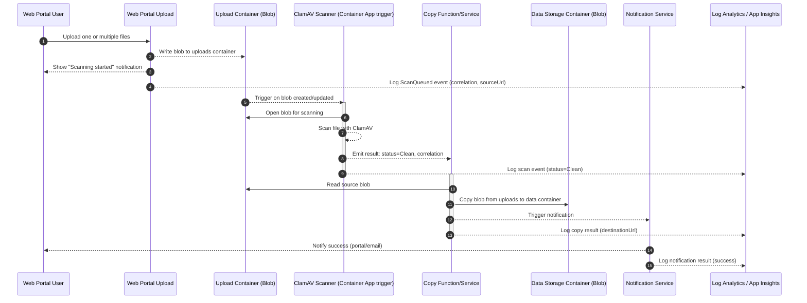
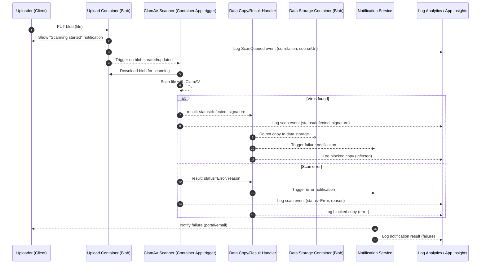

## FSDH AV Staging Workflow with container

This page documents the virus scanning workflow for FSDH. It explains the actors, the sequence of operations, the key events and blob metadata used across the process, and important operational notes.

## Goals

- Ensure all uploaded files are scanned before becoming accessible or downloadable.
- Isolate upload from data storage using separate containers and event-driven triggers.
- Provide clear events for downstream copy and user notification.
- Notify the user immediately after upload that scanning is in progress.

## Assumptions

- Dedicated upload storage containers are created during workspace deployment.
  - Legacy workspaces will not allow for external uploads
- Upload tools (for example, `azcopy`) target the upload container only
- No tokens are issued for the data storage container; files appear there only after a clean scan and copy.
- Files are not accessible or downloadable until the scan is complete and status is Clean.
- Azure Container Apps listens for blob created/updated events and kicks off the scan automatically

## Sequence (No virus detected)

## Sequence (Infected or Error)

