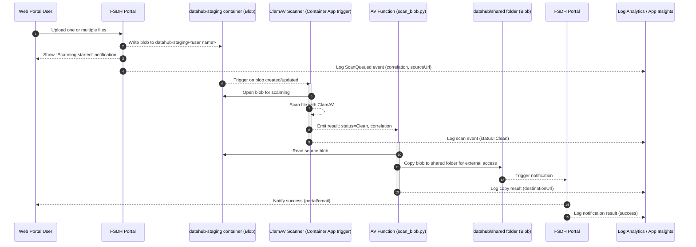
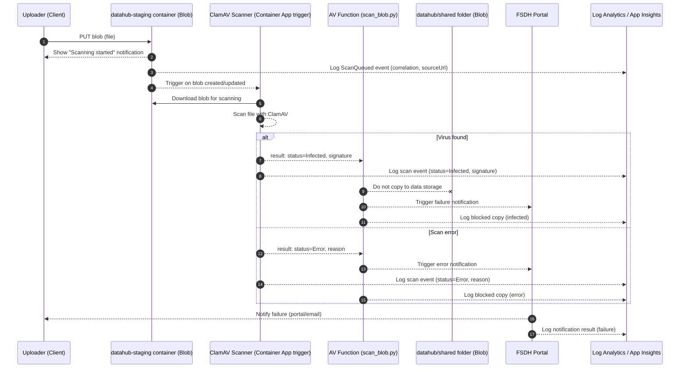
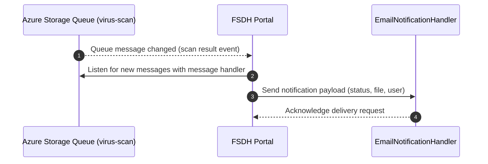

# FSDH AV Staging Workflow with Container

See [requirements](./requirements.md) for overview.

This page documents the virus scanning workflow for FSDH. It explains the actors, the sequence of operations, the key events and blob metadata used across the process, and important operational notes.

## Containers

Containers are described in Terraform in [data.tf](https://github.com/ssc-sp/datahub-resource-modules/blob/sw/v6.2-databricks-uc/modules/azure-storage-blob/data.tf)

- `datahub-staging` is the upload staging container where files are scanned
- `datahub` is the shared container used for external file exchange

## Folder structure

This section is the naming reference for other documents in this folder.

### Pre-scanning

- `datahub-staging`
  - `<user name>`
    - dataset1.csv
  - `john_doe`
    - dataset2.csv
  
### After scan and file copy

In `datahub`, the `shared` folder is used for files shared with external users.

- `datahub`
  - `shared`
    - `<user name>`
      - dataset1.csv
    - `john_doe`
      - dataset2.csv
  
## Copy function

The copy function is in the `datahub-images` repository:
[scan_blob.py](https://github.com/ssc-sp/datahub-images/blob/main/managed-containers/clamav-blobavscan/app/scan_blob.py)

### How it works

`scan_blob.py` is a polling service that reads blob-created events from an Azure Storage Queue and performs scanning and post-scan actions.

**Trigger — Azure Storage Queue**

The script polls the queue (default name: `virus-scan`) for messages. Each message is a base64-encoded JSON blob event containing the blob path (`subject`) and `data.blobUrl`. Only blobs in the containers listed in the `container_name` environment variable (default: `datahub-staging`) are processed; all others are skipped.

**Chunk-based scanning**

Large files are downloaded and scanned in 1 GB chunks. Each chunk is written to a temporary file and passed to ClamAV via a Unix socket (`pyclamd.ClamdUnixSocket()`). Scanning stops early if a threat is found in any chunk.

**Clean result**

The blob metadata is updated with `avscan=ok`, leaving the file in place for the portal or a downstream copy step to make it accessible.

**Infected result**

1. If `ENABLE_QUARANTINE=true`, the blob is copied to the quarantine container (`datahub-quarantine`) before the original is deleted.
2. A record is written to the `infectedfiles` Azure Table Storage table containing: original URL, quarantine URL, file size (MB), detected threat names, scan duration, and copy duration.
3. The original blob is deleted from the staging container.

### Configuration (environment variables)

| Variable                    | Default              | Description                                          |
| --------------------------- | -------------------- | ---------------------------------------------------- |
| `storage_connection_string` | _(required)_         | Connection string for the storage account            |
| `queue_name`                | `virus-scan`         | Queue that receives blob-created events              |
| `container_name`            | `datahub-staging`    | Comma-separated list of containers to scan           |
| `quarantine_container_name` | `datahub-quarantine` | Destination for infected blobs                       |
| `ENABLE_QUARANTINE`         | `false`              | Set to `true` to copy infected blobs before deletion |
| `WORK_DIR`                  | `/datahub-temp`      | Working directory for temporary files                |

## Sequence (No virus detected)

## Sequence (Infected or Error)

## Notifications

- Notifications will be processed through the FSDH portal to simplify ACLs on the storage account
  - _Service bus is not accessible from the AV scanning function_
  - _Connecting the service bus to the scanning function would require significant networking and permission changes_
- The portal already has a service principal with read/write access to the workspace storage container
- Required notifications are detailed in [requirements document](./requirements.md#notifications)
  

> This document was developed with the assistance of generative AI tools to support drafting, diagram generation and structuring activities. No Protected B or sensitive Government of Canada information was entered into these tools. All content has been reviewed, validated, and approved by the author to ensure accuracy, completeness, and compliance with Government of Canada security policies, standards, and applicable Treasury Board guidance.