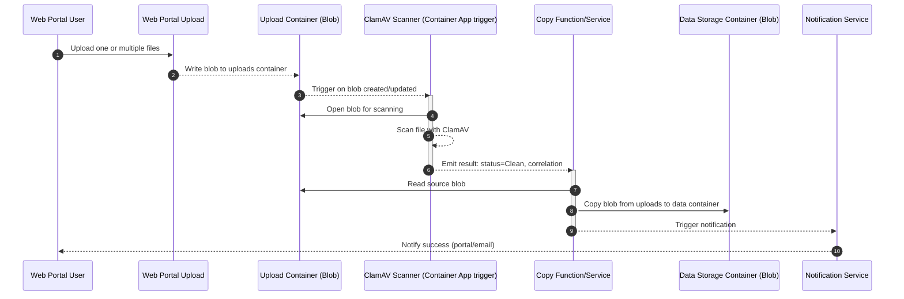
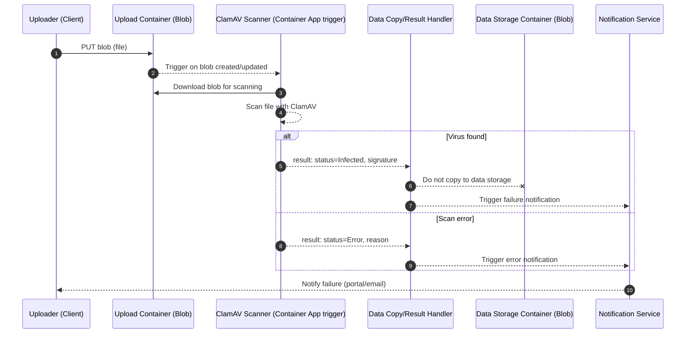

## FSDH AV Staging Workflow with container

This page documents the virus scanning workflow for FSDH. It explains the actors, the sequence of operations, the key events and blob metadata used across the process, and important operational notes.

## Goals

- Ensure all uploaded files are scanned before becoming accessible or downloadable.
- Isolate upload from data storage using separate containers and event-driven triggers.
- Provide clear events for downstream copy and user notification.

## Assumptions

- Dedicated upload storage containers are created during workspace deployment.
  - Legacy workspaces will not allow for external uploads
- Upload tools (for example, `azcopy`) target the upload container only
- No tokens are issued for the data storage container; files appear there only after a clean scan and copy.
- Files are not accessible or downloadable until the scan is complete and status is Clean.
- Azure Container Apps listens for blob created/updated events and kicks off the scan automatically

## Sequence (No virus detected)

## Sequence (Infected or Error)

## Data Elements

The following tables define a compact, canonical schema for blob event payloads, scan result messages, and blob metadata used across the workflow. Names are suggestions and can be adapted to your environment.

### Scan result event (from ClamAV to Copy Function)

| Key             | Type                             | Required | Description                             |
| --------------- | -------------------------------- | :------: | --------------------------------------- |
| correlationId   | string                           |    ✓     | Carries over from Q1.                   |
| status          | enum("Clean","Infected","Error") |    ✓     | Result of scanning.                     |
| signature       | string                           |          | Virus signature when status=Infected.   |
| engineVersion   | string                           |          | ClamAV engine/definitions version used. |
| scanStartedAt   | datetime                         |    ✓     | When scanning began.                    |
| scanCompletedAt | datetime                         |    ✓     | When scanning finished.                 |
| durationMs      | number                           |          | Total scan duration in milliseconds.    |
| blobUrl         | string                           |    ✓     | Original upload blob URL.               |

### Notification event

| Key            | Type                              | Required | Description                                                              |
| -------------- | --------------------------------- | :------: | ------------------------------------------------------------------------ |
| correlationId  | string                            |    ✓     | Correlates back to the upload and scan events.                           |
| status         | enum("Copied","Infected","Error") |    ✓     | Outcome for the user.                                                    |
| destinationUrl | string                            |          | URL to the copied blob in the Data Storage Container when status=Copied. |
| occurredAt     | datetime                          |    ✓     | Time of the event emission (UTC).                                        |

### Blob metadata (recommended keys)

| Key                     | Example                              | Description                                                          |
| ----------------------- | ------------------------------------ | -------------------------------------------------------------------- |
| dh:correlationId        | 2c75b4c1-3ee3-4a62-9f2a-a3b5f8b1a0e5 | Correlation identifier stamped on both source and destination blobs. |
| dh:scanStatus           | Clean                                | Clean, Infected, or Error.                                           |
| dh:scanSignature        | Win.Test.EICAR_HDB-1                 | Virus signature when infected.                                       |
| dh:scanEngine           | ClamAV 1.3.0 (defs: 2025‑11‑03)      | Scanner and definitions version.                                     |
| dh:scanStartedAt        | 2025-11-03T15:04:59Z                 | UTC timestamps for auditing.                                         |
| dh:scanCompletedAt      | 2025-11-03T15:05:01Z                 |                                                                      |
| dh:sourceContainer      | uploads                              | Name of the original container.                                      |

