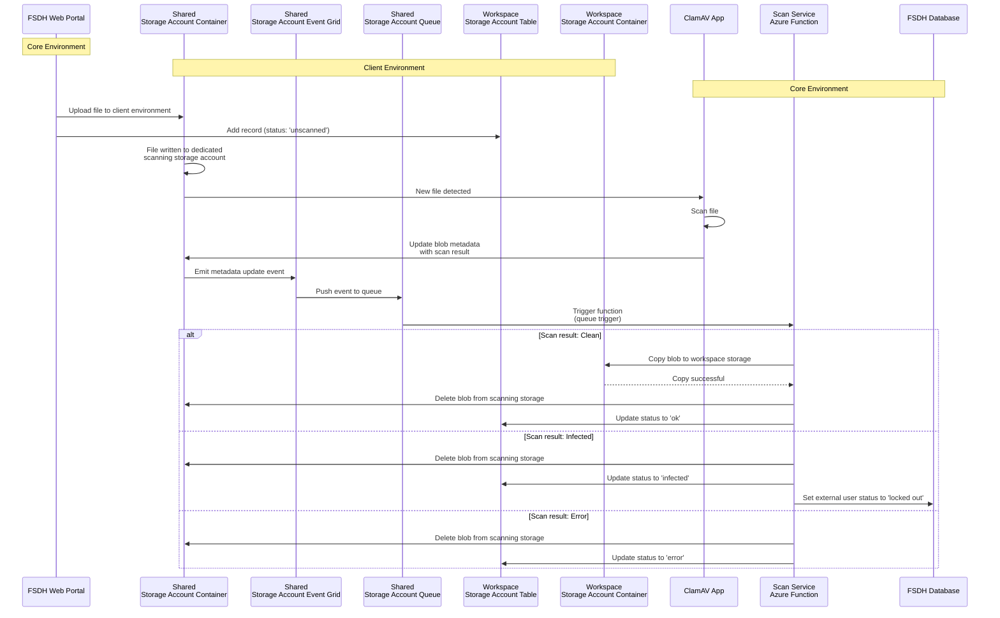

# ClamAV Integration for External User Access Control

## FSDH ClamAV Staging Workflow 

This document specifies the technical architecture and implementation requirements for the end-to-end ClamAV virus scanning workflow within the Federal Science DataHub (FSDH) portal, covering virus scanning of uploaded files, copying to data storage, and user notification. It defines the system goals, security constraints, required Azure resources, operational sequence, event-driven triggers, and blob metadata schema used across the malware detection pipeline. Throughout this document, "users" refers to external (non-GC) users authenticated to the FSDH portal, while Government of Canada personnel are referred to as "GC users". 

## Assumptions

The `ClamAV` containerized antivirus engine is pre-configured with up-to-date malware signatures and deployed within the infrastructure.

## Goals

- **Enforce mandatory malware scanning** for all uploaded files prior to accessibility or download availability.
    - Infected files must be immediately quarantined and deleted from the storage layer
    - Files triggering scan errors must be treated as potentially malicious and deleted (fail-secure approach)
- Execute `ClamAV` within an isolated container runtime environment
- **Implement automatic account lockout** for users uploading infected files
    - Deliver automated email notifications to affected users and workspace owners with scan results and remediation procedures
    - Expose lockout status via portal UI dashboard for workspace administrators
- Provide DataHub administrators with a centralized lockout management interface
    - Require upload of verified system scan evidence from the affected user before access reinstatement
    - Enable administrative override capabilities for access restoration
- **Restrict AZCopy access** for external users
    - Disable SAS token generation for external users while maintaining this capability for GC users
- Update Terms & Conditions to explicitly communicate device security requirements and scanning policies to external users
- Maintain comprehensive audit logs of all file upload events, scan results, and scanning activities for compliance and forensic analysis
- **Implement defenses against AV evasion techniques**:
    - Enforce decompression depth limits and maximum file size constraints to mitigate archive bomb (zip bomb) attacks
    - Detect obfuscation techniques, polyglot files, and dual/misleading file extensions
    - Ensure scanning engine supports deep content inspection within embedded objects (e.g., PDF attachments, OLE objects)
- Establish documented procedures for investigating and resolving false positive detections

## Restrictions
- Implement strict MIME type validation to enforce allowlist-based file format restrictions
- Enforce maximum file size limits 
- Network segmentation policy: workspace-scoped resources cannot initiate direct connections to core infrastructure resources

## New Resources Required

### Workspace External Storage Account Container

A dedicated Azure Blob Storage container for external uploads is required to isolate external user files from internal workspace data containers and enforce security boundaries.

### Workspace Storage Account Table

An Azure Table Storage instance within the workspace storage account is required to maintain file upload metadata and track scan status lifecycle (`unscanned` → `scanning` → `ok`/`infected`/`error`).

### Triaging Storage Account

To prevent direct uploads into workspace folders that could potentially compromise existing data, a dedicated triage storage container is required for initial file ingestion. Files undergo a quarantine-scan-promote workflow: uploaded to the staging container, scanned by `ClamAV`, and only promoted to the destination external-user folder after successful malware scanning. Three architectural options are available:

1. **Per-workspace container** — A dedicated blob container within each workspace storage account monitored by `ClamAV` via blob triggers. This approach maintains resource isolation within individual resource groups but requires dynamic container provisioning and `ClamAV` configuration updates on workspace creation/deletion events.

2. **Subscription-level storage account** — A centralized shared storage account in a dedicated resource group at the subscription scope. All workspaces upload to the same triage container with blob metadata specifying the target resource group and destination container. Post-scan, files are copied to their destination containers based on metadata routing.

3. **Dedicated subscription for shared storage** — A separate Azure subscription exclusively for hosting the shared triage storage account serving all other subscriptions. While this requires only a single shared account, cross-subscription blob copy operations violate the solution's security requirements and network isolation policies.

The flow diagram below is based on the **Subscription-level storage account** architecture.

The storage account must be configured with Azure Event Grid integration to emit Storage Queue messages triggered by blob metadata change events from scanned files.

### Azure Function

A new Azure Function (queue-triggered) is required to process scan result messages. The function subscribes to the subscription-level triage storage account queues and processes incoming scan completion events. 

## Logical Flow

### Successful Scan

- User uploads a file to the triage storage account via HTTPS PUT operation
    - A new record is inserted into the workspace storage account table with status `"scanning"`
- The `ClamAV` container is triggered by the blob creation event and initiates malware scanning
- `ClamAV` updates the blob metadata property with `Result = "Ok"`
- Azure Event Grid detects the metadata mutation and publishes an event to the storage queue
- The Azure Function is invoked by the queue trigger and processes the message
    - Performs a server-side blob copy to the target workspace container
    - Updates the workspace storage account table record with status `"ok"` 

### Virus Detected

- User uploads a file to the triage storage account via HTTPS PUT operation
    - A new record is inserted into the workspace storage account table with status `"scanning"`
- The `ClamAV` container is triggered by the blob creation event and initiates malware scanning
- `ClamAV` detects malware and updates the blob metadata property with `Result = "Virus"`
- Azure Event Grid detects the metadata mutation and publishes an event to the storage queue
- The Azure Function is invoked by the queue trigger and processes the message
    - Deletes the infected blob from the triage storage account
    - Sets user account lockout flag in the FSDH database
    - Dispatches automated email notifications to the affected user and workspace owner with remediation instructions
    - Updates the workspace storage account table record with status `"infected"` 

### ClamAV Scan Error

- User uploads a file to the triage storage account via HTTPS PUT operation
    - A new record is inserted into the workspace storage account table with status `"scanning"`
- The `ClamAV` container is triggered by the blob creation event and initiates malware scanning
- `ClamAV` encounters a scan error (e.g., corrupted file, timeout, resource exhaustion) and updates the blob metadata property with `Result = "Error"`
- Azure Event Grid detects the metadata mutation and publishes an event to the storage queue
- The Azure Function is invoked by the queue trigger and processes the message
    - Deletes the file from the triage storage account (fail-secure approach)
    - Updates the workspace storage account table record with status `"error"` 
 

# File Scanning Sequence Diagram

This diagram illustrates the file upload and scanning flow between Core and Client environments.

