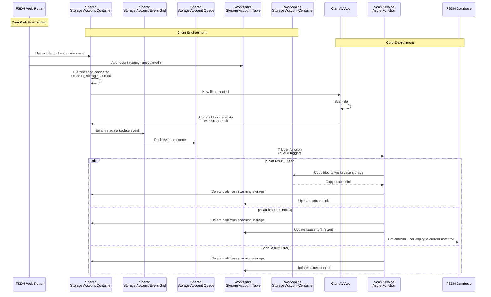

# File Scanning Sequence Diagram

This diagram illustrates the file upload and scanning flow between Core and Client environments.



## Flow Summary

### 1. File Upload
- User uploads a file through the Core Web Portal
- Portal sends the upload to the Client environment
- Record added to Client Storage Table with status 'unscanned'

### 2. File Scanning
- File is written to the Client Shared Storage Account (dedicated for scanning)
- Core ClamAV detects and scans the new file
- Scan result is written to blob metadata

### 3. Event Processing
- Metadata update emits an Event Grid event
- Event Grid pushes the event to Storage Queue (scan-results)
- Core Scan Service Function is triggered via queue trigger

### 4. Result Handling

**Clean Files:**
- Core service copies blob to Client Workspace Storage
- Source blob deleted from scanning storage
- Client Storage Table updated with status 'ok'

**Infected Files:**
- Blob deleted from scanning storage
- Client Storage Table updated with status 'infected'
- External user expiry set to current datetime

**Error Cases:**
- Blob deleted from scanning storage
- Client Storage Table updated with status 'error'
```
