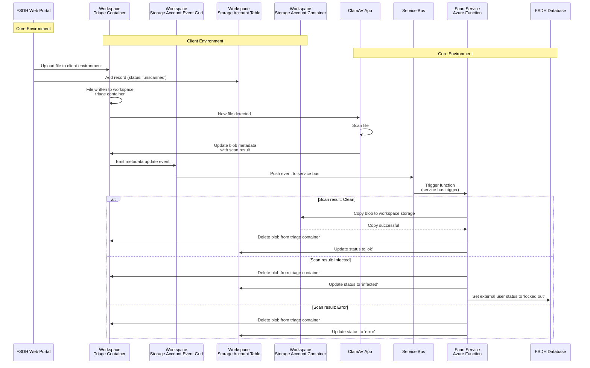

## FSDH ClamAV Staging Workflow 

This document specifies the technical architecture and implementation requirements for the virus scanning workflow within the Federal Science DataHub (FSDH). It defines the system goals, security constraints, required Azure resources, operational sequence, event-driven triggers, and blob metadata schema used across the malware detection pipeline. Throughout this document, "users" refers to external (non-GC) users authenticated to the FSDH portal, while Government of Canada personnel are referred to as "GC users".

## Assumptions

The `ClamAV` containerized antivirus engine is pre-configured with up-to-date malware signatures and deployed within the infrastructure.

## Goals

- **Enforce mandatory malware scanning** for all uploaded files prior to accessibility or download availability.
    - Infected files must be immediately quarantined and deleted from the storage layer
    - Files triggering scan errors must be treated as potentially malicious and deleted (fail-secure approach)
- Execute `ClamAV` within an isolated container runtime environment
- **Implement automatic account lockout** for users uploading infected files
    - Deliver automated email notifications to affected users and workspace owners with scan results and remediation procedures
    - Expose lockout status via portal UI dashboard for workspace administrators
- Provide DataHub administrators with a centralized lockout management interface
    - Require upload of verified system scan evidence from the affected user before access reinstatement
    - Enable administrative override capabilities for access restoration
- **Restrict AZCopy access** for external users
    - Disable SAS token generation for external users while maintaining this capability for GC users
- Update Terms & Conditions to explicitly communicate device security requirements and scanning policies to external users
- Maintain comprehensive audit logs of all file upload events, scan results, and scanning activities for compliance and forensic analysis
- **Implement defenses against AV evasion techniques**:
    - Enforce decompression depth limits and maximum file size constraints to mitigate archive bomb (zip bomb) attacks
    - Detect obfuscation techniques, polyglot files, and dual/misleading file extensions
    - Ensure scanning engine supports deep content inspection within embedded objects (e.g., PDF attachments, OLE objects)
- Establish documented procedures for investigating and resolving false positive detections

## Restrictions
- Implement strict MIME type validation to enforce allowlist-based file format restrictions
- Enforce maximum file size limits 
- Network segmentation policy: workspace-scoped resources cannot initiate direct connections to core infrastructure resources

## New Resources Required

### Workspace Storage Account Table

An Azure Table Storage instance within the workspace storage account is required to maintain file upload metadata and track scan status lifecycle (`unscanned` → `scanning` → `ok`/`infected`/`error`).

### Triaging Storage Account Container

A dedicated container will be created in the workspace storage account to hold files uploaded by users for scanning. The storage account must be configured with Azure Event Grid integration to emit Storage Queue messages whenever there are blob metadata changes for scanned files.

### External Uploads Storage Account Container

A separate container will be provisioned to store all successfully scanned files. These files will be accessible to external users via the application UI.

### Azure Function

A new Azure Function (queue-triggered) is required to process scan result messages. The function subscribes to the subscription-level triage storage account queues and processes incoming scan completion events. 

## Logical Flow

### Successful Scan

- User uploads a file to the triage container 
    - A new record is inserted into the workspace storage account table with status `"scanning"`
- The `ClamAV` container is triggered by the blob creation event and initiates malware scanning
- `ClamAV` updates the blob metadata property with `Result = "Ok"`
- Azure Event Grid detects the metadata mutation and publishes an event message to the service bus queue
- The Azure Function is invoked by the service bus queue and processes the message
    - Performs blob copy to the target workspace external-uploads container
    - Updates the workspace storage account table record with status `"ok"` 

### Virus Detected

- User uploads a file to the triage container
    - A new record is inserted into the workspace storage account table with status `"scanning"`
- The `ClamAV` container is triggered by the blob creation event and initiates malware scanning
- `ClamAV` detects malware and updates the blob metadata property with `Result = "Virus"`
- Azure Event Grid detects the metadata mutation and publishes an event message to the service bus queue
- The Azure Function is invoked by the service bus queue and processes the message
    - Deletes the infected blob from the triage storage account
    - Sets user account lockout flag in the FSDH database
    - Dispatches automated email notifications to the affected user and workspace owner with remediation instructions
    - Updates the workspace storage account table record with status `"infected"` 

### ClamAV Scan Error

- User uploads a file to the triage storage account via HTTPS PUT operation
    - A new record is inserted into the workspace storage account table with status `"scanning"`
- The `ClamAV` container is triggered by the blob creation event and initiates malware scanning
- `ClamAV` encounters a scan error (e.g., corrupted file, timeout, resource exhaustion) and updates the blob metadata property with `Result = "Error"`
- Azure Event Grid detects the metadata mutation and publishes an event message to the service bus queue
- The Azure Function is invoked by the service bus queue and processes the message
    - Deletes the file from the triage storage account (fail-secure approach)
    - Updates the workspace storage account table record with status `"error"` 
 

# File Scanning Sequence Diagram

This diagram illustrates the file upload and scanning flow between Core and Client environments.

