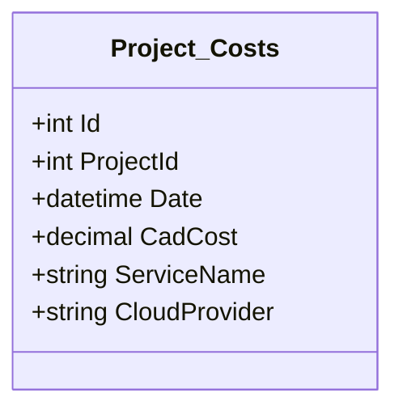

# Costing table

```mermaid

classDiagram

    class Project_Costs {
        +int Id
        +int ProjectId

        +datetime Date
        +decimal CadCost
        +string ServiceName
        +string CloudProvider
    }

```
