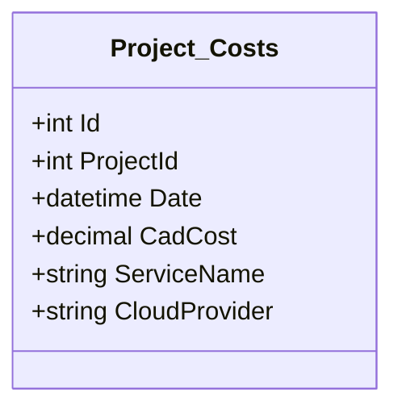

# Costing Function

Funtion in english:

> Fetch yesterday's cost of a project from the cloud provider and store it in the database.

> AI Generated
> Azure Consumption API query endpoint `https://management.azure.com/subscriptions/{subscriptionId}/providers/Microsoft.Consumption/usageDetails?api-version=2019-10-01&$filter=properties/usageEnd le '2020-10-01T00:00:00Z' and properties/usageStart ge '2020-09-30T00:00:00Z'`

https://learn.microsoft.com/en-us/rest/api/consumption/usage-details/list?tabs=HTTP

