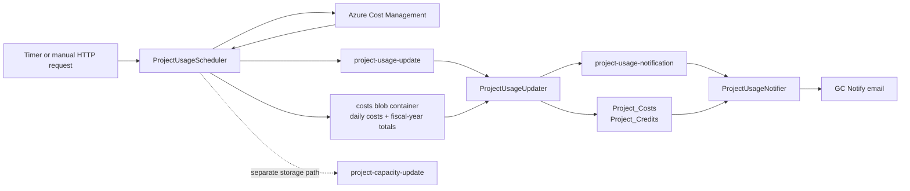

# Platform costing system

The costing system periodically imports Azure costs, stores a workspace-level cost history and summary, and notifies workspace administrators when spending reaches configured percentages of the workspace budget. The workflow is split across three Azure Functions so that the relatively expensive Azure queries are shared and each workspace can be updated independently.

## End-to-end flow



1. `ProjectUsageScheduler` selects at most 100 workspaces that need a cost or storage refresh.
2. It groups those workspaces by Azure subscription and makes two filtered Cost Management queries per subscription: daily actual costs for the last seven days and a total from April 1 of the current fiscal year through today.
3. The two aggregated result sets are written as JSON blobs. Each selected workspace receives a small Service Bus message containing its acronym and the two blob names.
4. `ProjectUsageUpdater` consumes one workspace message at a time, filters the shared data to that workspace's resource groups, updates cost records and the `Project_Credits` summary, performs a consistency check, and optionally rolls over its Azure budget.
5. After a successful cost update, the updater publishes a notification message.
6. `ProjectUsageNotifier` compares the updated spend with `Project_Budget` and sends a GC Notify message to workspace administrators and workspace leads when the applicable threshold changes.

Storage-capacity updates are scheduled at the same time but use the separate `project-capacity-update` queue and `ProjectCapacityUsageUpdater` entry point. They do not feed the cost notification calculation.

## `ProjectUsageScheduler`

The scheduler has two entry points:

- `ProjectUsageScheduler` is a timer trigger using `%ProjectUsageCRON%`.
- `ProjectUsageSchedulerHttp` is a function-authorized GET/POST endpoint for manually scheduling updates.

### Workspace selection

Deleted projects are excluded. A normal scheduled run selects workspaces whose cost information or storage capacity is stale, orders them by the cost summary's `LastUpdate` value (missing values sort as `DateTime.MinValue`), and takes the first 100.

Cost data is considered stale when `Project_Credits` is missing, `LastUpdate` is missing, or the last cost update was more than two hours ago. Storage has its own freshness check. Because the scheduler runs the two checks independently, it may enqueue only a cost update, only a capacity update, or both.

A manual request has this shape:

```json
{
  "manualRollover": false,
  "acronyms": ["ABC1", "XYZ2"]
}
```

When at least one acronym is supplied, selection is limited to those acronyms and both cost and capacity updates are forced for the matches. `manualRollover` is copied to each cost-update message as `ForceRollover`. An empty acronym list uses the normal stale-workspace selection; `manualRollover` can therefore request rollover for every workspace selected by that normal process.

The endpoint returns success after messages have been scheduled, not after downstream database updates, notifications, or rollover have completed. Unknown or deleted acronyms simply produce no matching workspaces.

### Azure queries and blobs

For each distinct subscription represented in the batch, the scheduler obtains all platform workspace resource-group names in that subscription and queries `ActualCost`:

| Dataset | Date range | Azure grouping | Purpose |
|---|---|---|---|
| Daily costs | UTC today minus 7 days through UTC today | service name, resource group, usage date | Backfill recent daily/service records and build current summaries |
| Totals | Current fiscal year start (April 1) through UTC today | resource group | Detect whether the detailed database history has drifted from Azure |

Results for every subscription are combined and uploaded to the `costs` container in the storage account configured by `Media:StorageConnectionString`. Blob names are unique and follow `costs-yyyy-MM-dd-hh-mm-ss-{guid}.json` and `totals-yyyy-MM-dd-hh-mm-ss-{guid}.json`. Every cost message in the batch refers to the same pair of blobs; the updater later filters them by workspace resource group.

The scheduler spaces workspace message publication by 500 ms. Azure Cost Management HTTP 429 responses establish an in-process one-hour query cooldown. The run that receives the 429 fails; a later run in the same process during the cooldown skips the subscription-query loop and continues with empty aggregate blobs.

### Messages published

`project-usage-update` receives:

```json
{
  "message": {
    "projectAcronym": "ABC1",
    "costsBlobName": "costs-2026-09-09-01-00-00-guid.json",
    "totalsBlobName": "totals-2026-09-09-01-00-00-guid.json",
    "forceRollover": false
  }
}
```

`project-capacity-update` receives the project acronym on the independent capacity-update path.

## `ProjectUsageUpdater`

`ProjectUsageUpdater` consumes `project-usage-update`. Its process-wide semaphore permits one cost update at a time in each Functions worker process, even though the Service Bus host may deliver messages concurrently. The related `ProjectCapacityUsageUpdater` uses a separate one-at-a-time semaphore.

For each cost message, the updater:

1. Validates that `ProjectAcronym` and `CostsBlobName` are present and that the costs blob name ends in `.json`.
2. Downloads and deserializes both blob files from the `costs` container.
3. Calls `UpdateWorkspaceCostsAsync` with the daily dataset.
4. Calls `VerifyAndRefreshWorkspaceCostsAsync` with the totals dataset.
5. Performs a budget rollover when explicitly forced, or when automatic rollover is enabled and the service detects a fiscal-year boundary.
6. Publishes `ProjectUsageNotificationMessage(projectAcronym)` after all preceding work succeeds.

An exception is rethrown from the queue handler, allowing normal Azure Functions/Service Bus retry and dead-letter behavior to apply. The updater does not publish the notification message when an earlier step fails.

### Updating detailed costs

The cost service resolves every resource group belonging to the workspace, then filters the batch-wide daily data to those groups. For each date returned by Azure except UTC today, it compares records by project, date, and service name:

- A missing service/day record is inserted into `Project_Costs`.
- An existing record is updated when its amount differs from Azure by more than $0.10.
- A difference of $0.10 or less is left unchanged.

Today's result is deliberately not persisted in `Project_Costs`, because Azure may still revise it. It is included transiently when the current summary is calculated. The backfill is upsert-like and therefore tolerates message retries, but it does not delete a database service/day row that is absent from a later Azure response.

### Updating `Project_Credits`

After backfilling, the service creates `Project_Credits` if necessary and updates:

| Field | Value |
|---|---|
| `Current` | Sum of all persisted project costs plus today's queried costs |
| `YesterdayCredits` | Sum of persisted costs dated UTC yesterday |
| `CurrentPerDay` | JSON summary of all persisted costs plus today's costs, grouped by date |
| `CurrentPerService` | JSON summary of all persisted costs plus today's costs, grouped by service |
| `YesterdayPerService` | JSON summary of yesterday's persisted costs, grouped by service |
| `LastUpdate` | Current UTC time |

Despite the name “credits,” the current implementation derives these fields from Azure actual-cost amounts. `Current` is not filtered to the current fiscal year; it includes every `Project_Costs` row retained for the project plus today's amount.

### Consistency refresh

The fiscal-year totals blob is filtered to the workspace's resource groups and compared with the sum of its current-fiscal-year `Project_Costs` records. When the absolute difference is greater than $5, the service performs a full daily Azure query from April 1 through today and runs the same backfill/summary update again.

The comparison currently uses strict database date boundaries (`>` fiscal-year start and `<` fiscal-year end). Records exactly on April 1 or March 31 are not included in the database side of this check.

### Fiscal-year budget rollover

The cost service reports that rollover is needed when the previous update/rollover state indicates the workspace has not rolled over in the current April-to-March fiscal year. It also supplies the total persisted cost from the last complete fiscal year.

Rollover occurs when either:

- the message has `ForceRollover = true`; or
- `EnableRollover` is `true` and rollover was detected.

The updater reads the Azure Consumption budget associated with the workspace's project resource group, sets its amount to `current Azure budget amount - last fiscal year's persisted cost`, and records the current UTC time in `Project_Credits.LastRollover`. A zero current budget causes the operation to fail. `EnableRollover` defaults to `false`, so automatic rollover is opt-in.

The older path that copied Azure's budget “current spend” into `Project_Credits.BudgetCurrentSpent` is deprecated and commented out; notification calculations use `Project_Credits.Current` instead.

## `ProjectUsageNotifier`

The notifier consumes `project-usage-notification` after the updater has committed the latest summary. It loads the project, its credits, and users assigned either the Admin or Workspace Lead role. Invalid email addresses are excluded.

The consumed percentage is calculated as:

```text
round(100 × Project_Credits.Current / Project_Budget)
```

If `Project_Budget` is zero or negative, the percentage is treated as zero. From the configured threshold list, the notifier chooses the highest value less than or equal to the calculated percentage. For example, with `25,50,75,100`, a calculated value of 82 selects 75.

No email is sent when no threshold has been reached or when the selected threshold equals `Project_Credits.PercNotified`. Otherwise, one GC Notify cost notification is sent to each valid Admin and Workspace Lead address. After sending, the notifier records the selected threshold in `PercNotified` and the current UTC time in `LastNotified`.

`PercNotified` suppresses only the currently selected threshold; it is not a “highest threshold ever sent” check. If the calculated percentage later moves into a different threshold band, that band is eligible for notification, including a lower band.

Email/database exceptions inside notification processing are logged and swallowed. Consequently, the Service Bus message can complete without a retry after such a failure. If there are no valid recipients, the notification state is still recorded as sent.

The class contains resource-deletion methods for projects at or above 100% when `PreventAutoDelete` is false. That behavior is currently disabled because the call from `Run` is commented out; the active notifier only sends cost notifications.

## Configuration

| Setting | Purpose | Default in code |
|---|---|---|
| `ProjectUsageCRON` | NCRONTAB expression for the scheduler | Required by the timer binding; deployment template uses `0 0 * * * *` (hourly) |
| `ProjectUsageNotificationPercents` | Comma-separated integer notification thresholds | `25,50,80,100` when absent; deployment template currently supplies `25,50,75,100` |
| `EnableRollover` | Enables automatically detected fiscal-year rollover | `false` |
| `DatahubServiceBus:ConnectionString` | Service Bus connection used by all three functions | Required |
| `Media:StorageConnectionString` | Storage account containing the intermediate `costs` blobs | Empty when absent; required in normal operation |
| `datahub_mssql_project` | Project database connection | Required |
| Azure ARM credentials | Used for Cost Management, resource-group discovery, storage metrics, and budget operations | `TENANT_ID`, `FUNC_SP_CLIENT_ID`, `FUNC_SP_CLIENT_SECRET` |

Threshold parsing happens when the notifier is constructed. Values must be comma-separated integers; malformed values prevent successful construction.

## Operational notes

- Cost data is eventually consistent. A scheduler invocation only means work was queued; the database and emails change later as queue messages are consumed.
- A batch's intermediate blobs are shared by up to 100 workspaces. They must remain available until all corresponding queue messages, including retries, have completed. These functions do not remove the blobs.
- The hourly deployment schedule is more frequent than the two-hour cost freshness threshold. Workspaces with fresh costs and storage are skipped.
- The 100-workspace cap means a backlog may require multiple scheduler invocations to drain.
- Queue handlers accept both a direct JSON payload and MassTransit-style `{ "message": ... }` envelopes through `DeserializeAndUnwrapMessageAsync`.
- Service Bus host settings allow up to 32 concurrent deliveries, but the updater semaphores serialize cost work and capacity work within each process. Scaling to multiple worker processes can still produce parallel updates.

When investigating a missing notification, trace the workspace acronym through scheduler selection, the two blob names, `project-usage-update`, the `Project_Costs`/`Project_Credits` update, and finally `project-usage-notification`. The most useful state is `LastUpdate`, `Current`, `Project_Budget`, `PercNotified`, and `LastNotified`.
