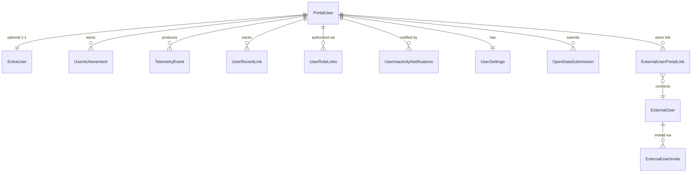

# PortalUser Table Schema and Design Rationale

## Overview

The `PortalUser` entity serves as the central identity hub within the Datahub portal. It aggregates user profile information, activity tracking, and relationships to external identities, achievements, telemetry data, and user-specific settings. Every user in the system—whether external or Entra-based—must have a corresponding `PortalUser` record.

## Column Specifications

| Column Name               | Data Type                          | Nullable | Required | Primary Key | Purpose                                             | Design Rationale                                                                                                                         |
| ------------------------- | ---------------------------------- | -------- | -------- | ----------- | --------------------------------------------------- | ---------------------------------------------------------------------------------------------------------------------------------------- |
| `Id`                      | int                                | No       | Yes      | ✓          | Unique identifier for the portal user record        | Standard primary key for entity identification. Used as foreign key by related entities (ExternalUser, EntraUser, UserAchievement, etc.) |
| `ExternalUser`            | ExternalUser?                      | Yes      | No       |             | Navigation to associated external user              | Nullable navigation allowing users to optionally be linked to external identity systems. Part of identity flexibility pattern. See [ExternalUser](./ExternalUser.md) for schema details            |
| `EntraUser`               | EntraUser?                         | Yes      | No       |             | Navigation to associated Entra user                 | Nullable navigation allowing users to optionally be linked to Microsoft Entra identity. Part of identity flexibility pattern             |
| `Email`                   | string                             | No       | Yes      |             | User's email address                                | Required field serving as a human-readable identifier and primary contact. Used for notifications, password resets, and user lookup      |
| `DisplayName`             | string?                            | Yes      | No       |             | User's display name                                 | Optional field for user-friendly name presentation in UI. Nullable to allow systems to generate names dynamically                        |
| `FirstLoginDateTime`      | DateTime?                          | Yes      | No       |             | Timestamp of first login                            | Nullable field tracking account activation. Enables identifying newly activated accounts and user lifecycle analytics                    |
| `LastLoginDateTime`       | DateTime?                          | Yes      | No       |             | Timestamp of most recent login                      | Nullable field for activity tracking. Used for user engagement metrics and inactivity detection across the entire portal                 |
| `BannerPictureUrl`        | string?                            | Yes      | No       |             | URL to user's banner picture                        | Optional field for profile customization. Enables user personalization without storing large binary data                                 |
| `ProfilePictureUrl`       | string?                            | Yes      | No       |             | URL to user's profile picture                       | Optional field for profile customization. Enables user identification in lists and profiles without storing binary data                  |

## Design Patterns

### Identity Flexibility

- **Multiple identity sources**: A `PortalUser` can be linked to either an `ExternalUser` OR an `EntraUser` (enforced by validation). External identity schema is documented in [ExternalUser](./ExternalUser.md)
- **Validation logic**: The `Validate` method ensures every portal user has at least one external identity
- **Decoupled identity**: Email is the primary human-readable identifier, independent of authentication source

### Activity Tracking

- **Dual timestamp fields**: Both `FirstLoginDateTime` and `LastLoginDateTime` are nullable to track user lifecycle
- **Portal-level tracking**: Unlike `ExternalUser` which tracks external-system-specific logins, `PortalUser` tracks overall portal engagement
- **DateTime vs DateTimeOffset**: Uses `DateTime` (UTC presumed) rather than `DateTimeOffset` for simplified activity tracking

### User Enrichment

- **Profile customization**: Picture URLs enable visual identification without storing binary data
- **Display name flexibility**: Optional display name allows customization or dynamic generation
- **Nullable optional fields**: Most fields are nullable to support progressive data completion and optional user customization

### Relationship Management

- **Collections initialization**: All relationship collections are initialized as empty lists to prevent null reference exceptions and enable LINQ queries
- **Concurrency control**: Timestamp field supports optimistic concurrency control in multi-user scenarios
- **User settings hierarchy**: One-to-one relationship with `UserSettings` for organizing additional user configuration

### Utility Functions

- **GetUserAchievements()**: Returns achievements ordered by ID and unlock date for chronological presentation
- **GetUnEarnedAchievements()**: Enables achievement progress tracking and gamification suggestions

## Relationship Architecture

The association table `ExternalUserPortalLink` replaces the direct foreign key on `ExternalUser`, preserving a clean separation while keeping reassociation history auditable. See the external-side schema and rationale in [ExternalUser](./ExternalUser.md).

## Identity Strategy

The system supports two authentication pathways:

1. **External Identity (GCCF)**
   - Users authenticated via Government of Canada Cloud Federation
   - Linked through `ExternalUser` entity
   - Tracks invitation lifecycle, external login activity

2. **Entra Identity (Microsoft)**
   - Users authenticated via Microsoft Entra (Azure AD)
   - Linked through `EntraUser` entity
   - Leverages enterprise directory integration

Every `PortalUser` must have at least one identity source, enforced by validation logic.

## Usage Scenarios

1. **User Registration**: Create `PortalUser` with email, optionally linked to identity source
2. **Activity Tracking**: Update `LastLoginDateTime` on each portal login
3. **Achievement System**: Query `Achievements` collection for user progress
4. **Role-Based Access**: Check `UserRoles` collection for authorization decisions
5. **User Enrichment**: Lazy-load `UserSettings` for personalization
6. **Telemetry Analysis**: Query `TelemetryEvents` for user behavior analytics
7. **Audit Deactivation**: Track deactivation through `ExternalUser.DeactivatedByUser` reference
8. **Inactivity Handling**: Query `LastLoginDateTime` and trigger `InactivityNotifications`
