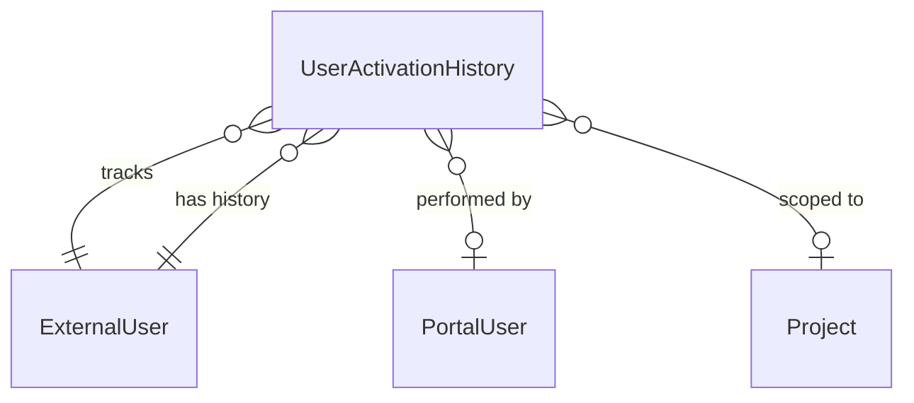

# UserActivationHistory Table Schema and Design Rationale

## Overview

The `UserActivationHistory` entity provides an immutable audit log of all activation and deactivation events for external users within the Datahub system. Each record captures a single state change, enabling complete reconstruction of a user's access lifecycle and supporting compliance, troubleshooting, and security investigations.

## Column Specifications

| Column Name       | Data Type       | Internal | Unique | Nullable | Required | Primary Key | Purpose                                              | Design Rationale                                                                                                                                                                                                     |
| ----------------- | --------------- | -------- | ------ | -------- | -------- | ----------- | ---------------------------------------------------- | -------------------------------------------------------------------------------------------------------------------------------------------------------------------------------------------------------------------- |
| `Id`              | int             | Yes      | Yes    | No       | Yes      | ✓           | Unique identifier for the history record             | Standard primary key for entity identification. Enables reliable referencing and ordering of audit entries                                                                                                           |
| `ExternalUserId`  | int             | Yes      | No     | No       | Yes      |             | Foreign key to the ExternalUser record               | Links the history entry to the specific external user. Required field that ensures every audit record is associated with a user. Indexed for efficient querying of user history                                     |
| `ExternalUser`    | ExternalUser    | Yes      | No     | No       | Yes      |             | Navigation property to the ExternalUser              | Enables eager/lazy loading of user details when querying history. Supports join operations for reporting                                                                                                             |
| `ActionType`      | string          | No       | No     | No       | Yes      |             | Type of activation event (Activated/Deactivated)     | Captures the nature of the state change. Uses string enum for extensibility (e.g., future states like Suspended). Values: `Activated`, `Deactivated`, `Reactivated`                                                 |
| `ActionDate_DT`   | DateTimeOffset  | No       | No     | No       | Yes      |             | Timestamp when the action occurred                   | Required field capturing the exact moment of state change. Uses DateTimeOffset to preserve timezone information for users across different regions. Critical for audit trail accuracy and regulatory compliance     |
| `PerformedById`   | int?            | Yes      | No     | Yes      | No       |             | Foreign key to the PortalUser who performed action   | Nullable to support system-initiated actions (e.g., automated expiry). When populated, establishes accountability for manual actions                                                                                |
| `PerformedBy`     | PortalUser?     | Yes      | No     | Yes      | No       |             | Navigation property to the performing user           | Enables eager/lazy loading of actor details. Nullable for system-initiated events                                                                                                                                    |
| `Reason`          | string?         | No       | No     | Yes      | No       |             | Human-readable reason for the action                 | Optional field providing context for the state change. Useful for documenting why access was revoked or restored. Supports compliance requirements and dispute resolution                                           |
| `WorkspaceId`     | int?            | Yes      | No     | Yes      | No       |             | Foreign key to specific workspace (if applicable)    | Nullable field to scope the action to a specific workspace. Null indicates a global action affecting all workspaces. Supports granular access management and per-workspace audit trails                             |
| `Workspace`       | Project?        | Yes      | No     | Yes      | No       |             | Navigation property to the workspace                 | Enables context-aware querying and reporting. Null for global activation/deactivation events                                                                                                                         |
| `PreviousStatus`  | string?         | No       | No     | Yes      | No       |             | Status before the action                             | Captures the prior state for complete audit trail. Nullable for initial activation where no prior state exists. Values align with ExternalUser.Status (Active/Inactive)                                             |
| `NewStatus`       | string          | No       | No     | No       | Yes      |             | Status after the action                              | Required field capturing the resulting state. Ensures every history entry records the outcome. Values: `Active`, `Inactive`                                                                                         |
| `IPAddress`       | string?         | Yes      | No     | Yes      | No       |             | IP address of the actor (if available)               | Optional field for security auditing. Supports investigation of suspicious activity. Nullable when action is system-initiated or IP unavailable                                                                     |
| `CorrelationId`   | string?         | Yes      | No     | Yes      | No       |             | Request correlation ID for distributed tracing       | Links the audit entry to Application Insights logs. Enables end-to-end request tracing for troubleshooting. See [Troubleshooting](#troubleshooting-queries) for usage                                               |

**Internal** indicates if a column is only visible to the application and not exposed to the user or the admins. Internal columns are never used in URLs or APIs and only required for relational queries.

## Design Patterns

### Immutable Audit Log

- **Append-only design**: Records are never updated or deleted; each state change creates a new row
- **Complete history**: Every activation and deactivation event is preserved indefinitely
- **Point-in-time reconstruction**: Query history to determine user status at any past moment

### Event Sourcing Approach

- **State derivation**: Current user status can be derived from the most recent history entry
- **Temporal queries**: Supports queries like "who was active on date X" without relying on snapshot data
- **Change attribution**: Every state change is attributed to an actor and timestamp

### Nullable Actor Pattern

- **Manual actions**: `PerformedBy` populated when a workspace owner or admin initiates the action
- **System actions**: `PerformedBy` null for automated events (e.g., scheduled expiry, policy enforcement)
- **Self-service actions**: Track when users complete their own onboarding via invitation flow

### Workspace Scoping

- **Global events**: `WorkspaceId` null indicates the event affects all workspaces (e.g., admin global deactivation)
- **Workspace-specific events**: `WorkspaceId` populated for per-workspace access changes
- **Aggregated views**: Query all events for a user regardless of workspace scope

## Relationship Architecture



## Usage Scenarios

1. **Onboarding Tracking**: Record `Activated` event when external user completes invitation flow
2. **Reactivation Audit**: Record `Reactivated` event when disabled user regains access via new invitation (see [External User Onboarding Flow](../GCCF/AuthenticationFlows.md#external-user-onboarding-flow))
3. **Access Revocation**: Record `Deactivated` event with reason when workspace owner removes user
4. **Compliance Reporting**: Query history to generate access audit reports for specific time periods
5. **Security Investigation**: Trace all status changes for a user during incident response
6. **Global Deactivation**: Record event with null `WorkspaceId` when admin disables user across all workspaces

## ActionType Values

| Value          | Description                                                        | Typical Actor        |
| -------------- | ------------------------------------------------------------------ | -------------------- |
| `Activated`    | User gained access for the first time via invitation               | System (onboarding)  |
| `Deactivated`  | User access was revoked                                            | Workspace Owner/Admin|
| `Reactivated`  | Previously deactivated user regained access                        | System (re-invitation)|

## Troubleshooting Queries

### Query User Activation History

To retrieve the complete activation history for a specific user:

```sql
SELECT 
    h.ActionDate_DT,
    h.ActionType,
    h.PreviousStatus,
    h.NewStatus,
    h.Reason,
    p.Email AS PerformedByEmail,
    w.Name AS WorkspaceName
FROM UserActivationHistory h
LEFT JOIN PortalUser p ON h.PerformedById = p.Id
LEFT JOIN Project w ON h.WorkspaceId = w.Id
WHERE h.ExternalUserId = @userId
ORDER BY h.ActionDate_DT DESC;
```

### Correlate with Application Insights

Use the `CorrelationId` to trace the full request context in Application Insights:

```kusto
let correlationId = "<CorrelationId from UserActivationHistory>";
AppTraces
| where TimeGenerated > ago(90d)
| where OperationId == correlationId
| project TimeGenerated, SeverityLevel, Message
| order by TimeGenerated asc
```

### Find All Deactivations in Time Range

```sql
SELECT 
    e.Signup_Email,
    h.ActionDate_DT,
    h.Reason,
    p.Email AS DeactivatedByEmail
FROM UserActivationHistory h
JOIN ExternalUser e ON h.ExternalUserId = e.Id
LEFT JOIN PortalUser p ON h.PerformedById = p.Id
WHERE h.ActionType = 'Deactivated'
  AND h.ActionDate_DT BETWEEN @startDate AND @endDate
ORDER BY h.ActionDate_DT DESC;
```

## Related Documentation

- [ExternalUser](./ExternalUser.md) - External user entity and lifecycle management
- [PortalUser](./PortalUser.md) - Portal user entity and identity management
- [Authentication Flows](../GCCF/AuthenticationFlows.md) - GCCF authentication and onboarding flows
