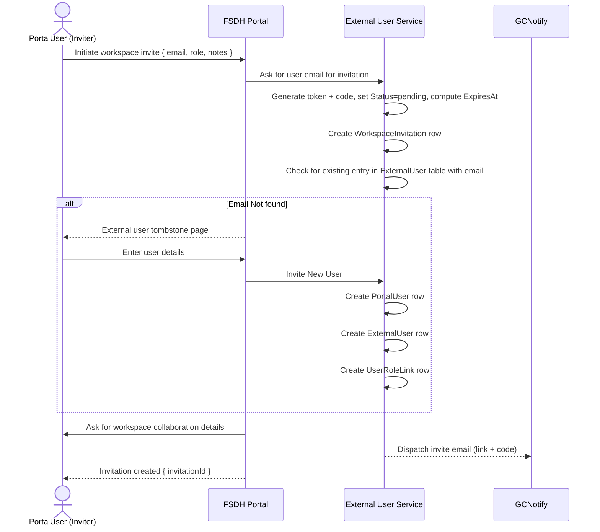
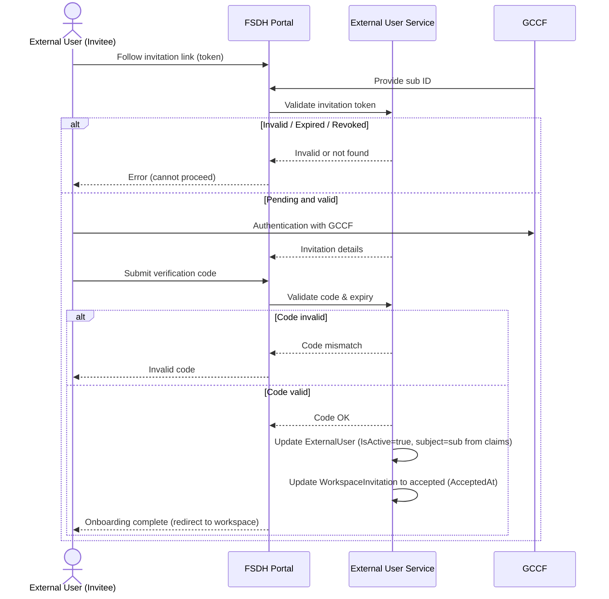

# External User OIDC Data Model Integration

This document proposes the data model changes required to incorporate the new external-user data elements (defined in `oidc_flow.md`) into the portal domain model, and a refinement to invitation handling so that invitations are workspace-scoped and normalized away from `UserRoleLink`.

- New ExternalUser entity
- New WorkspaceInvitation entity (per-workspace invitation lifecycle data);
- New EntraUser entity for Azure Entra–specific properties; and
- Changes to `PortalUser` so it references exactly one of {`EntraUser`, `ExternalUser`}.

## Proposed Additions Overview

| Concept                     | New / Modified                                             | Rationale                                                                                               |
| --------------------------- | ---------------------------------------------------------- | ------------------------------------------------------------------------------------------------------- |
| ExternalUser                | New                                                        | Stores profile attributes for an external identity (invitation data separated for normalization)       |
| WorkspaceInvitation         | New                                                        | Captures per-workspace invitation details (token, status, expiry, inviter) with optional UserRoleLink  |
| EntraUser                   | New                                                        | Stores Azure Entra–specific identity attributes (e.g., Graph GUID)                                      |
| `PortalUser.ExternalUserId` | Added (FK, nullable)                                       | Link to `ExternalUser` when applicable                                                                  |
| `PortalUser.EntraUserId`    | Added (FK, nullable)                                       | Link to `EntraUser` when applicable                                                                     |

## Detailed Schema Proposals

### ExternalUser entity

Represents the profile of an external user (identity and lifecycle independent of any single workspace invitation). Invitation mechanics are now modeled separately in `WorkspaceInvitation`.

| Property             | C# Type         | Constraints / Notes                            | Example                 |
| -------------------- | --------------- | ---------------------------------------------- | ----------------------- |
| `Id`                 | int             | PK                                             | 101                     |
| `ExternalSubject`    | string?         | GCCF `sub` claim (unique index when populated) | urn:gov:gccf:sub:abc123 |
| `PrimaryEmail`       | string          | Primary contact/login email                    | analyst@example.org     |
| `FirstName`          | string          | Mandatory                                      | Alex                    |
| `LastName`           | string          | Mandatory                                      | Singh                   |
| `Affiliation`        | string          | Role of the user within their organization     | Contractor              |
| `Organization`       | string          | Optional org context                           | Acme Research           |
| `AccountExpiry`      | DateTimeOffset  | Future expiry/renewal                          | 2025-12-31T23:59:59Z    |
| `CreatedAt`          | DateTimeOffset  | Creation timestamp                             | 2024-05-10T14:32:00Z    |
| `UpdatedAt`          | DateTimeOffset  | Update timestamp                               | 2024-06-01T09:15:00Z    |
| `UserRevokedAt`      | DateTimeOffset? | Timestamp when revoked                         | 2024-06-15T08:00:00Z    |
| `DeactivationReason` | string?         | Audit trail on disable                         | Revoked by security     |
| `PortalUserId`       | int             | Portal User ID relation (1:1 after linkage)    | 2001                    |

Existing fields from `UserSettings` used for external users remain:

- Language
- AcceptedDate (T&Cs)
- Theme

### WorkspaceInvitation entity

Represents a single invitation for a user (by email or existing account) to a specific workspace. Multiple invitations can exist per external user across different workspaces. `UserRoleLink` optionally references an accepted invitation for audit traceability.

| Property                | C# Type          | Notes                                                                                 |
| ----------------------- | ---------------- | ------------------------------------------------------------------------------------- |
| `Id`                    | int              | PK                                                                                    |
| `WorkspaceId`           | int              | FK to workspace/project (used to populate `UserRoleLink.Project_ID` after onboarding) |
| `ExternalUserId`        | int              | FK to `External_User` table                                                           |
| `PortalUserId`          | int              | FK to `Project_User` table                                                            |
| `InvitationToken`       | Guid             | Unique link token (unique)                                                            |
| `InvitationCode`        | string(6)        | Short human-entered verification code (e.g., 2T5-T1S)                                 |
| `InvitedByPortalUserId` | int              | FK to `PortalUser` (inviter)                                                          |
| `CollaborationNotes`    | string           | Short overview of collaboration objectives                                            |
| `Status`                | InvitationStatus | pending / accepted / expired / revoked                                                |
| `SentAt`                | DateTimeOffset?  | Timestamp when notification/email dispatched                                          |
| `AcceptedAt`            | DateTimeOffset?  | Timestamp when accepted                                                               |
| `ExpiresAt`             | DateTimeOffset   | Invitation expiry                                                                     |
| `RevokedAt`             | DateTimeOffset?  | Timestamp when explicitly revoked                                                     |
| `UserRoleLinkId`        | int?             | Optional FK to `UserRoleLink` created on onboarding                                   |
| `CreatedAt`             | DateTimeOffset   | Creation timestamp                                                                    |
| `UpdatedAt`             | DateTimeOffset   | Update timestamp                                                                      |

Relationship highlights:

- Workspace 1 ─── * WorkspaceInvitation
- ExternalUser 1 ─── * WorkspaceInvitation (post-accept; before onboarding `ExternalUserId` null)
- UserRoleLink 0..1 ─── 1 WorkspaceInvitation (only if derived from an invitation; direct role assignments omit link)

### EntraUser entity

Represents Azure Entra–backed identity data separated from `PortalUser`.

| Property       | C# Type        | Notes                              |
| -------------- | -------------- | ---------------------------------- |
| `Id`           | int            | Primary key (identity)             |
| `GraphGuid`    | string         | Azure AD object ID (unique index)  |
| `CreatedAt`    | DateTimeOffset | Set at insert                      |
| `UpdatedAt`    | DateTimeOffset | Updated on modification            |
| `Email`        | string         | User principal email/UPN if needed |
| `PortalUserId` | int            | Portal User ID relation            |

### PortalUser Changes

Additions:

```csharp
public class PortalUser
{
    // Provider links (exactly one must be non-null)
    public int? ExternalUserId { get; set; } // FK to ExternalUser
    public ExternalUser ExternalUser { get; set; }

    public int? EntraUserId { get; set; } // FK to EntraUser
    public EntraUser EntraUser { get; set; }

    // Convenience: computed property (option A)
    public bool IsExternal => ExternalUserId.HasValue && !EntraUserId.HasValue;

    // Optional: keep universal display fields at PortalUser (provider-agnostic)
    public string DisplayName { get; set; }
}
```

## Mapping of OIDC Flow Data Elements → Schema

| OIDC Flow Element        | Target Property          | Entity               | Notes                                        |
| ------------------------ | ------------------------ | -------------------- | -------------------------------------------- |
| Invitation Token         | `InvitationToken`        | WorkspaceInvitation  | Provided in emailed URL                      |
| Invitation Code          | `InvitationCode`         | WorkspaceInvitation  | User-entered verification                    |
| Invited Email            | `InvitedEmail`           | WorkspaceInvitation  | Target email                                 |
| Expires At               | `ExpiresAt`              | WorkspaceInvitation  | Used for onboarding gating                   |
| Invited By               | `InvitedByPortalUserId`  | WorkspaceInvitation  | FK to inviter                                |
| Workspace                | `WorkspaceId`            | WorkspaceInvitation  | Explicit FK                                  |
| Invite Status            | `Status`                 | WorkspaceInvitation  | State machine transitions                    |
| GCCF Identity (Subject)  | `ExternalSubject`        | ExternalUser         | Persistent link to IdP identity              |
| First / Last Name        | `FirstName` / `LastName` | ExternalUser         | Profile attributes                           |
| Affiliation              | `Affiliation`            | ExternalUser         | Relationship notes                           |
| Primary Email            | `PrimaryEmail`           | ExternalUser         | Login + comms                                |
| Preferred Language       | `Language`               | UserSettings         | UX localization                              |
| Organization             | `Organization`           | ExternalUser         | Contextual                                   |
| Terms of Use Accepted At | `AcceptedDate`           | UserSettings         | Compliance timestamp                         |
| Last Login               | `LastLoginDateTime`      | PortalUser           | Last login timestamp                         |
| Account Expiry           | `AccountExpiry`          | ExternalUser         | Lifecycle governance                         |

## Sequence diagrams

The FSDH Portal is a single monolithic layer (no separate UI/API services exposed). Diagrams reflect a unified `Portal` participant orchestrating persistence and notification.

### Invitation creation (entities created)



Key entity created:

- WorkspaceInvitation (Status=pending)

### Onboarding acceptance with code validation (entities created & linked)



## Edge Cases & Considerations

| Scenario                                            | Handling                                                                                                                                           |
| --------------------------------------------------- | -------------------------------------------------------------------------------------------------------------------------------------------------- |
| Invitation manually revoked                         | `WorkspaceInvitation.Status = revoked`; onboarding flow blocks.                                                                                   |
| External user deactivated                           | `AccountStatus = disabled`; login flow denies access post-auth, or soft-lock workspace roles.                                                      |

## Phased Migration Plan

1. Schema Creation: Add `ExternalUsers` and `EntraUsers` tables; add nullable `ExternalUserId` / `EntraUserId` FKs to `PortalUser`.
2. Backfill Entra: Create `EntraUser` rows from existing `PortalUser.GraphGuid` + emails; set `PortalUser.EntraUserId`. Verify counts.
3. Introduce external invitation workflow (create ExternalUser on invite; link on onboarding).
4. Drop `PortalUser.GraphGuid` and `PortalUser.Email` (make nullable, then remove) once all rows are linked to `EntraUser`.
