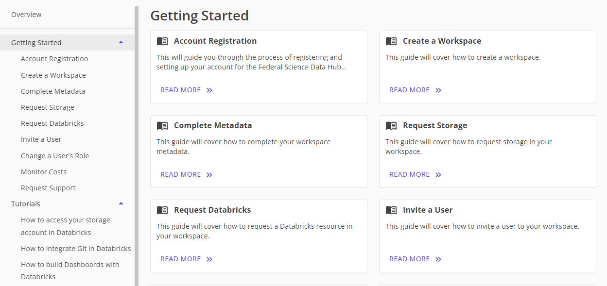
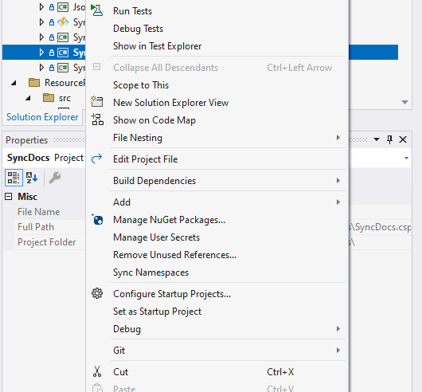
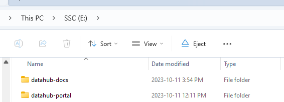
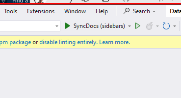
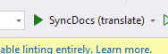

# Updating the documentation

This document covers the process ofr update the documentation in FSDH DataHub.

## More pages

If you need more pages, you can simply create more markdown files in the datahub-docs directory. 

The directory structure has the main documentation guides:
- **DeveloperGuide:** Covers the .net DataHub solution and terraform
- **UserGuide:** Contains the files visible in "Resources" in the portal
- **AdminGuide:** This guide is for the FSDH Team and provides documentation for common tasks.

## Docsify Style

DataHub follow the same markdown and structure as Docsify. The documentation is rendered in the portal and also can be exported as HTML using Docsify.

## Sidebars

The navigation and structure in docsify and in the portal leverages files called `_sidebar.md`

### Manually generated sidebars

To curate the content inside the resources, the sidebar is manually generated and organized. `UserGuide` has a manually generated `_sidebar.md`

```md
- [Federal Science DataHub User Guide](/UserGuide/User-Guide.md)

- Getting Started
  - [Account Registration](/UserGuide/Preregistration/Preregistration.md)
  - [Create a Workspace](/UserGuide/GettingStarted/Creating-a-workspace.md)
...

- Tutorials
  - [How to access your storage account in Databricks](/UserGuide/Databricks/Access-your-storage-account-in-Databricks.md)
  ...
```

this is rendered in the portal as



To prevent automatic generation of the sidebar, a file called `_sidebar.md.yaml` contains 

```yaml
autogenerate: false
```

## SyncDocs Project

The SyncDoc project in the visual studio solution is used to:
- Auto generate sidebars (for sidebars that have `autogenerate: true` in yaml)
- Generate suggested translation

### Running SyncDocs 

This can be executed from the command line but the pre-defined launch settings can be used.

Right click project and select "Set as Startup Project"



The pre-defined launch settings assume that the folder structure is the following:



### Step 1: Update sidebars

Select the configuration "SyncDocs (sidebars)" in the toolbar and execute it. 



### Step 2: Update suggested translations

To update the translations, select the configuration "SyncDocs (translate)" in the toolbar and execute it. This relies on the config.deepl.json file.

It is important to pull all changes from the documentation site, because a cache and manually edited translations are saved in `fr/translationcache.json`

The tool will delete all files in the `fr` directory and regenerate them.

### Glossary.csv

Custom translations can be added by editing `glossary.csv` in the main folder. This is where acronyms and other translations should be saved.



## config.deepl.json

``json
{
  "deepl": {
    "Key": "<key>",
    "UseFreeAPI":  true/false
  }
}
``

## Review process

DataHub follows the GoC language official guidelines and no changes to the documentation site should be done without proper review either through commit review or pull request.