# OIDC Flow with Provider Selection

This document illustrates the authentication flows where a user can select between GCCF and Azure Entra as their identity provider.

## Authentication Flows

### GCCF Authentication Flow

This diagram shows the flow when an external user uses GCCF to log in into FSDH after the invitation and onboarding processes have been completed.

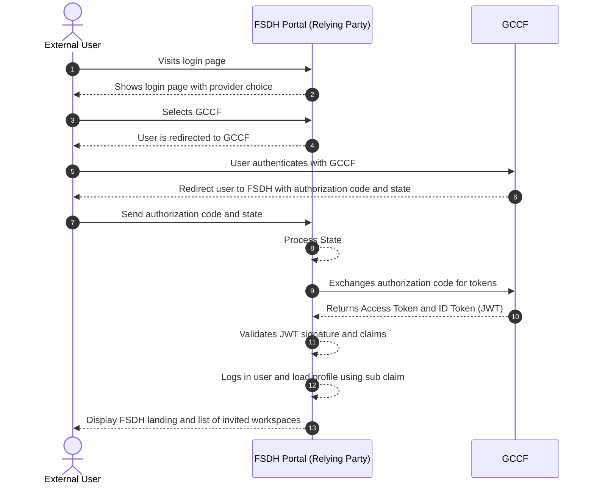

- Steps 1-3: The user starts at the FSDH Portal, sees provider choices, and selects GCCF.
- Steps 4-5: The portal redirects the user to GCCF to handle authentication.
- Steps 6-11: Standard OIDC workflow between GCCF and FSDH portal
- Step 12: Portal logs the user using the `sub` claim from GCCF
- Step 13: The portal displays the landing page with invited workspaces.

### Azure Entra Authentication Flow

This diagram shows the direct authentication flow for guest users via Azure Entra.

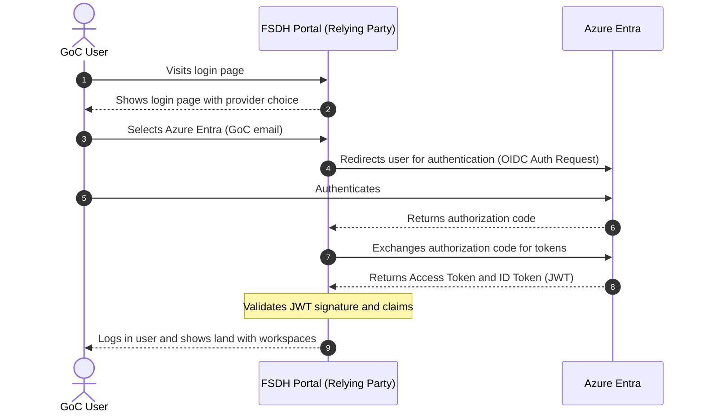

- Steps 1-3: The user starts at the FSDH Portal, sees provider choices, and selects Azure Entra.
- Steps 4-6: The portal redirects to Azure Entra, the user authenticates, and an authorization code is returned.
- Steps 7-8: The FSDH Portal exchanges the code for an Access Token and an ID Token.
- Step 9: The portal shows the landing page with workspaces.

### Validation Process

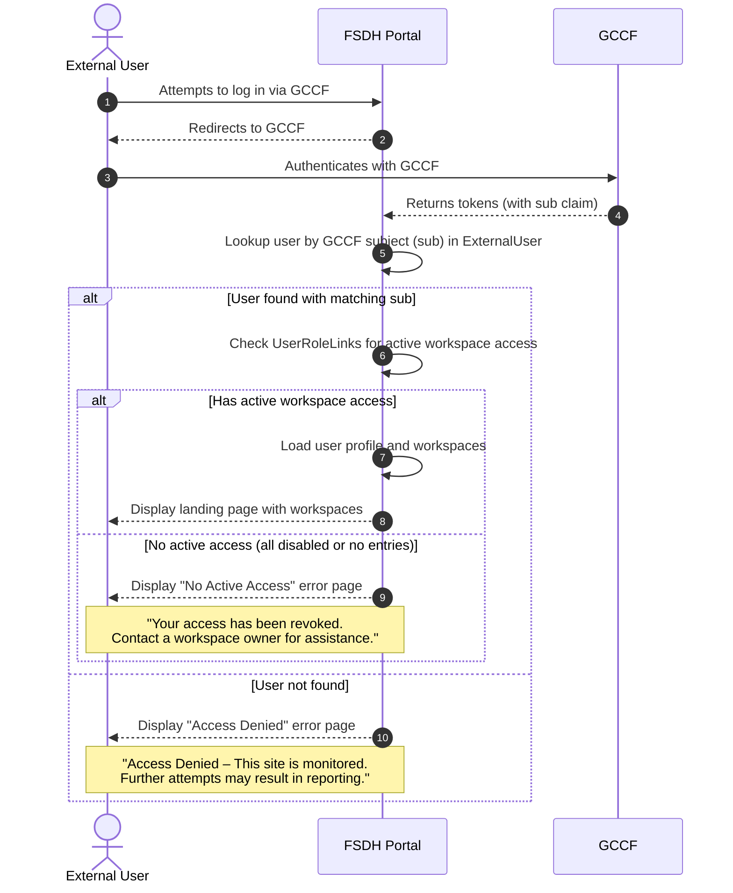

- Steps 1-4: The user authenticates via GCCF and the portal receives tokens with the `sub` claim.
- Step 5: The portal looks up the user by the GCCF subject in the ExternalUser table.
- Step 6: If the user is found, the portal checks for active UserRoleLinks entries.
- Steps 7-8: If the user has at least one active workspace access, the profile and workspaces are loaded and the landing page is displayed.
- Step 9: If the user exists but has no active access (all UserRoleLinks are disabled or no entries exist), a "No Active Access" error page is shown.
- Step 10: If no matching user is found, an "Access Denied" error page is shown with a warning message.

This validation ensures that only users who have completed the invitation and onboarding process and have active workspace access can use FSDH via GCCF.

## Logout and Session Management

### FSDH Logout Flow

This diagram shows the front channel sign out flow with the relying party and GCCF as OpenID provider.

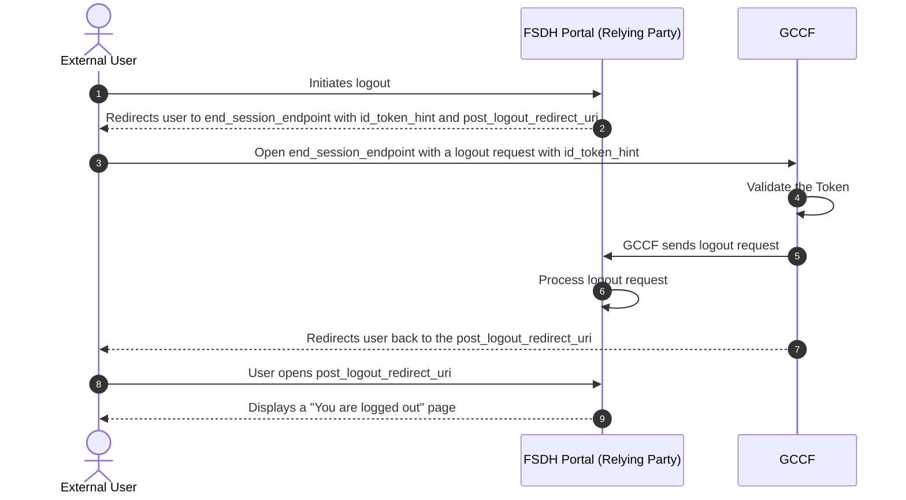

- Step 1: The user clicks the logout button in the FSDH Portal.
- Steps 2-3: The portal redirects the user to the `end_session_endpoint` at GCCF, including an `id_token_hint` to identify the user's session.
- Steps 4-5: GCCF validates the token, requests logout, and sends a logout request to the relying party.
- Step 6: The portal initiates local session cookies and data cleanup.
- Step 7-8: GCCF redirects the user back to the `post_logout_redirect_uri` specified by the FSDH Portal.
- Step : The user sees a page confirming they have been successfully logged out.

## User Invitation & Onboarding

### New External User Invitation Flow

This diagram illustrates how a workspace owner can invite a new external user to the FSDH Portal. This flow is used when the external user has not yet been validated (i.e., has no GCCF subject associated with their profile).

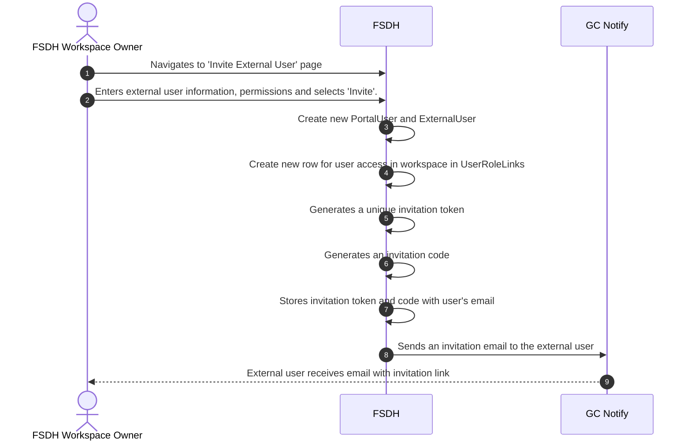

- Step 1: A new page in the portal lets workspace owners invite external users
- Step 2: The workspace owner enters the external user's email and selects Invite;
- Step 3: The portal checks if an external user with the same email already exists in FSDH.
- Steps 4-5: If the user does not exist, a new PortalUser and ExternalUser are created; otherwise, the existing records are reused.
- Step 6: A new UserRoleLink is created for the workspace access.
- Steps 7-9: The portal generates a unique, single-use invitation token and code, stored with the invitee's details.
- Steps 10-11: The system sends an invitation email through GC Notify; the external user receives it with the link.

## User Onboarding

### External User Onboarding Flow

This diagram shows how an external user signs in for the first time using the invitation link and associates their email with the anonymous GCCF identity. It also accounts for the case where a disabled entry already exists in the ExternalUser table with the same GCCF user ID (e.g., from a previous deactivation or re-enrollment scenario).

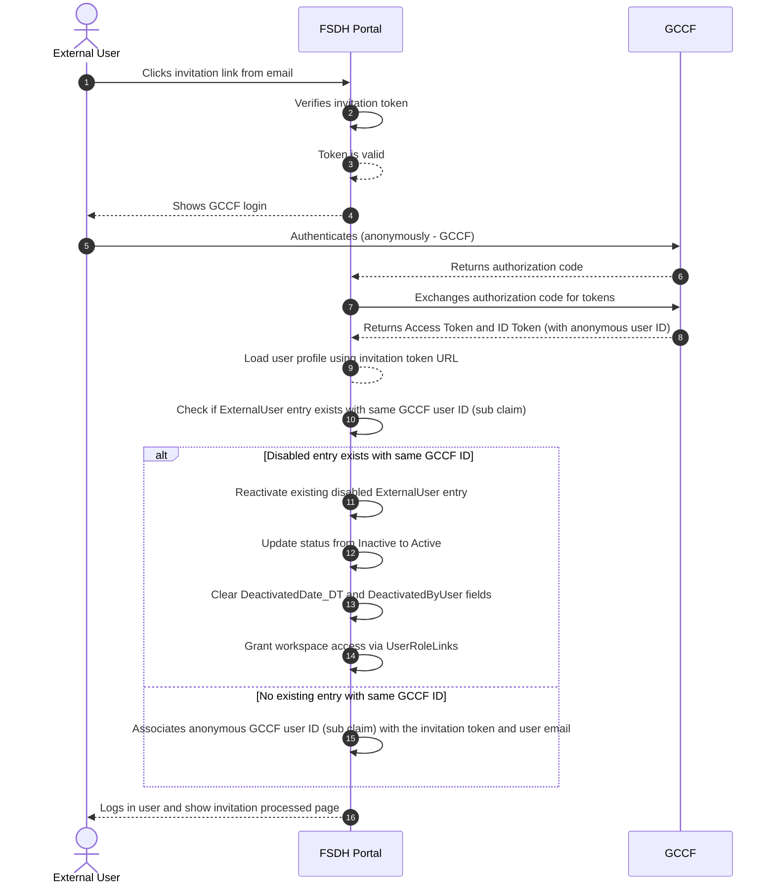

- Step 1: The external user clicks the invitation link from their email.
- Steps 2-3: The FSDH Portal verifies the invitation token; if valid, processing continues.
- Steps 4-5: The portal shows GCCF login and the user authenticates (anonymous GCCF identity).
- Steps 6-8: GCCF returns an authorization code; the portal exchanges it and receives tokens including the anonymous user ID.
- Step 9: The portal loads the user profile using the invitation token URL.
- Step 10: The portal checks if an ExternalUser entry already exists with the same GCCF user ID (sub claim).
- Steps 11-14 (Disabled entry exists): If a disabled ExternalUser entry is found with the matching GCCF ID, the system reactivates it by updating its status from Inactive to Active, clearing the DeactivatedDate_DT and DeactivatedByUser fields, and restoring workspace access via UserRoleLinks.
- Step 15 (No existing entry): If no existing entry is found with the same GCCF ID, the system creates a new association between the GCCF user ID and the invitation token and user email.
- Step 16: The user is logged in and sees the invitation processed page.

**Note:** This flow handles re-enrollment scenarios where a user previously had an inactive account with the same GCCF identity. By checking for and reactivating disabled entries, the system maintains a clear audit trail while allowing users to regain access without requiring admin intervention.

### Invitation Code Entry Flow (after onboarding)

This diagram shows how the external user, now authenticated and viewing the "Invitation processed" page, enters the invitation code to complete access to the target workspace. Note: the invitation code shares the same expiry as the invitation; no separate code expiry check is required. The invitation context is already present (looked up using the token in the invitation URL) before the page is shown, so the code is validated against that context.

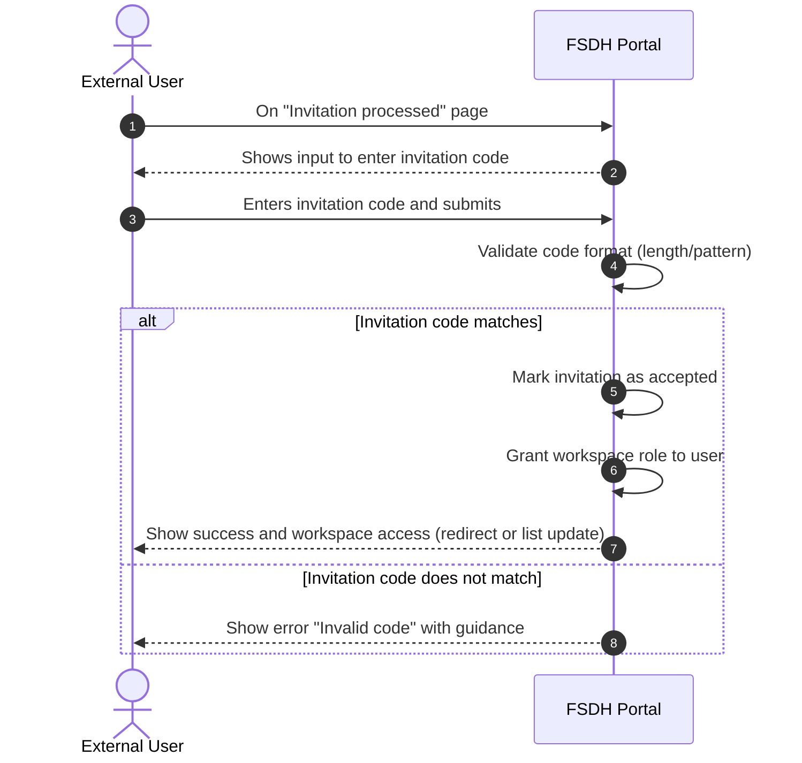

- Steps 1-3: The user, already authenticated, lands on the invitation processed page and submits the invitation code.
- Steps 4-5: The portal performs basic validation; the invitation context was already fetched before rendering this page (no lookup by code at submit time).
- Steps 6-9: If the submitted code matches the invitation’s stored code, the system uses the preloaded invitation context tied to the user’s profile; if not yet accepted, the invite is marked accepted and workspace access is granted.
- Step 10: The user sees a confirmation and either gets redirected into the workspace or sees their workspace list updated.
- Already accepted: The portal shows the same 'Invitation Expired' page as the expired invitation flow.
- Error path: If the code is invalid (does not match), the portal displays an actionable error and asks the user to contact the workspace owner for a new invitation.

### Expired & Accepted Invitation Flow

This diagram shows what happens when a user tries to use an expired, invalid or already accepted invitation link.

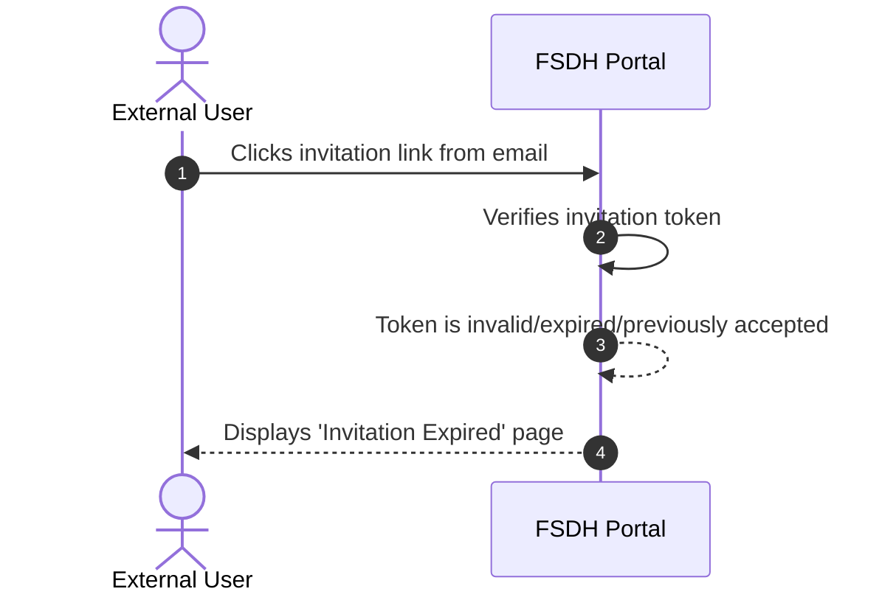

- Step 1: The external user clicks an expired or invalid invitation link.
- Steps 2-3: The FSDH Portal verifies the invitation token and finds it is invalid or expired.
- Step 4: The user is shown a page indicating that the invitation has expired.
- Follow-up: The user needs to contact the workspace owner to request a new invitation

## Identity Management

### GCCF Identity Reassociation Flow (Re-enrollment)

When an external user loses access to their original GCCF credentials or needs to use a different GCCF account, the identity reassociation process reuses the existing invitation flow:

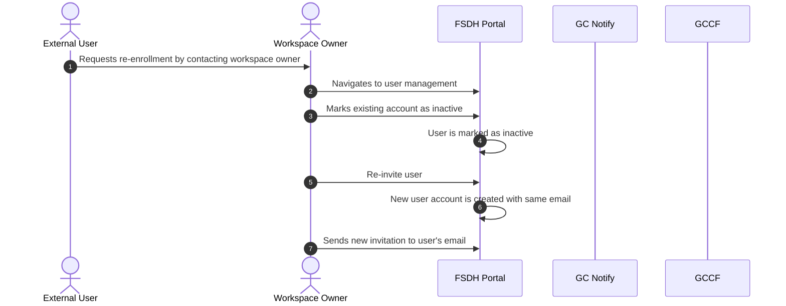

- Step 1: The external user contacts a workspace owner to request re-enrollment.
- Step 2: The workspace owner navigates to user management.
- Step 3: The workspace owner marks the existing account as inactive.
- Step 4: The user is marked as inactive (GCCF subject is retained, DeactivatedDate_DT and DeactivatedByUser field are populated to mark the row as inactive)
- Step 5: The workspace owner re-invites the user.
- Step 6: A new user account is created with the same email.
- Step 7: The workspace owner sends a new invitation to the user's email.

After receiving the invitation, the user follows the standard [External User Onboarding Flow](#external-user-onboarding-flow) and [Invitation Code Entry Flow](#invitation-code-entry-flow-after-onboarding) to complete the re-enrollment process with their new GCCF credentials. The new GCCF subject will be associated with the new user account, while the old account retains the original GCCF subject for audit purposes.

This approach avoids creating a separate reassociation token mechanism and leverages the security and validation already built into the invitation flow.

The data model uses a 1 to n link from `ExternalUserInvitation` to `PortalUser`.

**Expected cases per year:** 5% of all external users

### External User Email Change Flow

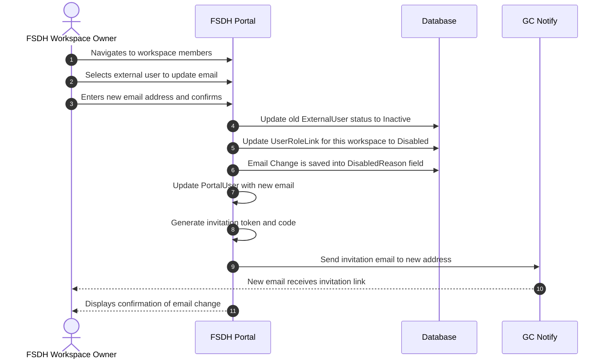

- Steps 1-3: The workspace owner navigates to workspace members, selects the user, and enters the new email address.
- Steps 4-5: The old account is deactivated: ExternalUser status set to Inactive (GCCF subject retained for audit), and UserRoleLink disabled.
- Step 6: The change is recorded for audit purposes, including the previous email address.
- Steps 8-9: A new PortalUser and ExternalUser are created with the new email; a new UserRoleLink is created with the same workspace role.
- Steps 10-11: An invitation token and code are generated; an invitation email is sent to the new address.
- Step 12: The owner sees a confirmation that the email has been changed and the invitation sent.

The user must complete the standard onboarding flow with the new email to regain access. The old email account cannot be used to log in. Previous email is kept in `UserInvitation` history.

**Expected cases per year:** 10% of all external users

### Alternative Approaches to Email Changes

The following approaches were considered:

| Initiator             | Approach                      | Description                                                                     | Issues                                                                                                                                                 |
| --------------------- | ----------------------------- | ------------------------------------------------------------------------------- | ------------------------------------------------------------------------------------------------------------------------------------------------------ |
| FSDH Admin            | **In-place email update**     | Update the email field directly on the existing PortalUser/ExternalUser records | If user has access to multiple workspaces, all workspace owners would need to agree to the change; GCCF subject remains linked to a different identity |
| Workspace Owner       | **Soft migration with alias** | Keep old record active and add new email as an alias                            | Complexity in identity resolution; potential for duplicate logins; unclear which email receives notifications                                          |
| External Collaborator | **Self-service email change** | Let users change their own email after verification                             | Requires recovery system with encrypted answers and cryptographic keys. Creates security risk if user's original email is compromised                  |

The chosen approach (disable old account + new invitation) ensures:

- Clear audit trail with distinct records for each email
- Each workspace owner controls their own user list
- GCCF identity is properly re-associated with the new email
- No ambiguity about which account is active

## User Access Management

### External User Workspace Deactivation Flow

This diagram shows how a workspace owner can remove an external user's access to a specific workspace without affecting their access to other workspaces.

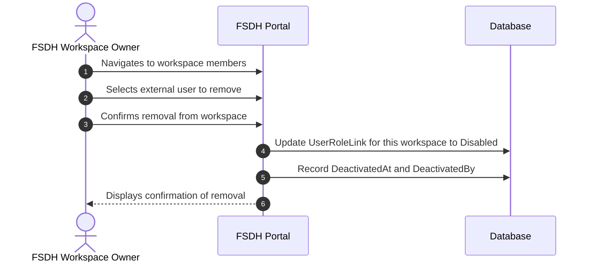

- Steps 1-3: The workspace owner navigates to workspace members, selects the external user, and confirms removal.
- Step 4: The `UserRoleLink` for this specific workspace is updated to `Disabled`.
- Step 5: The deactivation timestamp and actor are recorded for audit purposes.
- Step 6: The owner sees a confirmation that the user has been removed from the workspace.

The user's GCCF identity and access to other workspaces remain intact. If the user has no remaining active workspace access, they will see the "No Active Access" error page on login.

### External User Global Deactivation Flow

This diagram shows how an FSDH admin can globally deactivate an external user, preventing access to all workspaces and removing the GCCF identity link.

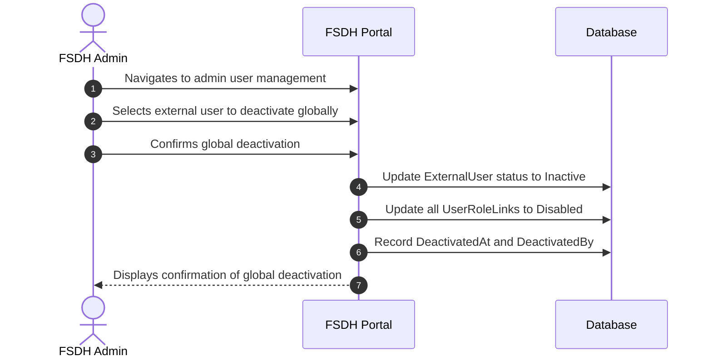

- Steps 1-3: The admin navigates to user management, selects the external user, and confirms global deactivation.
- Step 4: The portal sets the ExternalUser status to Inactive (GCCF subject is retained for audit purposes).
- Step 5: All `UserRoleLink` records for this user across all workspaces are updated to `Disabled`.
- Step 6: The deactivation timestamp and actor are recorded for audit purposes.
- Step 7: The admin sees a confirmation that the user has been globally deactivated.

Once globally deactivated, the user cannot log in or access any workspaces. The GCCF subject is retained for audit trail purposes. To reactivate, an admin must send a new invitation and a workspace owner must restore workspace roles.

## Data Models & Troubleshooting

### Data elements for external users

The following data elements are required for inviting, authenticating, onboarding, and managing access for external users in the FSDH Portal when using GCCF.

### Invitation and linking (FSDH-managed)

| Element          | Purpose / Usage                      | Notes                                  |
| ---------------- | ------------------------------------ | -------------------------------------- |
| Invitation Token | Unique, single-use link token        | Embedded in invite URL                 |
| Invitation Code  | Short code entered in portal         | Separate from link token               |
| Invited Email    | Email address the invitation targets | Linked to authenticated user           |
| Expires At       | Invitation expiry timestamp          |                                        |
| Invited By       | Inviter (workspace owner)            | Internal identifier                    |
| Workspace        | Target workspace                     |                                        |
| Invite Status    | Invite lifecycle state               | invited / accepted / expired / revoked |

### External user profile (stored by FSDH)

| Element                  | Purpose / Usage                                                 | Notes                           |
| ------------------------ | --------------------------------------------------------------- | ------------------------------- |
| GCCF Identity (Subject)  | Link to GCCF identity                                           | Persist `sub`                   |
| First Name               | Identity of the user                                            |                                 |
| Last Name                | Identity of the user                                            |                                 |
| Affiliation              | Notes on the relation between workspace owner and external user |                                 |
| Collaboration Objective  | Type of collaboration expected with the user                    |                                 |
| Primary Email            | Email associated with the user                                  |                                 |
| Status                   | Access state                                                    | active / disabled (with reason) |
| Preferred Language       | UX localization                                                 | en / fr                         |
| Organization             | Context / affiliation                                           | Collected if available          |
| Terms of Use Version     | Track Terms of Use consent                                      | Enforce before access           |
| Terms of Use Accepted At | Timestamp of consent                                            |                                 |
| Last Login               | Last successful authentication                                  |                                 |
| Account Expiry           | Expiration date                                                 | 1 year + renewal option?        |

### Duplicate entries for the same user

In some cases, duplicate entries for the same user may exist in the `PortalUser` table (e.g. email changes or re-invitation).

To query all events related to a specific user (by email address), use the following query to trace the complete history of actions:

```kusto
let userEmail = "user@example.com";
AppTraces
| where TimeGenerated > ago(90d)
| where Message has userEmail
| project TimeGenerated, OperationId, SeverityLevel, Message
| order by TimeGenerated desc
```

To get the full request context for a specific operation, use the `OperationId` from the results above:

```kusto
let operationId = "<OperationId from previous query>";
AppTraces
| where TimeGenerated > ago(90d)
| where OperationId == operationId
| project TimeGenerated, SeverityLevel, Message
| order by TimeGenerated asc
```

This query helps identify when duplicate user records were created, the operation context, and the email addresses involved. Cross-reference the `OperationId` with other application logs to trace the full request flow and determine the root cause.
