# OIDC Flow with Provider Selection

This document illustrates the authentication flows where a user can select between GCCF and Azure Entra as their identity provider.

## Authentication Flows

### GCCF Authentication Flow

This diagram shows the flow when an external user uses GCCF to log in into FSDH after the invitation and onboarding processes have been completed.

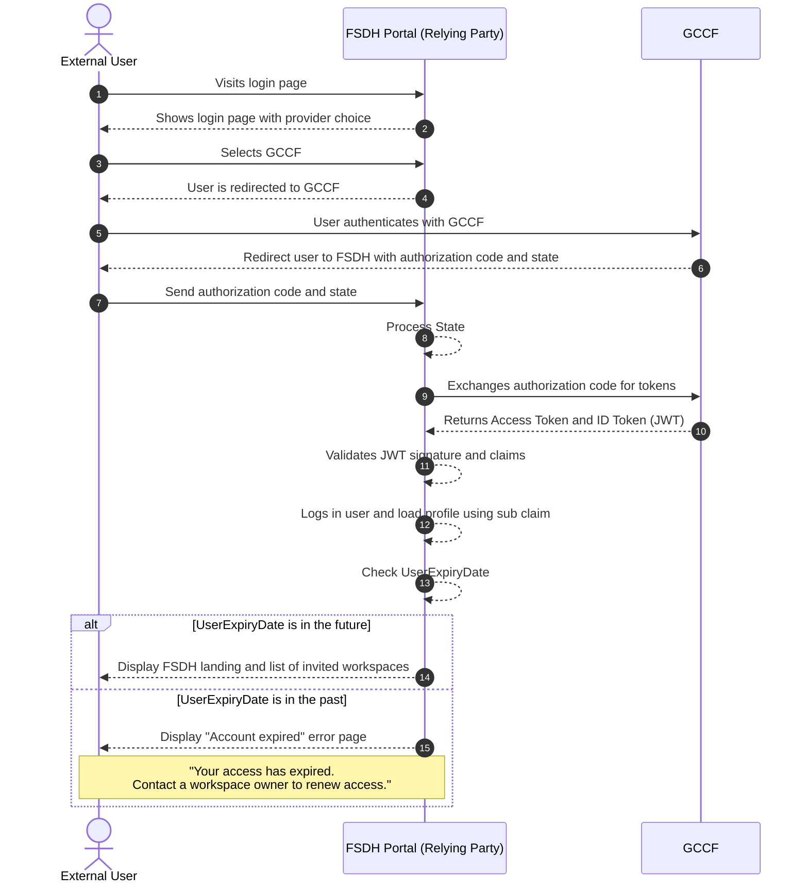

- Steps 1-3: The user starts at the FSDH Portal, sees provider choices, and selects GCCF.
- Steps 4-5: The portal redirects the user to GCCF to handle authentication.
- Steps 6-11: Standard OIDC workflow between GCCF and FSDH portal.
- Step 12: Portal logs the user using the `sub` claim from GCCF.
- Steps 13-15: The portal checks `UserExpiryDate`; if it is in the future or unset, the landing page is shown. If it is in the past, an "Account expired" message is shown with guidance to contact a workspace owner for renewal.

### Azure Entra Authentication Flow

This diagram shows the direct authentication flow for guest users via Azure Entra.

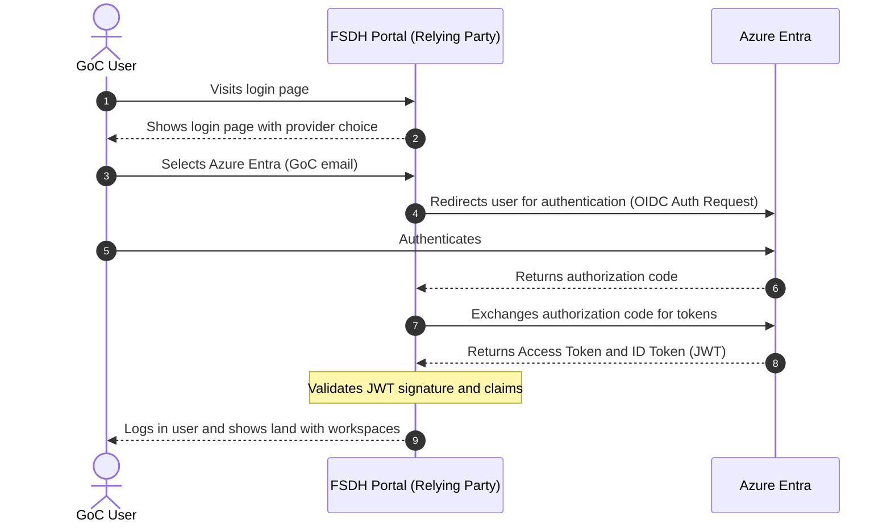

- Steps 1-3: The user starts at the FSDH Portal, sees provider choices, and selects Azure Entra.
- Steps 4-5: The portal redirects to Azure Entra and the user authenticates.
- Step 6: An authorization code is returned.
- Steps 7-8: The FSDH Portal exchanges the code for an Access Token and an ID Token.
- Step 9: The portal validates the JWT signature and claims.
- Step 10: The portal shows the landing page with workspaces.

### Validation Process

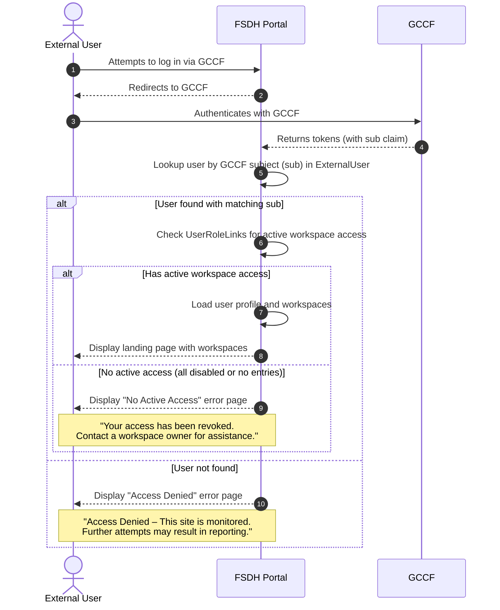

- Steps 1-4: The user authenticates via GCCF and the portal receives tokens with the `sub` claim.
- Step 5: The portal looks up the user by the GCCF subject in the [ExternalUser](../Database/ExternalUser.md) table.
- Step 6: If the user is found, the portal checks for active UserRoleLinks entries.
- Steps 7-8: If the user has at least one active workspace access, the profile and workspaces are loaded and the landing page is displayed.
- Step 9: If the user exists but has no active access (all UserRoleLinks are disabled or no entries exist), a "No Active Access" error page is shown.
- Step 10: If no matching user is found, an "Access Denied" error page is shown with a warning message.

This validation ensures that only users who have completed the invitation and onboarding process and have active workspace access can use FSDH via GCCF.

## Logout and Session Management

### FSDH Logout Flow

This diagram shows the front channel sign out flow with the relying party and GCCF as OpenID provider.

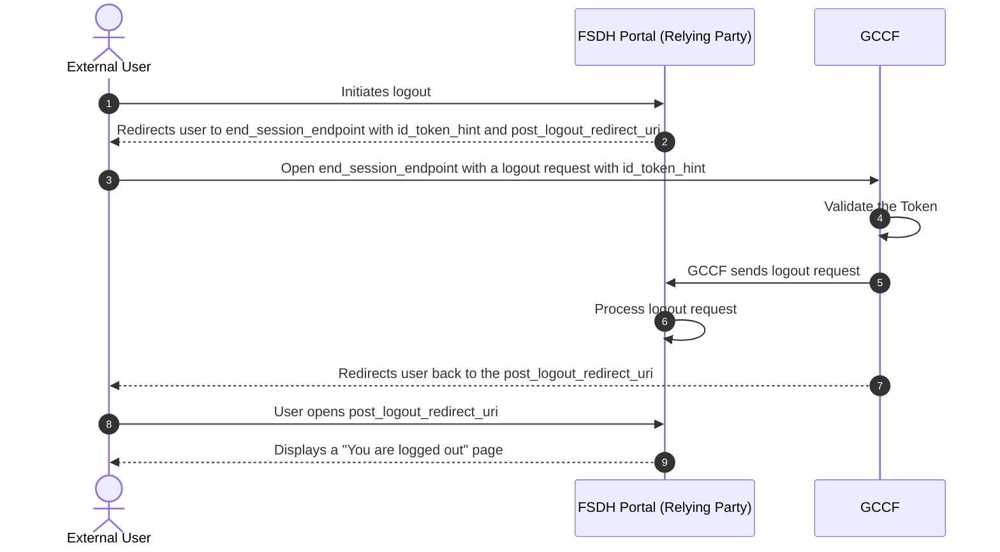

- Step 1: The user clicks the logout button in the FSDH Portal.
- Step 2: The portal redirects the user to the `end_session_endpoint` at GCCF, including an `id_token_hint` to identify the user's session.
- Step 3: The user opens the `end_session_endpoint` with a logout request.
- Step 4: GCCF validates the token.
- Step 5: GCCF sends a logout request to the relying party.
- Step 6: The portal processes the logout request and cleans up session cookies and data.
- Step 7: GCCF redirects the user back to the `post_logout_redirect_uri` specified by the FSDH Portal.
- Step 8: The user opens the `post_logout_redirect_uri`.
- Step 9: The user sees a page confirming they have been successfully logged out.

## User Invitation & Onboarding

### New External User Invitation Flow

This diagram illustrates how a workspace owner can invite a new external user to the FSDH Portal. This flow is used when the external user has not yet been validated (i.e., has no GCCF subject associated with their profile).

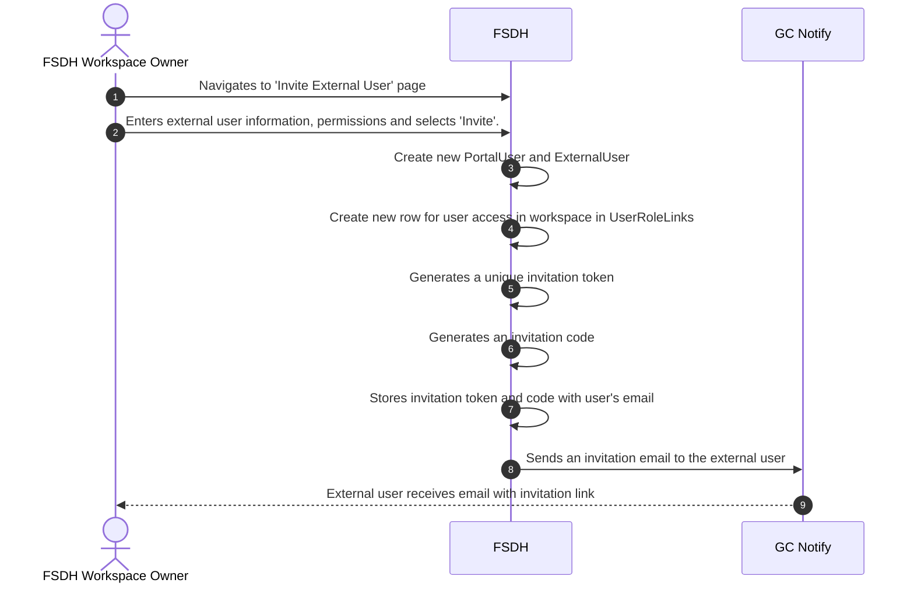

- Step 1: The workspace owner navigates to the 'Invite External User' page.
- Step 2: The workspace owner enters the external user's information, permissions, and selects 'Invite'.
- Step 3: A new [PortalUser](../Database/PortalUser.md) and [ExternalUser](../Database/ExternalUser.md) are created.
- Step 4: A new UserRoleLink is created for the user's access to the workspace.
- Step 5: A unique invitation token is generated.
- Step 6: An invitation code is generated.
- Step 7: The invitation token and code are stored with the user's email in [ExternalUserInvitation](../Database/ExternalUserInvitation.md).
- Step 8: An invitation email is sent to the external user through GC Notify.
- Step 9: The external user receives the email with the invitation link.

## User Onboarding

### External User Onboarding Flow

This diagram shows how an external user signs in for the first time using the invitation link and associates their email with the anonymous GCCF identity. It also accounts for the case where a disabled entry already exists in the ExternalUser table with the same GCCF user ID (e.g., from a previous deactivation or re-enrollment scenario).

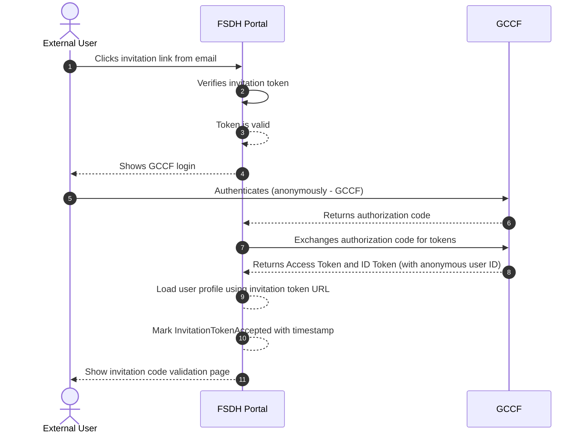

- Step 1: The external user clicks the invitation link from their email.
- Step 2: The FSDH Portal verifies the invitation token in [ExternalUserInvitation](../Database/ExternalUserInvitation.md).
- Step 3: If valid, the token verification succeeds and processing continues.
- Step 4: The portal shows the GCCF login page.
- Step 5: The user authenticates with GCCF (anonymous GCCF identity).
- Step 6: GCCF returns an authorization code.
- Step 7: The portal exchanges the authorization code for tokens.
- Step 8: GCCF returns Access Token and ID Token with the anonymous user ID.
- Step 9: The portal loads the user profile using the invitation token URL.
- Step 10: The portal marks the InvitationTokenAccepted timestamp.
- Step 11: The user is shown the invitation code validation page.

**Note:** This flow handles re-enrollment scenarios where a user previously had an inactive account with the same GCCF identity. By checking for and reactivating disabled entries, the system maintains a clear audit trail while allowing users to regain access without requiring admin intervention.

### Invitation Code Validation

This diagram shows how the external user, now authenticated and viewing the "Invitation code validation" page, enters the invitation code to complete access to the target workspace. Note: the invitation code shares the same expiry as the invitation; no separate code expiry check is required. The invitation context is already present (looked up using the token in the invitation URL) before the page is shown, so the code is validated against that context.

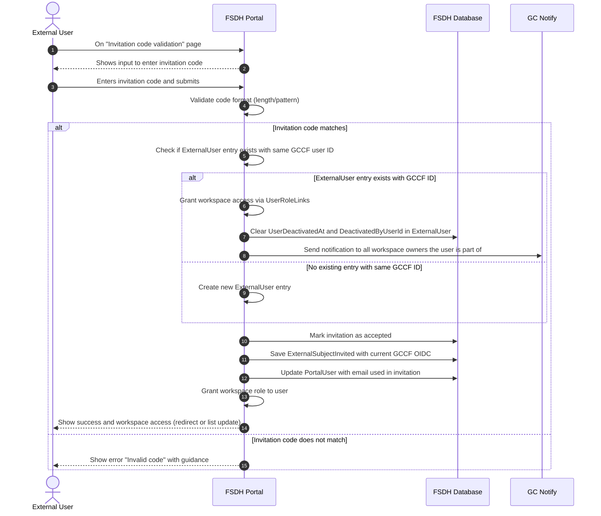

- Step 1: The user is on the 'Invitation code validation' page.
- Step 2: The portal shows the input field to enter the invitation code.
- Step 3: The user enters the invitation code and submits.
- Step 4: The portal validates the code format (length and pattern).
- Steps 5-13 (Code matches): If the code matches, the portal checks if an ExternalUser entry exists with the same GCCF user ID. If it exists, workspace access is granted and deactivation fields are cleared (Steps 6-8). The invitation is then marked as accepted, the GCCF OIDC is saved, the PortalUser email is updated, and workspace role is granted (Steps 9-12). A notification is sent to all workspace owners (Step 13).
- Step 14: The user sees a success message and either gets redirected into the workspace or sees their workspace list updated.
- Error path: If the code does not match, the portal displays an error message asking the user to contact the workspace owner for a new invitation.

### Expired & Accepted Invitation Flow

This diagram shows what happens when a user tries to use an expired, invalid or already accepted invitation link.

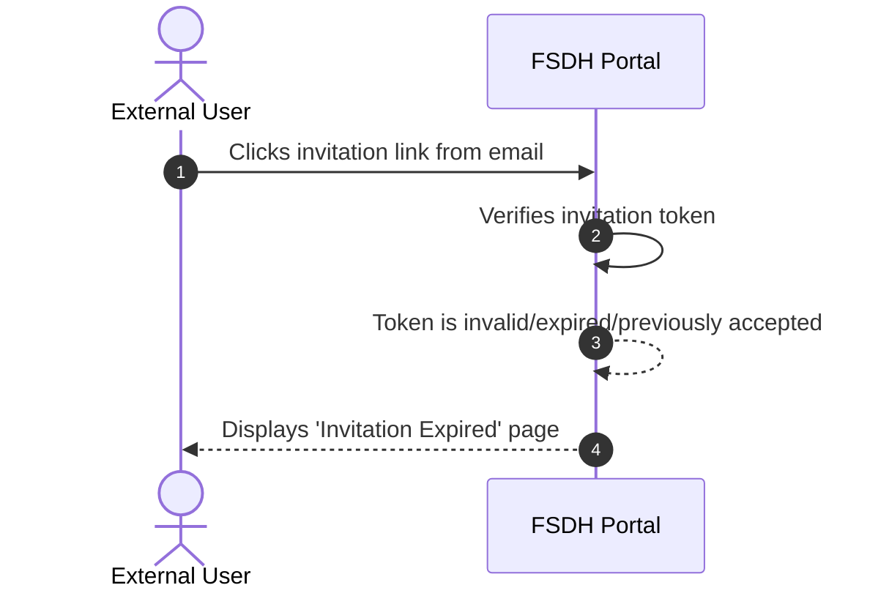

- Step 1: The external user clicks an expired or invalid invitation link.
- Step 2: The FSDH Portal verifies the invitation token.
- Step 3: The token is found to be invalid, expired, or previously accepted.
- Step 4: The user is shown a page indicating that the invitation has expired.
- Follow-up: The user needs to contact the workspace owner to request a new invitation.

## Identity Management

### GCCF Identity Reassociation Flow (Re-enrollment)

When an external user loses access to their original GCCF credentials or needs to use a different GCCF account, the identity reassociation process reuses the existing invitation flow:

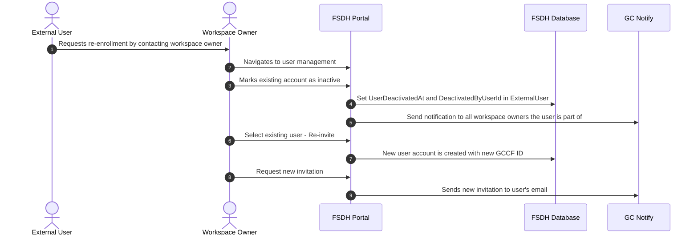

- Step 1: The external user contacts a workspace owner to request re-enrollment.
- Step 2: The workspace owner navigates to user management.
- Step 3: The workspace owner marks the existing account as inactive.
- Step 4: The [ExternalUser](../Database/ExternalUser.md) status is set to Inactive (GCCF subject is retained, DeactivatedAt and DeactivatedByUserId are populated).
- Step 5: A notification is sent to all workspace owners the user is part of.
- Step 6: The workspace owner selects the existing user and initiates re-invite.
- Step 7: A new user account is created with a new GCCF ID.
- Step 8: The workspace owner requests a new invitation.
- Step 9: The system sends a new invitation email to the user's email address via GC Notify.

After receiving the invitation, the user follows the standard [External User Onboarding Flow](#external-user-onboarding-flow) and [Invitation Code Entry Flow](#invitation-code-entry-flow-after-onboarding) to complete the re-enrollment process with their new GCCF credentials. During onboarding, a "Reactivated" event is recorded in [UserActivationHistory](../Database/UserActivationHistory.md) when the user's account status transitions back to Active. The new GCCF subject will be associated with the new user account, while the old account retains the original GCCF subject for audit purposes.

This approach avoids creating a separate reassociation token mechanism and leverages the security and validation already built into the invitation flow. The [UserActivationHistory](../Database/UserActivationHistory.md) table maintains a complete audit trail of all activation state changes for compliance and troubleshooting purposes.

The data model uses a 1 to n link from [ExternalUserInvitation](../Database/ExternalUserInvitation.md) to [PortalUser](../Database/PortalUser.md).

**Expected cases per year:** 5% of all external users

### External User Email Change Flow

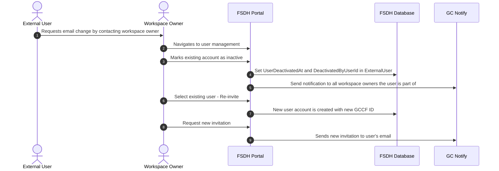

- Step 1: The external user requests an email change by contacting the workspace owner.
- Step 2: The workspace owner navigates to user management.
- Step 3: The workspace owner marks the existing account as inactive.
- Step 4: The [ExternalUser](../Database/ExternalUser.md) status is set to Inactive (GCCF subject retained for audit).
- Step 5: A notification is sent to all workspace owners the user is part of.
- Step 6: The workspace owner selects the existing user and initiates re-invite.
- Step 7: A new user account is created with a new GCCF ID.
- Step 8: The workspace owner requests a new invitation.
- Step 9: The system sends a new invitation email to the user's email address via GC Notify.

The user must complete the standard onboarding flow with the new email to regain access. The old email account cannot be used to log in. Previous email is kept in [ExternalUserInvitation](../Database/ExternalUserInvitation.md) history. The [UserActivationHistory](../Database/UserActivationHistory.md) table provides a complete audit trail showing when the old account was deactivated and when the new account is activated.

**Expected cases per year:** 10% of all external users

### Alternative Approaches to Email Changes

The following approaches were considered:

| Initiator             | Approach                      | Description                                                                     | Issues                                                                                                                                                 |
| --------------------- | ----------------------------- | ------------------------------------------------------------------------------- | ------------------------------------------------------------------------------------------------------------------------------------------------------ |
| FSDH Admin            | **In-place email update**     | Update the email field directly on the existing PortalUser/ExternalUser records | If user has access to multiple workspaces, all workspace owners would need to agree to the change; GCCF subject remains linked to a different identity |
| Workspace Owner       | **Soft migration with alias** | Keep old record active and add new email as an alias                            | Complexity in identity resolution; potential for duplicate logins; unclear which email receives notifications                                          |
| External Collaborator | **Self-service email change** | Let users change their own email after verification                             | Requires recovery system with encrypted answers and cryptographic keys. Creates security risk if user's original email is compromised                  |

The chosen approach (disable old account + new invitation) ensures:

- Clear audit trail with distinct records for each email
- Each workspace owner controls their own user list
- GCCF identity is properly re-associated with the new email
- No ambiguity about which account is active

## User Access Management

### External User Workspace Deactivation Flow

This diagram shows how a workspace owner can remove an external user's access to a specific workspace without affecting their access to other workspaces.

- Step 1: The workspace owner navigates to workspace members.
- Step 2: The workspace owner selects the external user to remove.
- Step 3: The workspace owner confirms removal from the workspace.
- Step 4: The `UserRoleLink` for this specific workspace is updated to `Disabled`.
- Step 5: The deactivation timestamp and actor (DeactivatedAt and DeactivatedBy) are recorded for audit purposes.
- Step 6: The owner sees a confirmation that the user has been removed from the workspace.

The user's GCCF identity and access to other workspaces remain intact. If the user has no remaining active workspace access, they will see the "No Active Access" error page on login.

### External User Global Deactivation Flow

This diagram shows how an FSDH admin can globally deactivate an external user, preventing access to all workspaces and removing the GCCF identity link.

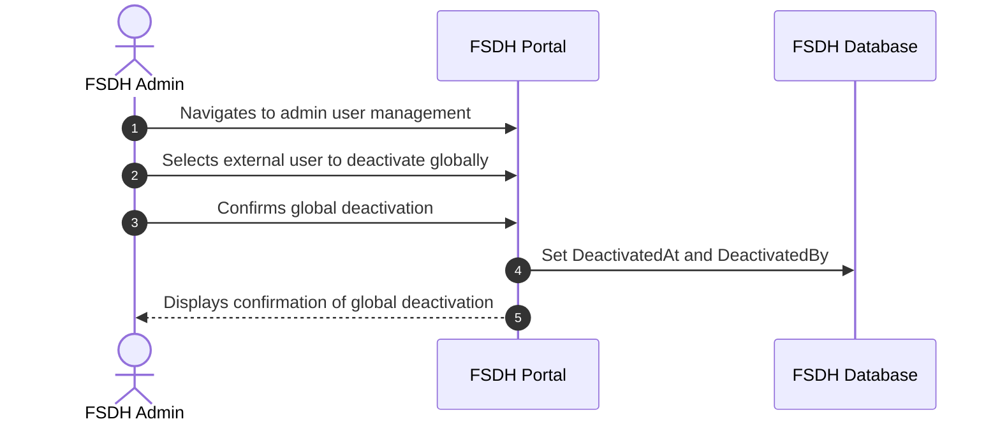

- Step 1: The admin navigates to admin user management.
- Step 2: The admin selects the external user to deactivate globally.
- Step 3: The admin confirms global deactivation.
- Step 4: The [ExternalUser](../Database/ExternalUser.md) status is updated to Inactive (GCCF subject is retained for audit purposes).
- Step 5: All `UserRoleLink` records for this user across all workspaces are updated to `Disabled`.
- Step 6: The deactivation timestamp and actor are recorded in the database for audit purposes.
- Step 7: The admin sees a confirmation that the user has been globally deactivated.

Once globally deactivated, the user cannot log in or access any workspaces. The GCCF subject is retained in [ExternalUser](../Database/ExternalUser.md) for audit trail purposes. To reactivate, an admin must send a new invitation and a workspace owner must restore workspace roles.

## Data Models & Troubleshooting

### Data Model Overview

The external user management system relies on several key database tables. For comprehensive schema details, column specifications, and design rationale, refer to the following database documentation:

- **[ExternalUser](../Database/ExternalUser.md)** - Represents external users linked to the portal. Stores GCCF object identifier (OID), login timestamps, deactivation status, and relationships to portal users and invitations.

- **[ExternalUserInvitation](../Database/ExternalUserInvitation.md)** - Tracks the complete invitation lifecycle for external users. Stores invitation tokens, codes, expiry dates, and dual-verification timestamps (token and code acceptance).

- **[PortalUser](../Database/PortalUser.md)** - Central identity hub within the Datahub portal. Aggregates user profile information, activity tracking, and relationships to external identities.

- **[UserActivationHistory](../Database/UserActivationHistory.md)** - Immutable audit log of all activation and deactivation events. Provides complete reconstruction of a user's access lifecycle for compliance and troubleshooting.

### Key Design Principles

- **GCCF-keyed external users**: The external user data model is keyed on the GCCF ID (`OID`), with only one active record per user at any given time. `PortalUser` will be associated with a single `ExternalPortalUser` which represents the active entity.
- **Email history tracking**: Email addresses are recorded in [ExternalUserInvitation](../Database/ExternalUserInvitation.md) for each invitation. When email changes occur, multiple invitations exist for the same user; the most recent email in [PortalUser](../Database/PortalUser.md) represents the current address.
- **Activation history**: Since users can be activated and deactivated multiple times, the [UserActivationHistory](../Database/UserActivationHistory.md) table maintains an immutable audit trail of all state changes.
