# OIDC Flow with Provider Selection

This document illustrates the authentication flows where a user can select between GCCF and Azure Entra as their identity provider.

## GCCF Authentication Flow

This diagram shows the flow when an external user uses GCCF to log in into FSDH after the invitation and onboarding processes have been completed.

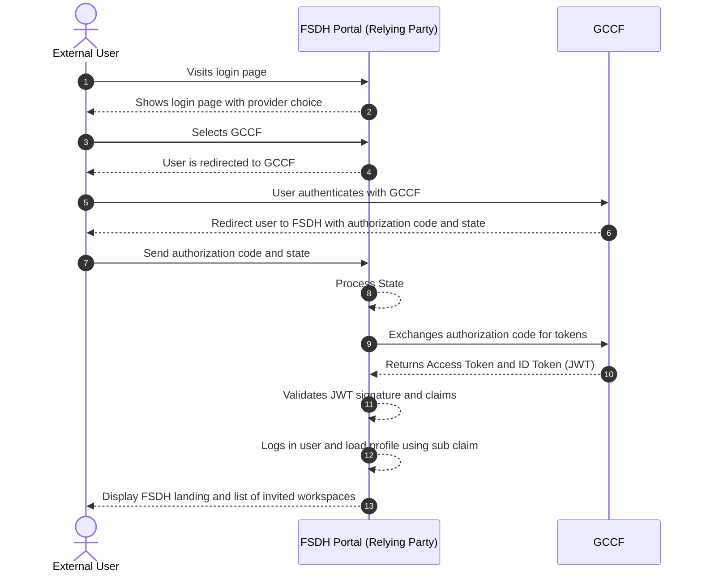

- Steps 1-3: The user starts at the FSDH Portal, sees provider choices, and selects GCCF.
- Steps 4-5: The portal redirects the user to GCCF to handle authentication.
- Steps 6-11: Standard OIDC workflow between GCCF and FSDH portal
- Step 12: Portal logs the user using the `sub` claim from GCCF
- Step 13: The portal displays the landing page with invited workspaces.

## External User Login Validation

This diagram shows the validation performed when an external user attempts to log in to FSDH using GCCF. If the GCCF subject is not associated with an existing user profile, or the user has no active workspace access, access is denied.

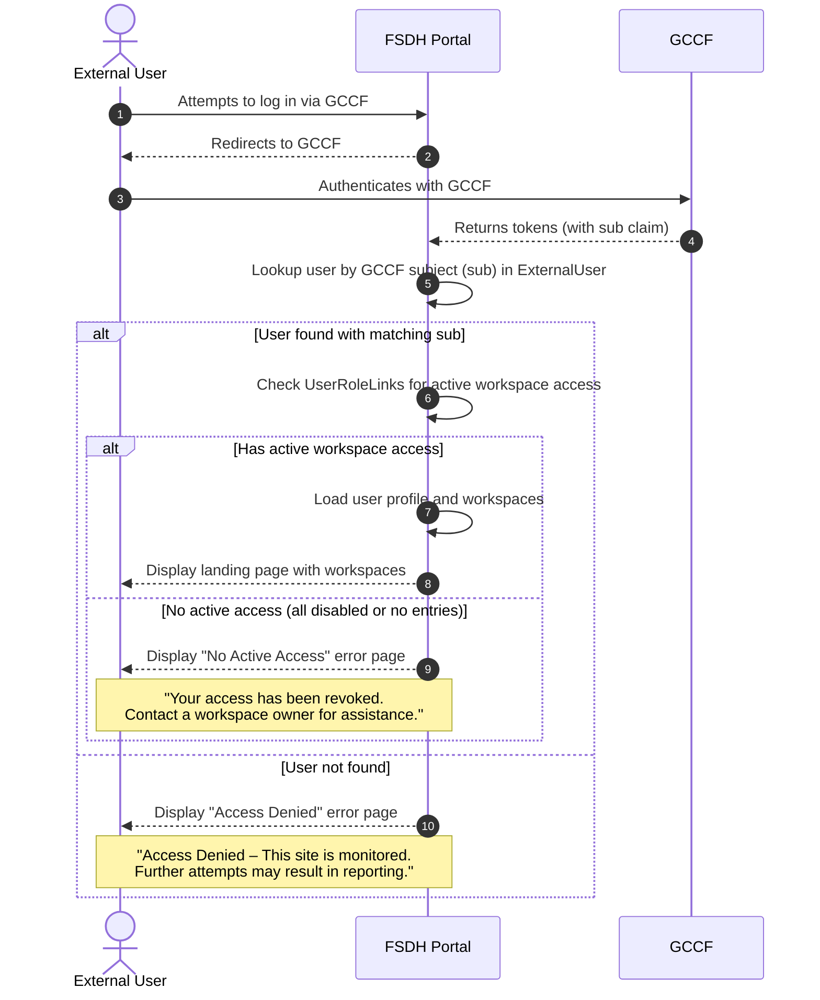

- Steps 1-4: The user authenticates via GCCF and the portal receives tokens with the `sub` claim.
- Step 5: The portal looks up the user by the GCCF subject in the ExternalUser table.
- Step 6: If the user is found, the portal checks for active UserRoleLinks entries.
- Steps 7-8: If the user has at least one active workspace access, the profile and workspaces are loaded and the landing page is displayed.
- Step 9: If the user exists but has no active access (all UserRoleLinks are disabled or no entries exist), a "No Active Access" error page is shown.
- Step 10: If no matching user is found, an "Access Denied" error page is shown with a warning message.

This validation ensures that only users who have completed the invitation and onboarding process and have active workspace access can use FSDH via GCCF.

## Azure Entra Authentication Flow

This diagram shows the direct authentication flow for guest users via Azure Entra.

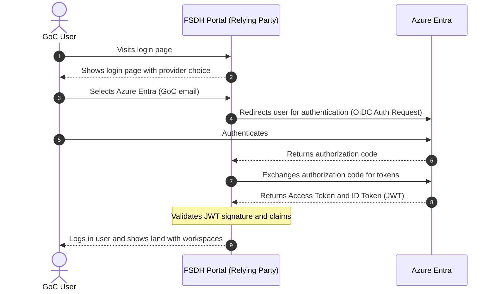

- Steps 1-3: The user starts at the FSDH Portal, sees provider choices, and selects Azure Entra.
- Steps 4-6: The portal redirects to Azure Entra, the user authenticates, and an authorization code is returned.
- Steps 7-8: The FSDH Portal exchanges the code for an Access Token and an ID Token.
- Step 9: The portal shows the landing page with workspaces.

## FSDH Logout Flow

This diagram shows the front channel sign out flow with the relying party and GCCF as OpenID provider.

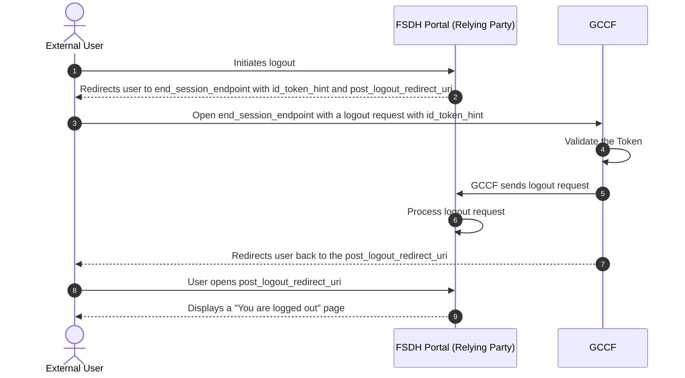

- Step 1: The user clicks the logout button in the FSDH Portal.
- Steps 2-3: The portal redirects the user to the `end_session_endpoint` at GCCF, including an `id_token_hint` to identify the user's session.
- Steps 4-5: GCCF validates the token, requests logout, and sends a logout request to the relying party.
- Step 6: The portal initiates local session cookies and data cleanup.
- Step 7-8: GCCF redirects the user back to the `post_logout_redirect_uri` specified by the FSDH Portal.
- Step : The user sees a page confirming they have been successfully logged out.

## User Invitation Flow (New External Users)

This diagram illustrates how a workspace owner can invite a new external user to the FSDH Portal. This flow is used when the external user has not yet been validated (i.e., has no GCCF subject associated with their profile).

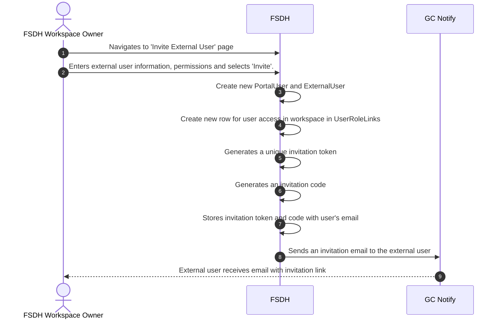

- Step 1: A new page in the portal lets workspace owners invite external users
- Step 2: The workspace owner enters the external user's email and selects Invite;
- Step 3: The portal checks if an external user with the same email already exists in FSDH.
- Steps 4-5: If the user does not exist, a new PortalUser and ExternalUser are created; otherwise, the existing records are reused.
- Step 6: A new UserRoleLink is created for the workspace access.
- Steps 7-9: The portal generates a unique, single-use invitation token and code, stored with the invitee's details.
- Steps 10-11: The system sends an invitation email through GC Notify; the external user receives it with the link.

## User Invitation Flow (Validated External Users)

This diagram illustrates how a workspace owner can invite an existing validated external user (one who already has a GCCF subject associated with their profile) to a new workspace. Since the user is already validated, no GCCF authentication is required—the workspace access is granted directly.

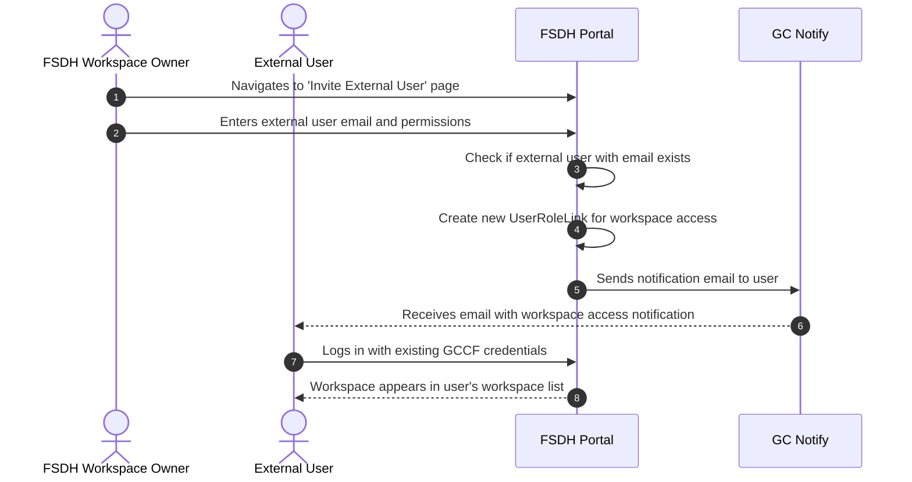

- Steps 1-2: The workspace owner navigates to the invite page and enters the external user's email.
- Steps 3-4: The portal finds an existing external user with a validated GCCF subject.
- Steps 5-6: A new UserRoleLink is created and immediately set to Active (no invitation token/code needed).
- Steps 7-8: A notification email is sent to inform the user of their new workspace access.
- Steps 9-10: The user logs in with their existing GCCF credentials and sees the new workspace in their list.

This streamlined flow skips the invitation token/code mechanism since the user's identity has already been verified through a previous onboarding process.

## External User Onboarding Flow

This diagram shows how an external user signs in for the first time using the invitation link and associates their email with the anonymous GCCF identity.

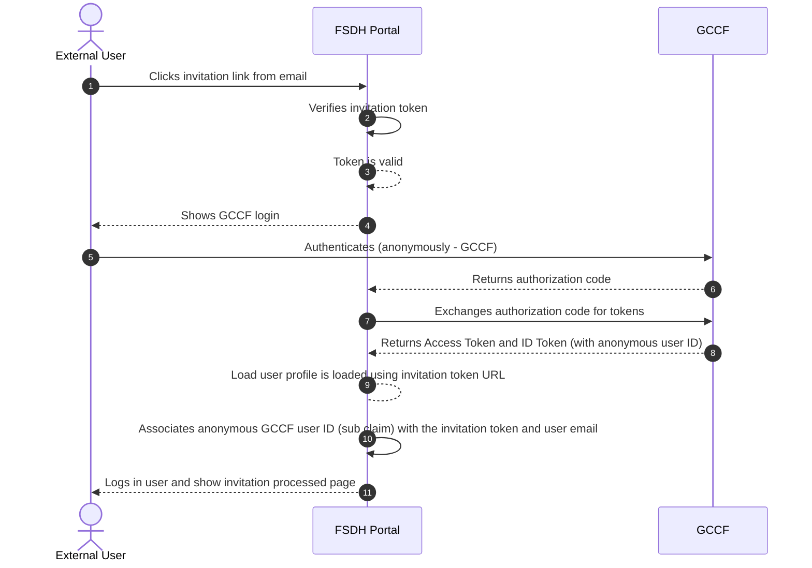

- Step 1: The external user clicks the invitation link from their email.
- Steps 2-3: The FSDH Portal verifies the invitation token; if valid, processing continues.
- Steps 4-5: The portal shows GCCF login and the user authenticates (anonymous GCCF identity).
- Steps 6-8: GCCF returns an authorization code; the portal exchanges it and receives tokens including the anonymous user ID.
- Step 9: The portal associates the anonymous GCCF user ID (`sub`) with the invitation token and user email; the backend creates a linked user profile.
- Step 10: The user is logged in and sees the invitation processed page.

## Invitation Code Entry Flow (after onboarding)

This diagram shows how the external user, now authenticated and viewing the "Invitation processed" page, enters the invitation code to complete access to the target workspace. Note: the invitation code shares the same expiry as the invitation; no separate code expiry check is required. The invitation context is already present (looked up using the token in the invitation URL) before the page is shown, so the code is validated against that context.

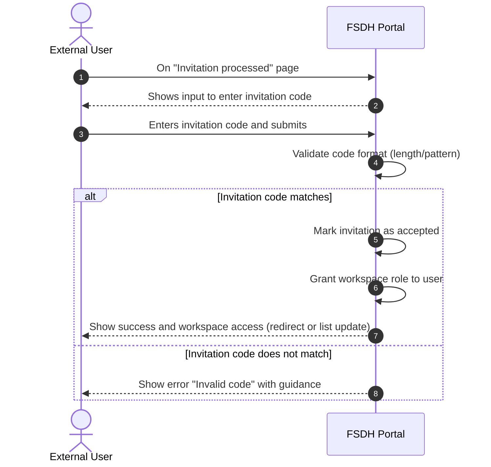

- Steps 1-3: The user, already authenticated, lands on the invitation processed page and submits the invitation code.
- Steps 4-5: The portal performs basic validation; the invitation context was already fetched before rendering this page (no lookup by code at submit time).
- Steps 6-9: If the submitted code matches the invitation’s stored code, the system uses the preloaded invitation context tied to the user’s profile; if not yet accepted, the invite is marked accepted and workspace access is granted.
- Step 10: The user sees a confirmation and either gets redirected into the workspace or sees their workspace list updated.
- Already accepted: The portal shows the same 'Invitation Expired' page as the expired invitation flow.
- Error path: If the code is invalid (does not match), the portal displays an actionable error and asks the user to contact the workspace owner for a new invitation.

## Expired & Accepted Invitation Flow

This diagram shows what happens when a user tries to use an expired, invalid or already accepted invitation link.

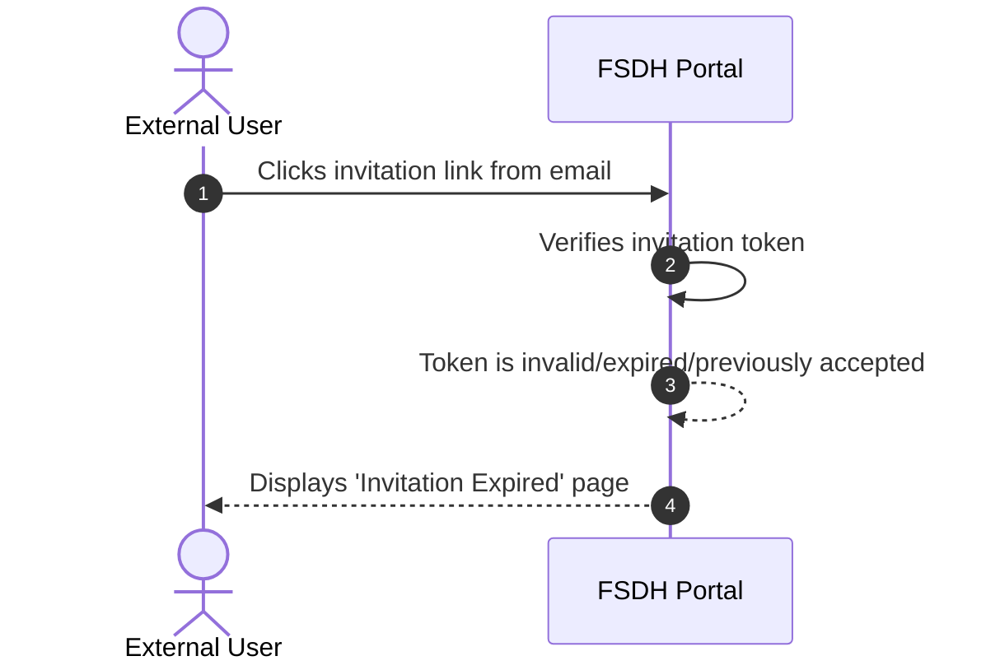

- Step 1: The external user clicks an expired or invalid invitation link.
- Steps 2-3: The FSDH Portal verifies the invitation token and finds it is invalid or expired.
- Step 4: The user is shown a page indicating that the invitation has expired.
- Follow-up: The user needs to contact the workspace owner to request a new invitation

## GCCF Identity Reassociation Flow

When an external user loses access to their original GCCF credentials or needs to use a different GCCF account, the identity reassociation process reuses the existing invitation flow:

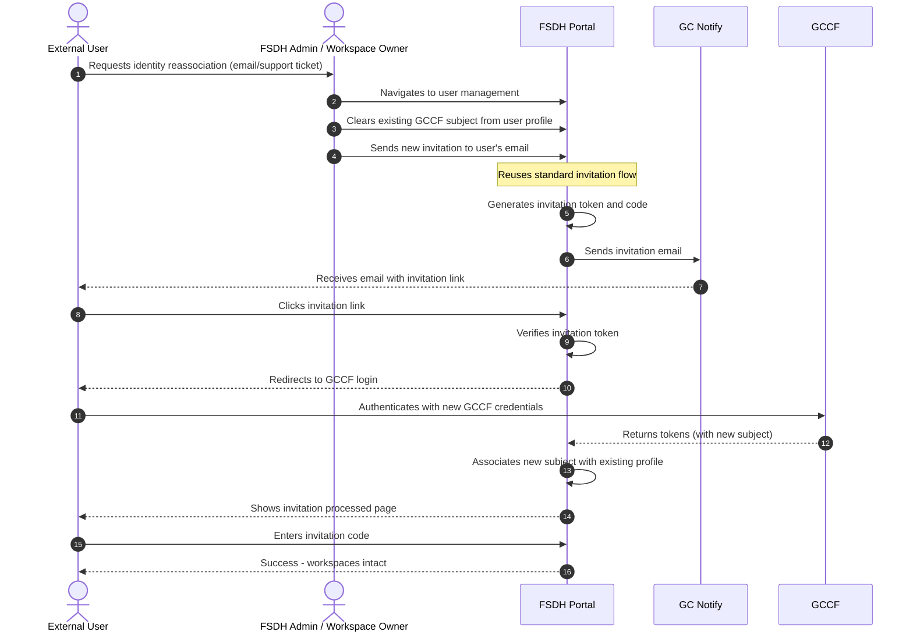

- Step 1: The external user contacts an admin or workspace owner to request identity reassociation.
- Steps 2-3: The admin navigates to user management and clears the existing GCCF subject from the user's profile.
- Steps 4-7: The admin sends a new invitation using the standard invitation flow; the user receives the email.
- Steps 8-12: The user clicks the link, authenticates with their new GCCF credentials via standard OIDC flow.
- Steps 13-14: The portal associates the new GCCF subject with the existing user profile.
- Steps 15-17: The user completes the invitation code entry; workspace access and user data remain intact.

This approach avoids creating a separate reassociation token mechanism and leverages the security and validation already built into the invitation flow.

## External User Deactivation Flow

This diagram shows how an admin or workspace owner can deactivate an external user, preventing further access to the FSDH Portal.

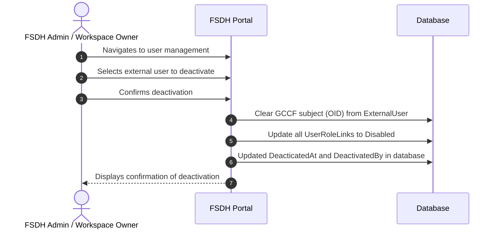

- Steps 1-3: The admin navigates to user management, selects the external user, and confirms deactivation.
- Step 4: The portal clears the GCCF subject (OID) from the user's profile, breaking the identity link.
- Step 5: All `UserRoleLink` records for this user are updated to `Disabled`, revoking workspace access.
- Step 6: The user's status is set to `Disabled` in the external user profile.
- Step 7: The admin sees a confirmation that the user has been deactivated.

Once deactivated, the user cannot log in or access any workspaces. To reactivate, the admin must send a new invitation to reassociate a GCCF identity and restore workspace roles.

## New Data elements for external users

The following data elements are required for inviting, authenticating, onboarding, and managing access for external users in the FSDH Portal when using GCCF.

### Invitation and linking (FSDH-managed)

| Element          | Purpose / Usage                      | Notes                                         |
| ---------------- | ------------------------------------ | --------------------------------------------- |
| Invitation Token | Unique, single-use link token        | Embedded in invite URL                        |
| Invitation Code  | Short code entered in portal         | Separate from link token                      |
| Invited Email    | Email address the invitation targets | Linked to authenticated user |
| Expires At       | Invitation expiry timestamp          |                                               |
| Invited By       | Inviter (workspace owner)            | Internal identifier                           |
| Workspace        | Target workspace                     |                                               |
| Invite Status    | Invite lifecycle state               | invited / accepted / expired / revoked        |

### External user profile (stored by FSDH)

| Element                  | Purpose / Usage                                                 | Notes                           |
| ------------------------ | --------------------------------------------------------------- | ------------------------------- |
| GCCF Identity (Subject)  | Link to GCCF identity                                           | Persist `sub`                   |
| First Name               | Identity of the user                                            |                                 |
| Last Name                | Identity of the user                                            |                                 |
| Affiliation              | Notes on the relation between workspace owner and external user |                                 |
| Collaboration Objective  | Type of collaboration expected with the user                    |                                 |
| Primary Email            | Email associated with the user                                  |                                 |
| Status                   | Access state                                                    | active / disabled (with reason) |
| Preferred Language       | UX localization                                                 | en / fr                         |
| Organization             | Context / affiliation                                           | Collected if available          |
| Terms of Use Version     | Track Terms of Use consent                                      | Enforce before access           |
| Terms of Use Accepted At | Timestamp of consent                                            |                                 |
| Last Login               | Last successful authentication                                  |                                 |
| Account Expiry           | Expiration date                                                 | 1 year + renewal option?        |
