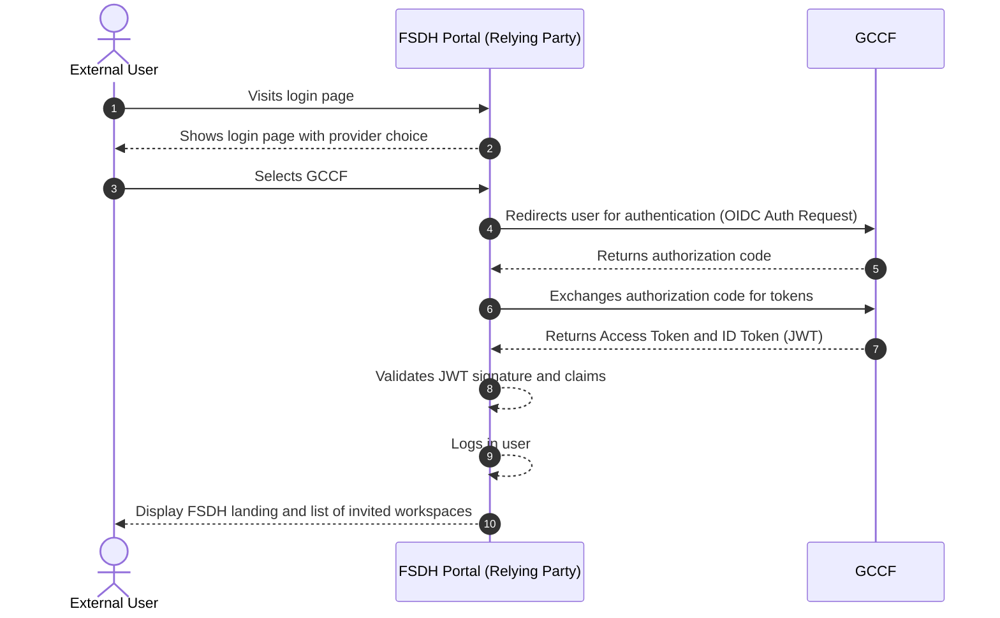
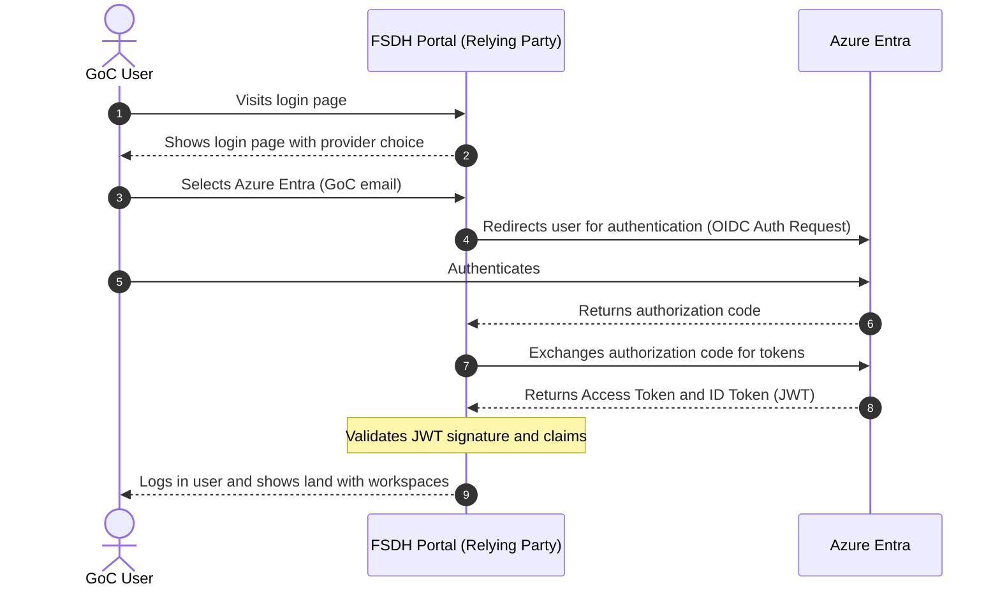
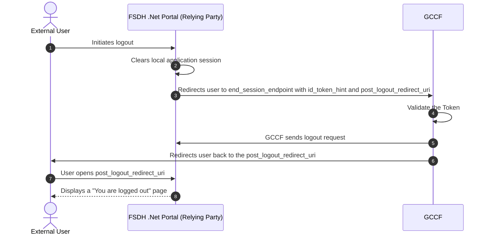
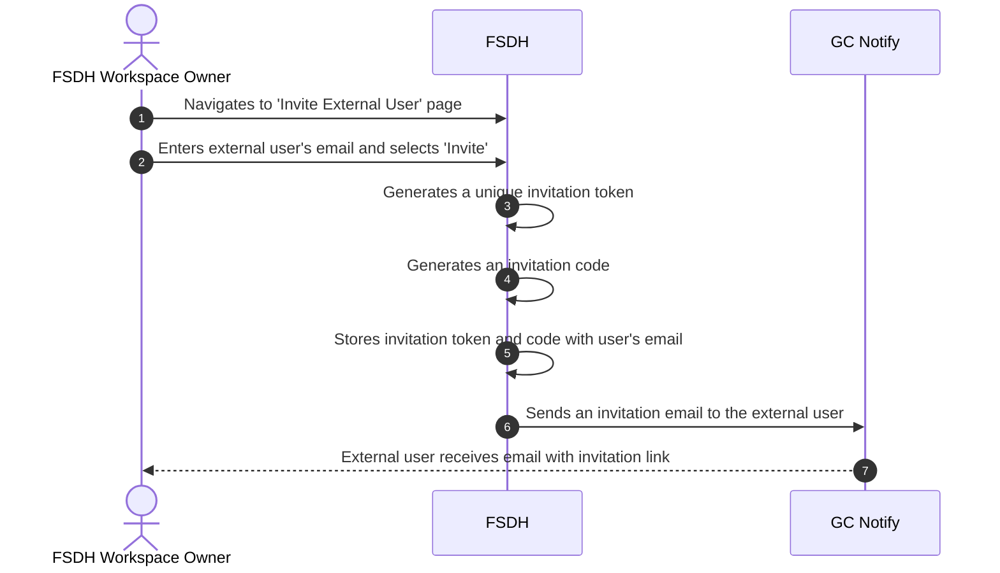
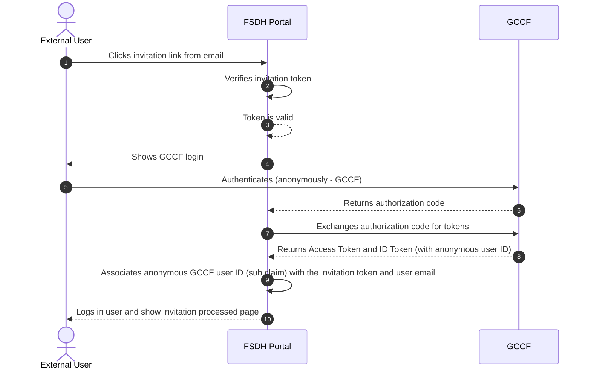
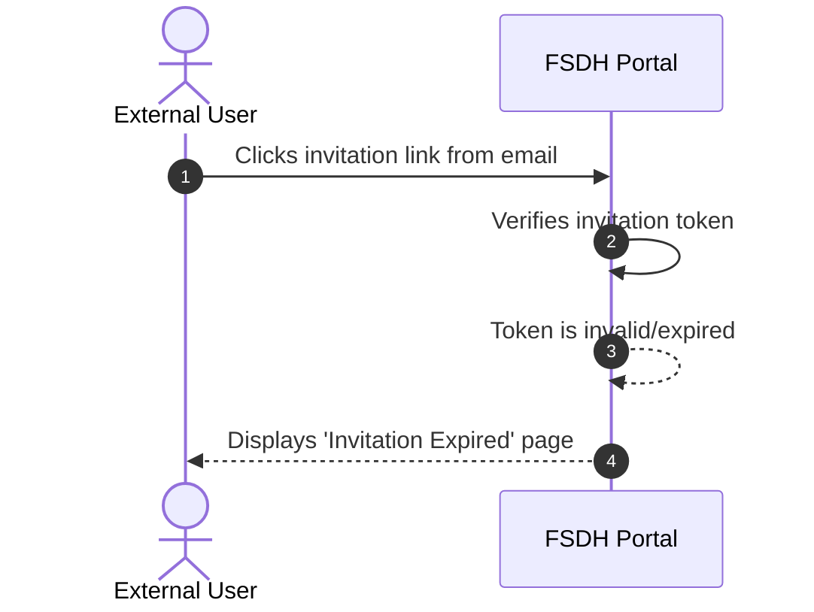

# OIDC Flow with Provider Selection

This document illustrates the authentication flows where a user can select between GCCF and Azure Entra as their identity provider.

## GCCF Authentication Flow

This diagram shows the flow when FSDH Portal uses GCCF as a consolidator, which in turn federates with other identity providers (e.g., a departmental Azure AD).

- Steps 1-3: The user starts at the FSDH Portal, sees provider choices, and selects GCCF.
- Step 4: The portal redirects the user to GCCF to handle authentication.
- Steps 4-5: GCCF, acting as a consolidator, federates with the user's departmental identity provider (such as a departmental Azure AD) where the user authenticates.
- Steps 6-7: The FSDH Portal exchanges the authorization code for an Access Token and an ID Token.
- Step 8: The .NET OIDC layer validates JWT signature and claims received from GCCF
- Steps 9-11: The portal displays the landing page with invited workspaces.

## Azure Entra Authentication Flow

This diagram shows the direct authentication flow for guest users via Azure Entra.

- Steps 1-3: The user starts at the FSDH Portal, sees provider choices, and selects Azure Entra.
- Steps 4-6: The portal redirects to Azure Entra, the user authenticates, and an authorization code is returned.
- Steps 7-8: The FSDH Portal exchanges the code for an Access Token and an ID Token.
- Step 9: The portal shows the landing page with workspaces.

## FSDH Logout Flow

This diagram shows the front channel sign out flow with the relying party and GCCF as OpenID provider.

- Step 1: The user clicks the logout button in the FSDH Portal.
- Step 2: The FSDH Portal clears its own local session cookies and data.
- Step 3: The portal redirects the user to the `end_session_endpoint` at GCCF, including an `id_token_hint` to identify the user's session.
- Steps 4-5: GCCF validates the token, requests logout, and sends a logout request to the relying party.
- Step 6-7: GCCF redirects the user back to the `post_logout_redirect_uri` specified by the FSDH Portal.
- Step 8: The user sees a page confirming they have been successfully logged out.

## User Invitation Flow

This diagram illustrates how an existing user can invite an external user to the FSDH Portal.

- Step 1: A new page in the portal lets workspace owners invite external users
- Step 2: The workspace owner enters the external user's email and selects Invite;
- Steps 3-4: The portal generates a unique, single-use invitation token and is stored with the invitee's details
- Steps 5-6: The system sends an invitation email through GC Notify; the external user receives it with the link.

## External User Onboarding Flow

This diagram shows how an external user signs in for the first time using the invitation link and associates their email with the anonymous GCCF identity.

- Step 1: The external user clicks the invitation link from their email.
- Steps 2-3: The FSDH Portal verifies the invitation token; if valid, processing continues.
- Steps 4-5: The portal shows GCCF login and the user authenticates (anonymous GCCF identity).
- Steps 6-8: GCCF returns an authorization code; the portal exchanges it and receives tokens including the anonymous user ID.
- Step 9: The portal associates the anonymous GCCF user ID (`sub`) with the invitation token and user email; the backend creates a linked user profile.
- Step 10: The user is logged in and sees the invitation processed page.

## Expired Invitation Flow

This diagram shows what happens when a user tries to use an expired or invalid invitation link.

- Step 1: The external user clicks an expired or invalid invitation link.
- Steps 2-3: The FSDH Portal verifies the invitation token and finds it is invalid or expired.
- Step 4: The user is shown a page indicating that the invitation has expired.
- Follow-up: The user needs to contact the workspace owner to request a new invitation

## New Data elements for external users

The following data elements are required for inviting, authenticating, onboarding, and managing access for external users in the FSDH Portal when using GCCF.

### Invitation and linking (FSDH-managed)

| Element          | Purpose / Usage                      | Notes                                         |
| ---------------- | ------------------------------------ | --------------------------------------------- |
| Invitation Token | Unique, single-use link token        | Embedded in invite URL                        |
| Invitation Code  | Short code entered in portal         | Separate from link token                      |
| Invited Email    | Email address the invitation targets | Linked to authenticated user |
| Expires At       | Invitation expiry timestamp          |                                               |
| Invited By       | Inviter (workspace owner)            | Internal identifier                           |
| Workspace        | Target workspace                     |                                               |
| Initial Role     | Role granted on acceptance           |                                               |
| Invite Status    | Invite lifecycle state               | invited / accepted / expired / revoked        |

### External user profile (stored by FSDH)

| Element                  | Purpose / Usage                | Notes                           |
| ------------------------ | ------------------------------ | ------------------------------- |
| GCCF Identity (Subject)  | Link to GCCF identity          | Persist `sub`                   |
| First Name               | Identity of the user           |                                 |
| Last Name                | Identity of the user           |                                 |
| Primary Email            | Email associated with the user |                                 |
| Status                   | Access state                   | active / disabled (with reason) |
| Preferred Language       | UX localization                | en / fr                         |
| Organization             | Context / affiliation          | Collected if available          |
| Terms of Use Version     | Track Terms of Use consent     | Enforce before access           |
| Terms of Use Accepted At | Timestamp of consent           |                                 |
| Last Login               | Last successful authentication |                                 |
| Account Expiry           | Expiration date                | 1 year + renewal option?        |
