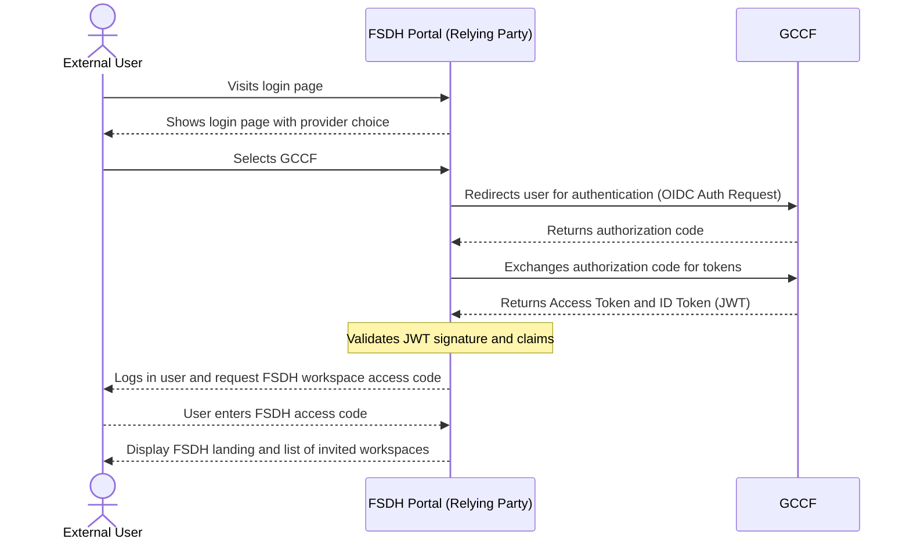
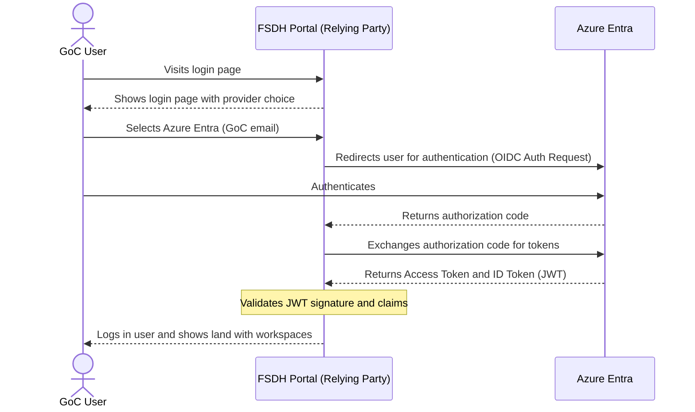
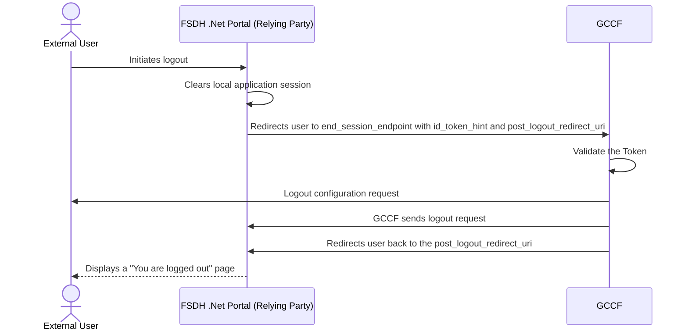
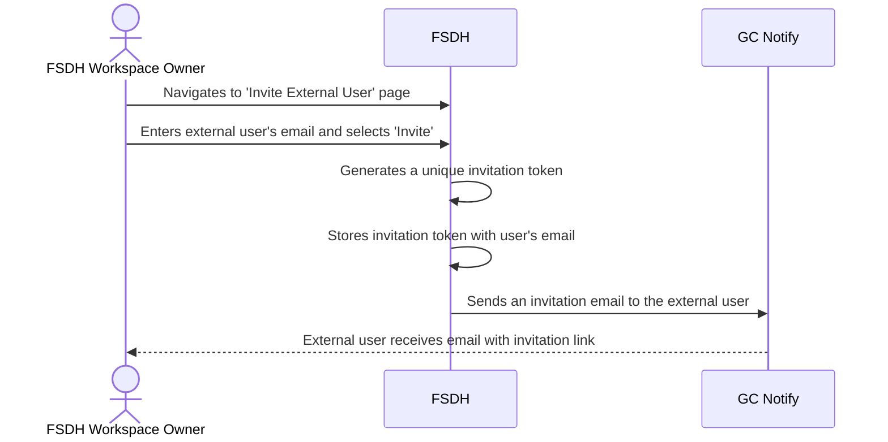
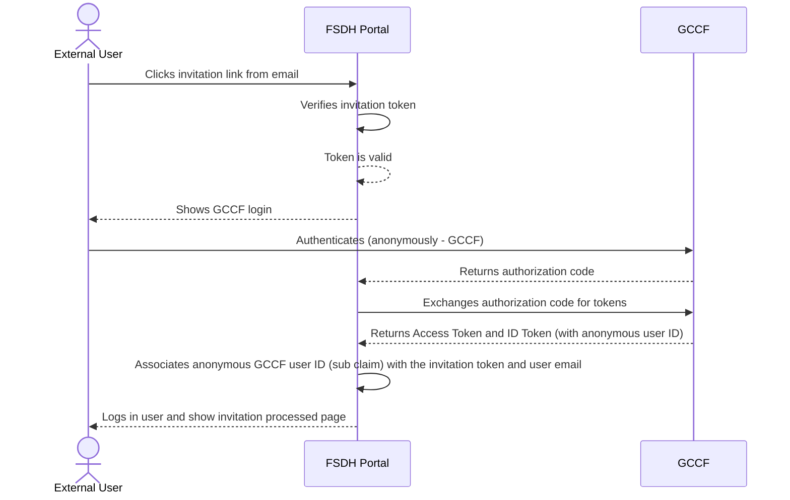
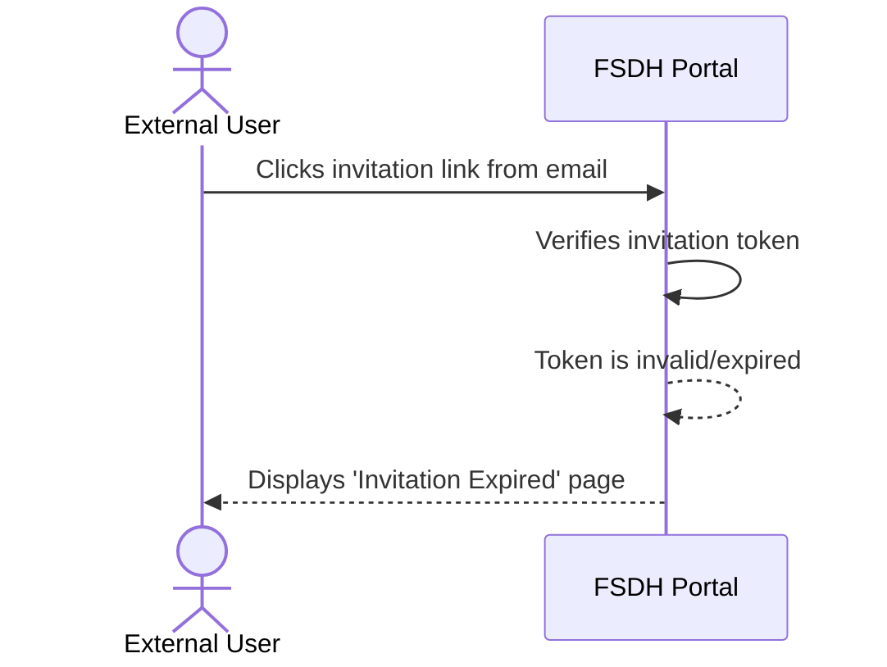

# OIDC Flow with Provider Selection

This document illustrates the authentication flows where a user can select between GCCF and Azure Entra as their identity provider.

## GCCF Authentication Flow (as Consolidator)

This diagram shows the flow when FSDH Portal uses GCCF as a consolidator, which in turn federates with other identity providers (e.g., a departmental Azure AD).

- **Provider Selection**: The user starts at the FSDH Portal and chooses GCCF as their identity provider.
- **Redirection to GCCF**: The portal redirects the user to GCCF to handle the authentication process.
- **Federated Authentication**: GCCF, acting as a consolidator, federates with the user's departmental identity provider (like a departmental Azure AD) where the user authenticates.
- **Token Exchange**: After successful authentication, GCCF provides an authorization code to the FSDH Portal. The portal then exchanges this code to get an Access Token and an ID Token.
- **User Access**: The portal validates the tokens and logs the user in. The user is then prompted for an FSDH workspace access code to see their workspaces.

## Azure Entra Authentication Flow

This diagram shows the direct authentication flow for guest users via Azure Entra.

- **Provider Selection**: The user starts at the FSDH Portal and chooses Azure Entra as their identity provider.
- **Direct Authentication**: The portal redirects the user directly to Azure Entra for authentication.
- **Token Exchange**: After the user authenticates, Azure Entra provides an authorization code to the FSDH Portal. The portal exchanges this code for an Access Token and an ID Token.
- **User Access**: The portal validates the tokens and logs the user in, showing them their landing page with a list of workspaces.

## FSDH Logout Flow

This diagram shows the front channel sign out flow with the relying party and GCCF as OpenID provider.

- **Initiation**: The user clicks the logout button in the FSDH Portal.
- **Local Session Cleanup**: The FSDH Portal clears its own local session cookies and data.
- **Redirect to OIDC Provider**: The portal redirects the user to the `end_session_endpoint` at GCCF, including an `id_token_hint` to identify the user's session.
- **Central Logout**: GCCF validates the token, logs the user out of the central session, and handles any federated logout procedures.
- **Redirect Back to Application**: GCCF redirects the user back to the `post_logout_redirect_uri` specified by the FSDH Portal.
- **Confirmation**: The user sees a page confirming they have been successfully logged out.

## User Invitation Flow

This diagram illustrates how an existing user can invite an external user to the FSDH Portal.

- **Initiation**: An existing FSDH user initiates an invitation from the portal.
- **Invitation Request**: The portal's backend receives the request, including the external user's email.
- **Token Generation**: A unique, single-use invitation token is generated and stored, associated with the invitee's email.
- **Email Notification**: The system sends an email to the external user containing a link with the unique invitation token.

## External User Onboarding Flow

This diagram shows how an external user signs in for the first time using the invitation link and associates their email with the anonymous GCCF identity.

- **Invitation Link**: The external user clicks the invitation link from their email.
- **Token Verification**: The FSDH Portal verifies the invitation token with the backend system.
- **GCCF Authentication**: The user is prompted to log in and selects GCCF, which provides an anonymous identity.
- **Token Exchange**: The portal receives an ID Token from GCCF containing an anonymous user ID (`sub` claim).
- **Email Association**: The portal sends the anonymous user ID and the user's email (retrieved from the invitation) to the backend.
- **Account Linking**: The backend system creates a user profile, associating the anonymous GCCF user ID with the user's email address.
- **Access Granted**: The user is now logged in and can access the FSDH workspace they were invited to.

## Expired Invitation Flow

This diagram shows what happens when a user tries to use an expired or invalid invitation link.

- **Expired Link**: The external user clicks an expired or invalid invitation link.
- **Token Verification Fails**: The FSDH Portal verifies the invitation token and finds it is invalid or expired.
- **Error Display**: The user is shown a page indicating that the invitation has expired.
- **Request New Invitation**: The user is given an option to request a new invitation.

