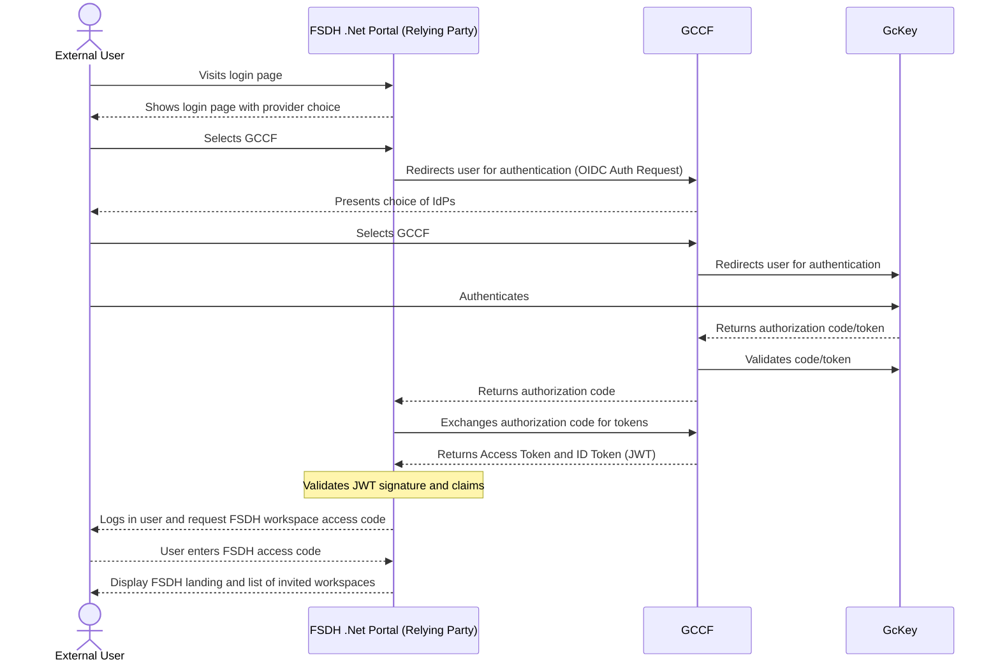
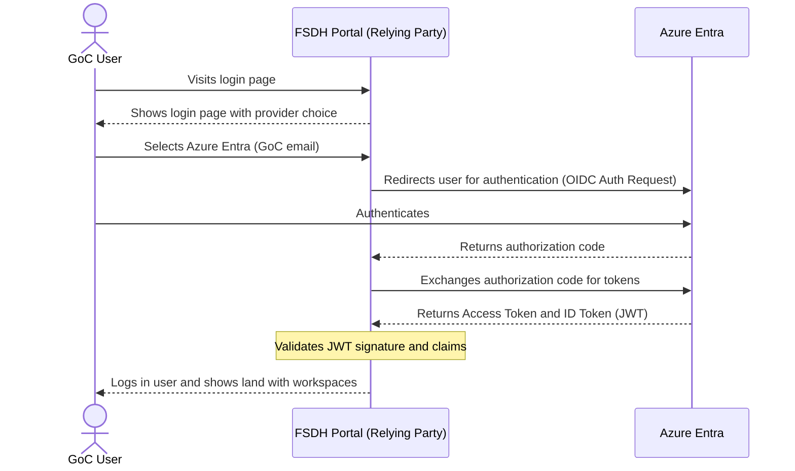
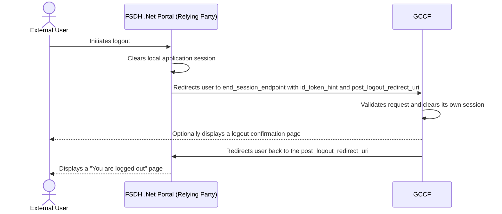

# OIDC Flow with Provider Selection

This document illustrates the authentication flows where a user can select between GCCF and Azure Entra as their identity provider.

## GCCF Authentication Flow (as Consolidator)

This diagram shows the flow when FSDH Portal uses GCCF as a consolidator, which in turn federates with other identity providers (e.g., a departmental Azure AD).

## Azure Entra Authentication Flow

This diagram shows the direct authentication flow for guest users via Azure Entra.

## FSDH Logout Flow

This diagram shows the front channel sign out flow with the relying party and GCCF as OpenID provider.

