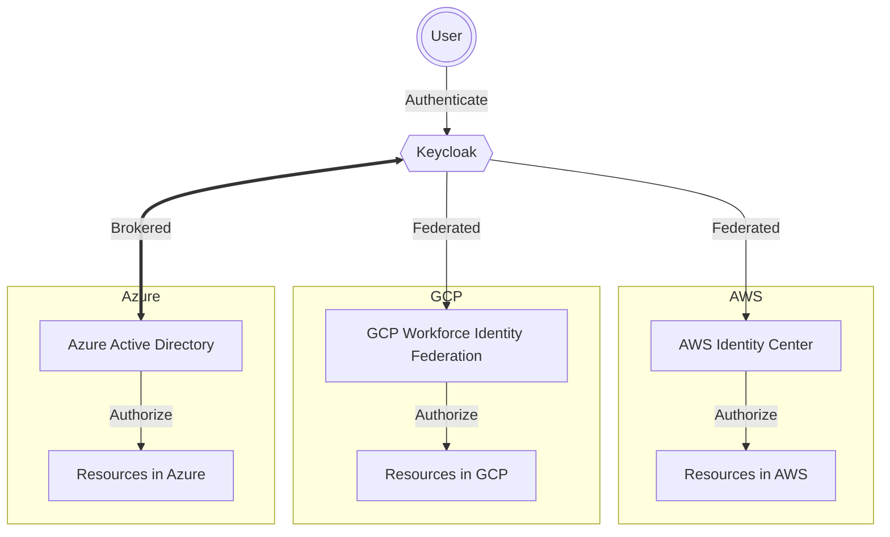

# Multi-cloud security

## Overview

Here is a diagram for how a user will authenticate against keycloak and then access the different cloud providers. 

# AWS Identity Center

[AWS IAM](https://docs.aws.amazon.com/IAM/latest/UserGuide/introduction.html) is a service that enables you to manage access to AWS services and resources securely. Using IAM, you can create and manage AWS users and groups, and use permissions to allow and deny their access to AWS resources.

IAM Identity Center also supports a System for Cross-Domain Identity MAnagement (SCIM). See [SCIM profile and SAML2.0 implementation on AWS](https://docs.aws.amazon.com/singlesignon/latest/userguide/scim-profile-saml.html) for more information.

There is also a mechanism to handle the provisioning automatically. See [Automatic provisioning](https://docs.aws.amazon.com/singlesignon/latest/userguide/provision-automatically.html) for more information. There are a few considerations to take into account when using automatic provisioning that are covered in the previous link.

<b>For SCIM synchronization to work, every user must have a First name, Last name, Username and Display name value specified. If any of these values are missing from a user, that user will not be provisioned.</b>

> Note: Changes to users and groups in your identity provider are only reflected in IAM Identity Center after your identity provider sends those changes to IAM Identity Center. 

# GCP Identity Center

[GCP IAM](https://cloud.google.com/iam/docs/overview) is a service that enables you to manage access to GCP services and resources securely. Using IAM, you can create and manage GCP users and groups, and use permissions to allow and deny their access to GCP resources.

GCP Identity Center also supports a System for Cross-Domain Identity Management (SCIM). See [Configure workforce identity federation](https://cloud.google.com/iam/docs/configuring-workforce-identity-federation) for more information.

## What is workforce identity federation?

Workforce identity federation lets you use an external identity provider (IdP) to authenticate and authorize a workforce—a group of users, such as employees, partners, and contractors—using IAM, so that the users can access Google Cloud services. With workforce identity federation you don't need to synchronize user identities from your existing IdP to Google Cloud identities, as you would with Cloud Identity's Google Cloud Directory Sync (GCDS). 

<b>Workforce identity federation extends Google Cloud's identity capabilities to support syncless, attribute-based single sign on.</b>

> Note: In some IdPs, attributes are also known as claims or assertions.
After user authentication, information that is received from the IdP is used to determine the scope of access to the Google Cloud resources.

You can use workforce identity federation with any IdP that supports OpenID Connect (OIDC) or SAML 2.0, such as Azure Active Directory (Azure AD), Active Directory Federation Services (AD FS), Okta, and others.

# Azure Active Directory

[Azure AD](https://docs.microsoft.com/en-us/azure/active-directory/fundamentals/active-directory-whatis) is Microsoft’s cloud-based identity and access management service. 
