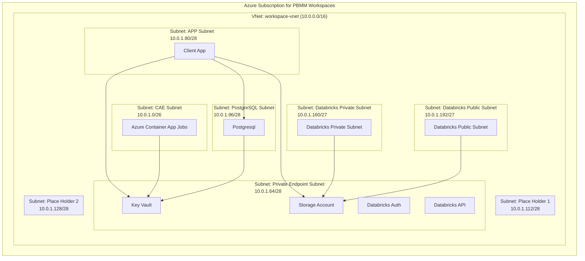
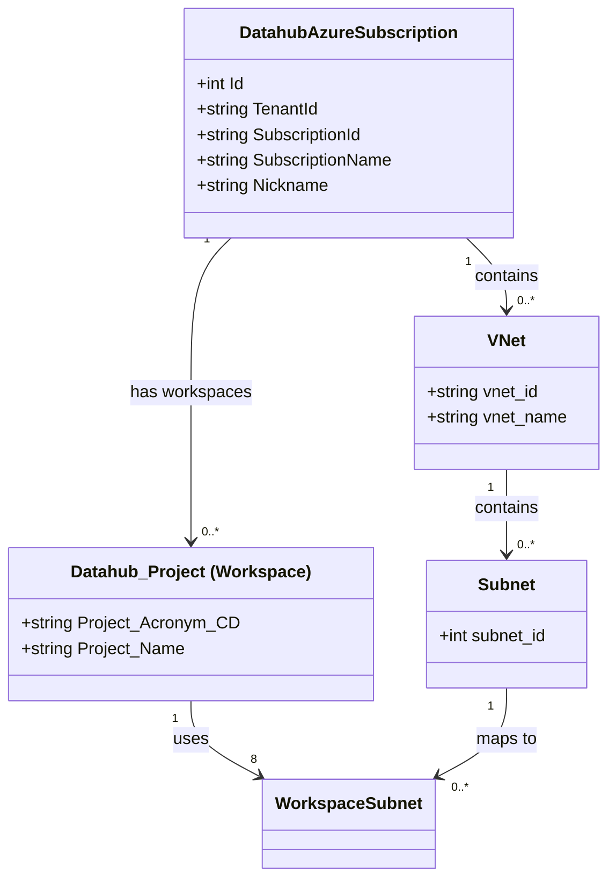

# Overview

The PBMM workspaces in FSDH share a set of Azure subscriptions. Each subscription has a VNet used by multiple workspaces. Although VNet is shared among workspaces, NSG are in place to ensure subnets are isolated to deny traffic crossing workspace while allowing HTTPS traffic within a workspace.

The network layout follows this structure: tenant -> VNet -> subnets <- workspaces. A single workspace is mapped to 8 subnets, and all 8 subnets for that workspace use the same group number.

## Sample

## Proposed Data Model

In the portal model, the workspace is represented by `Datahub_Project` and the Azure subscription is represented by `DatahubAzureSubscription`, which already includes `TenantId`. The proposed extension is to add VNet and Subnet entities, then link subnets to workspaces. This keeps the hierarchy explicit through the existing subscription model: a subscription carries the tenant identifier, a VNet belongs to a subscription, a VNet owns subnets, and a workspace is associated with subnets that all share the same group number.

The class diagram hides relational properties such as foreign keys because those associations would be managed by EF Core.

In this model, the subnet group identifies the set of 8 subnets assigned to a `Datahub_Project`. For example, subnet group `1` would follow naming such as `GcDcCNR-SSC_FSDHWorkspace-vnet/GcDcCNR-SSC_FSDHWorkspace_PEP-1-snet`.
