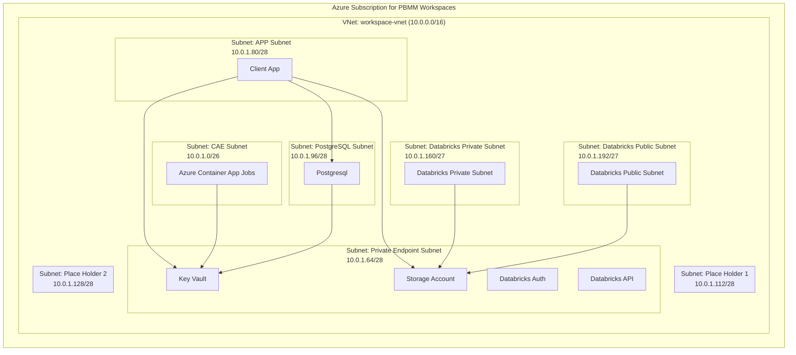

# Overview

The PBMM workspaces in FSDH share a set of Azure subscriptions. Each subscription has a VNet used by multiple workspaces. Although VNet is shared among workspaces, NSG are in place to ensure subnets are isolated to deny traffic crossing workspace while allowing HTTPS traffic within a workspace.

# Diagram

