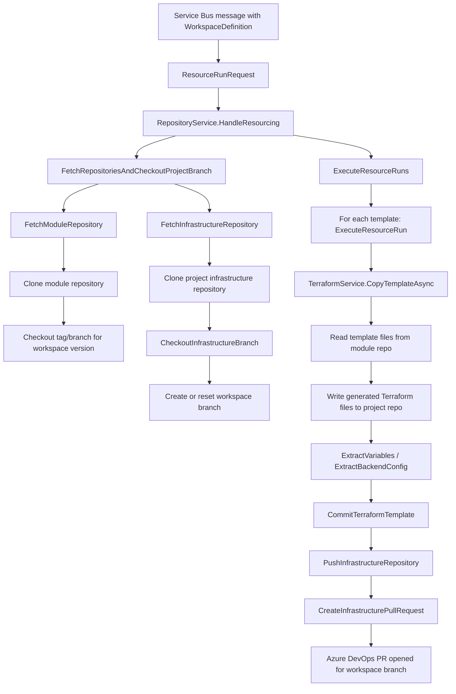
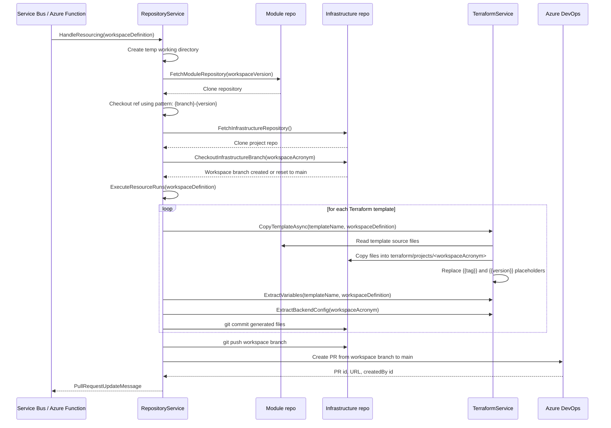
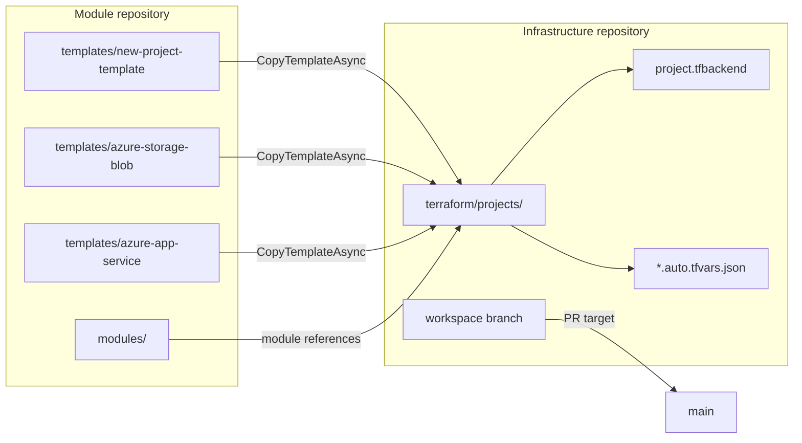
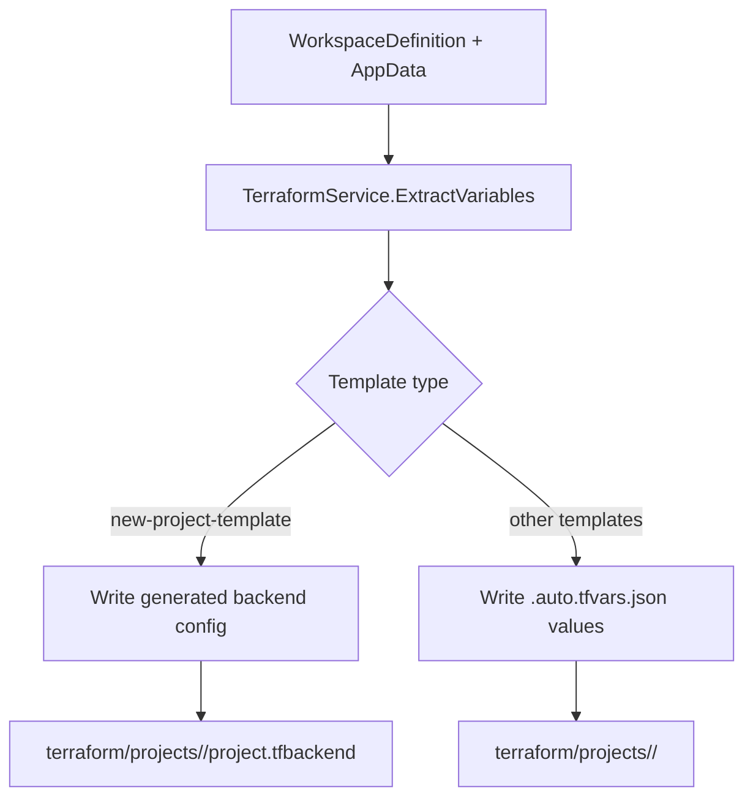
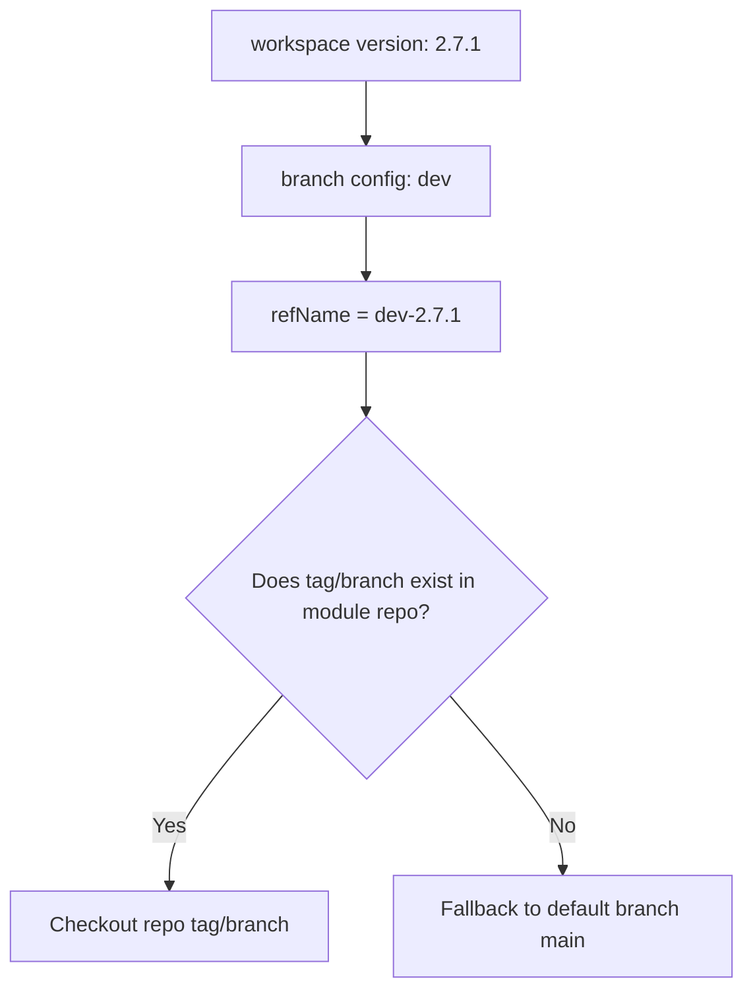
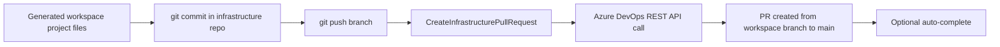

# Module repository provisioning flow

This document describes how the Resource Provisioner uses the module repository as the source of Terraform templates and how those files are merged into the per-workspace infrastructure repository that eventually becomes an Azure DevOps pull request.

The runtime logic is implemented primarily in:

- `ResourceProvisioner.Infrastructure.Services.RepositoryService`
- `ResourceProvisioner.Infrastructure.Services.TerraformService`
- `ResourceProvisioner.Infrastructure.Common.DirectoryUtils`
- `ResourceProvisioner.Application.Config.ResourceProvisionerConfiguration`

## Repository roles

### Module repository
The module repository is the template source.

Configuration values are read from `ResourceProvisionerConfiguration.ModuleRepository`:

- `Url` – Git repo URL for Terraform modules/templates
- `LocalPath` – local temp path used for cloning
- `TemplatePathPrefix` – where template folders live (for example `templates/`)
- `ModulePathPrefix` – where reusable module folders live (for example `modules/`)
- `Branch` – repo branch used for version mapping

The module repo is cloned into a temporary working directory and checked out to a versioned ref such as:

- `dev-1.2.3`
- or the default `main` branch if the matching tag/branch is missing.

### Project infrastructure repository
The infrastructure repository is the workspace state repo.

Configuration values are read from `ResourceProvisionerConfiguration.InfrastructureRepository`:

- `Url` – Azure DevOps Git repo URL
- `LocalPath` – temp path for local clone
- `Name` – repo name, such as `datahub-project-infrastructure-dev`
- `ProjectPathPrefix` – folder under the repo that holds per-workspace Terraform projects, such as `terraform/projects`
- `MainBranch` – target branch for pull requests, such as `main`
- `PullRequestUrl` / `PullRequestBrowserUrl` – Azure DevOps PR API endpoints

This repo is cloned once, then a workspace branch is created or reset before committing generated Terraform files.

## High-level provisioning flow

## Detailed runtime sequence

## How template files are copied

The project infrastructure repository is not authored directly from scratch. Instead, the module repository provides a template source tree and the provisioner copies selected files into the workspace project path.

The actual path resolution happens in `DirectoryUtils`:

- `GetTemplatePath` -> module repo + `ModuleRepository.TemplatePathPrefix` + template name
- `GetProjectPath` -> infrastructure repo + `InfrastructureRepository.ProjectPathPrefix` + workspace acronym

This is why the module repo acts as a source library and the infrastructure repo becomes the long-lived project state repo.

## Variable and backend generation

After template files are copied, Terraform variables are generated for the workspace.

Important steps:

- `TerraformService.CopyTemplateAsync` reads each file from the module repo template folder.
- It replaces placeholders such as:
  - `{{tag}}` -> `?ref={branch}-{workspace.version}`
  - `{{version}}` -> the workspace version
- `ExtractVariables` compares required variables in the template with the generated project files and creates missing `.auto.tfvars.json` content.
- `ExtractBackendConfig` creates `project.tfbackend` for the workspace state backend.

## Branch and version behavior

The module repo branch/version mapping is explicitly handled in `RepositoryService.FetchModuleRepository`.

This means the module repository can track multiple infrastructure versions without mixing them into a single source-of-truth repo. The project infrastructure repo remains the repository where the actual generated Terraform project lives, while the module repo supplies the reusable building blocks.

## Pull request integration

Once the workspace branch contains generated Terraform files and variable settings, the provisioner pushes the branch and opens a pull request.

The PR is created using the Azure DevOps API configured in `InfrastructureRepository.PullRequestUrl` and `InfrastructureRepository.ApiVersion`. If auto-complete is enabled, the provisioner patches the PR with completion metadata and sets the repository to allow the branch to complete once checks pass.

## Summary

The module repository and infrastructure repository have distinct responsibilities:

- Module repository = reusable Terraform source templates and modules.
- Infrastructure repository = generated workspace project state, branch-per-workspace changes, and PR review workflow.

The flow is:

1. Clone module repo and select versioned module source.
2. Clone infrastructure repo and check out the workspace branch.
3. Copy template files from the module repo into the workspace project directory.
4. Generate backend and variable files.
5. Commit and push the infrastructure repo branch.
6. Open a PR from the workspace branch into the main infrastructure branch.

This keeps the Terraform template set reusable and versioned, while the project infra repo remains the controlled, reviewable deployment artifact for each workspace.
