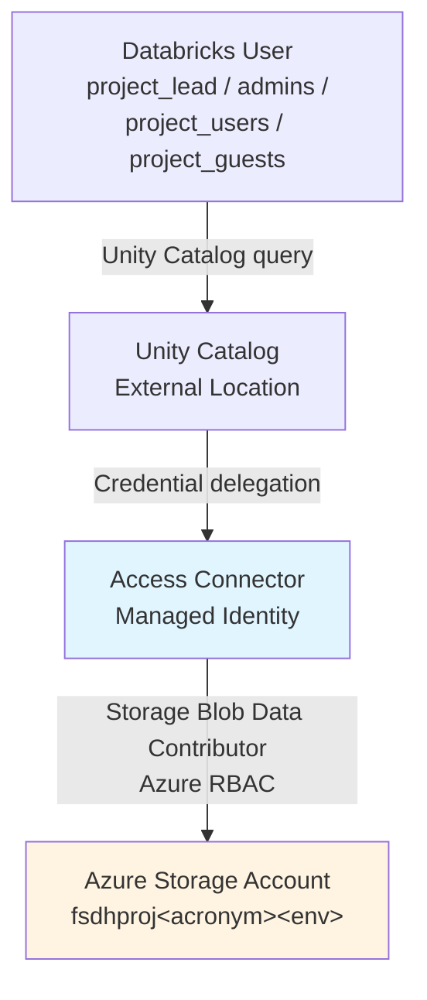
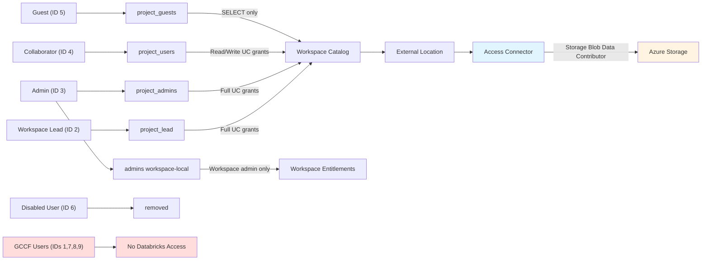

# Databricks & Unity RBAC Role Mapping

This document describes the optimal mapping of DataHub Portal RBAC roles (defined in [`Project_Role`](https://github.com/ssc-sp/datahub-portal/blob/develop/Portal/src/Datahub.Core/Model/Workspaces/Project_Role.cs)) into Databricks workspace entitlements and Unity Catalog permissions. It also covers how all users access the workspace Azure Storage account through a Databricks Access Connector.

## Related Documents

- [Portal RBAC](/DeveloperGuide/Security/RBAC/Portal.md) — source of truth for Portal role IDs and definitions
- [Databricks Workspace RBAC Grants](/DeveloperGuide/Security/WorkspaceUsersRBAC.md) — documents the Resource Provisioner implementation
- [Azure Storage RBAC Grants](/DeveloperGuide/Security/RBAC/AzureStorageBlob.md) — documents the Resource Provisioner storage role assignments
- [Databricks Guest Permissions](/DeveloperGuide/Databricks/Databricks-Guest.md) — detailed guest entitlement reference

## Permission Planes

Two distinct permission systems govern user access when Databricks is connected to the workspace storage:

| Plane                                 | What it controls                                                                   | Governed by                                                          |
| ------------------------------------- | ---------------------------------------------------------------------------------- | -------------------------------------------------------------------- |
| **Databricks workspace entitlements** | Sign in to the workspace UI, use notebooks, create clusters, access SQL warehouses | Databricks groups and ACLs (data plane)                              |
| **Unity Catalog grants**              | Read, write, create, and manage tables, schemas, and catalogs within the metastore | Unity Catalog `GRANT` statements scoped to the per-workspace catalog |
| **Azure RBAC on storage**             | Read/write blobs directly on the Azure Storage account resource                    | Azure role assignments on `fsdhproj<WorkspaceAcronym><Environment>`  |

> **Key distinction**: User access to Azure Storage from inside Databricks flows through the **Access Connector managed identity**, not through individual user Azure RBAC assignments. Individual user Azure RBAC on the storage account (assigned by the Resource Provisioner) governs access from outside Databricks (e.g., Azure Storage Explorer, AzCopy).

## Databricks Unity Group Structure (Account Groups)

Each workspace uses Databricks groups corresponding to Portal role levels. The following groups needs to be provisioned in the TF:

| Databricks Group | Group Type                       | Maps from Portal Role(s) | Used In                                                                | Notes                                                                            |
| ---------------- | -------------------------------- | ------------------------ | ---------------------------------------------------------------------- | -------------------------------------------------------------------------------- |
| `project_lead`   | **Account group**                | Workspace Lead (ID 2)    | Workspace entitlements, Unity Catalog grants, External Location grants | Full workspace and data governance control                                       |
| `admins`         | **Workspace-local system group** | Admin (ID 3)             | Workspace administration and workspace entitlements                    | Built-in Databricks workspace admin group; not used as a Unity Catalog principal |
| `project_admins` | **Account group**                | Admin (ID 3)             | Unity Catalog grants, External Location grants                         | Recommended account-level data principal for Admin users                         |
| `project_users`  | **Account group**                | Collaborator (ID 4)      | Workspace entitlements, Unity Catalog grants, External Location grants | Standard read/write data access                                                  |
| *(removed)*      | N/A                              | Disabled User (ID 6)     | N/A                                                                    | User is removed from all Databricks groups                                       |

> **Note on current implementation**: The existing Resource Provisioner maps both `User` and `Guest` Portal roles to the `project_users` Databricks group. See [Databricks Workspace RBAC Grants](/DeveloperGuide/Security/WorkspaceUsersRBAC.md) for the current implementation.

## How Databricks Groups Are Created

Databricks group creation and membership updates are automated by the Resource Provisioner when a workspace includes the `azure-databricks` template (or `terraform:azure-databricks`).

### Group Creation and Sync Flow

1. The Resource Provisioner reads the workspace role list from the DataHub workspace definition.
2. It connects to the target Databricks workspace using the workspace host URL in `AppData.DatabricksHostUrl`.
3. For each group required by the active role-mapping configuration, it checks whether the group exists in the workspace.
4. Missing groups are created in Databricks.
5. Users are created or updated, then added to the mapped group.
6. Users marked as removed are deleted from the Databricks workspace and removed from group membership.

### Permissions Required to Create Account Groups

For this role-mapping model, create **account groups** (not workspace-local groups) for principals that receive Unity Catalog and External Location grants.

Databricks documents the exact roles that can create account groups in identity-federated workspaces:

| Creation path                              | Exact required role/permission                                                                   |
| ------------------------------------------ | ------------------------------------------------------------------------------------------------ |
| Account console / workspace admin settings | **Account admin** or **Workspace admin**                                                         |
| Account Groups API (automation)            | Caller authenticated as **Account admin**, **Workspace admin**, or a delegated **Group manager** |

References:
- [Principal: Workspace-local and account groups](https://docs.databricks.com/aws/en/sql/language-manual/sql-ref-principal#workspace-local-and-account-groups)
- [Manage groups: Add groups to your account](https://docs.databricks.com/aws/en/admin/users-groups/manage-groups#add-groups-to-your-account)
- [Manage groups using the API (Account Groups API)](https://docs.databricks.com/aws/en/admin/users-groups/manage-groups#manage-groups-using-the-api)

> Recommended pattern: use account groups for all principals that receive Unity Catalog or External Location grants, and reserve workspace-local groups for workspace administration only.

## Databricks Role Mapping

### Internal (Entra) Roles

| Role ID | Portal Role Name | Databricks Group                                              | Workspace Entitlements                             | Unity Catalog Access                                                | Azure Storage (direct)          |
| ------- | ---------------- | ------------------------------------------------------------- | -------------------------------------------------- | ------------------------------------------------------------------- | ------------------------------- |
| 2       | Workspace Lead   | `project_lead`                                                | Workspace access, Databricks SQL, Cluster creation | Full (owner-level grants on workspace catalog)                      | `Storage Blob Data Contributor` |
| 3       | Admin            | `admins` (workspace-local) + `project_admins` (account group) | Workspace access, Databricks SQL, Cluster creation | Full (owner-level grants on workspace catalog) via `project_admins` | `Storage Blob Data Contributor` |
| 4       | Collaborator     | `project_users`                                               | Workspace access, Databricks SQL                   | Read/Write on workspace catalog schemas and tables                  | `Storage Blob Data Contributor` |
| 5       | Guest            | `project_guests`                                              | Workspace access, Databricks SQL                   | Read-only (`SELECT`) on workspace catalog                           | `Storage Blob Data Reader`      |
| 6       | Disabled User    | *(removed from all groups)*                                   | None                                               | None                                                                | Role assignment removed         |


## Workspace Entitlements by Group

Databricks workspace entitlements define what capabilities are available to each group within the workspace UI.

| Entitlement                  | `project_lead` | `admins` | `project_users` |
| ---------------------------- | :------------: | :------: | :-------------: |
| Workspace access             |       ✅        |    ✅     |        ✅        |
| Databricks SQL access        |       ✅        |    ✅     |        ✅        |
| Cluster creation             |       ✅        |    ✅     |        ❌        |
| Allow instance pool creation |       ✅        |    ✅     |        ❌        |

> `project_users` and `project_guests` use SQL warehouses (shared compute) rather than personal clusters. This reduces cost and simplifies permission enforcement.

## Unity Catalog Permission Grants

DataHub uses a **shared Unity Catalog metastore** with a **dedicated catalog per workspace**, named after the workspace acronym (e.g., `proj1`). All grants below are scoped to the workspace catalog. See [Manage Unity Catalog permissions](https://docs.databricks.com/en/data-governance/unity-catalog/manage-privileges/index.html) for an overview of the Unity Catalog permission management workflow.

### Recommended Grant Matrix

> See the [GRANT statement (Databricks SQL)](https://docs.databricks.com/en/sql/language-manual/security-grant.html) reference for full syntax details.

```sql
-- project_lead and project_admins: full control of the workspace catalog
GRANT USE CATALOG, USE SCHEMA, CREATE SCHEMA, CREATE TABLE, CREATE FUNCTION,
      SELECT, MODIFY, EXECUTE ON CATALOG <workspace_catalog> TO project_lead;

GRANT USE CATALOG, USE SCHEMA, CREATE SCHEMA, CREATE TABLE, CREATE FUNCTION,
    SELECT, MODIFY, EXECUTE ON CATALOG <workspace_catalog> TO project_admins;

-- project_users: read/write, can create tables within existing schemas
GRANT USE CATALOG, USE SCHEMA, SELECT, MODIFY, CREATE TABLE
      ON CATALOG <workspace_catalog> TO project_users;

-- project_guests: read-only access
GRANT USE CATALOG, USE SCHEMA, SELECT
      ON CATALOG <workspace_catalog> TO project_guests;
```

### Privilege Summary Table

| Unity Catalog Privilege | `project_lead` | `project_admins` | `project_users` | `project_guests` |
| ----------------------- | :------------: | :--------------: | :-------------: | :--------------: |
| `USE CATALOG`           |       ✅        |        ✅         |        ✅        |        ✅         |
| `USE SCHEMA`            |       ✅        |        ✅         |        ✅        |        ✅         |
| `SELECT`                |       ✅        |        ✅         |        ✅        |        ✅         |
| `MODIFY`                |       ✅        |        ✅         |        ✅        |        ❌         |
| `CREATE TABLE`          |       ✅        |        ✅         |        ✅        |        ❌         |
| `CREATE SCHEMA`         |       ✅        |        ✅         |        ❌        |        ❌         |
| `CREATE FUNCTION`       |       ✅        |        ✅         |        ❌        |        ❌         |
| `EXECUTE`               |       ✅        |        ✅         |        ❌        |        ❌         |

> Unity Catalog privileges cascade: granting at the catalog level propagates to all schemas and tables within it. More restrictive schema-level overrides can be applied where needed. See [Unity Catalog privilege model and inheritance](https://docs.databricks.com/en/data-governance/unity-catalog/manage-privileges/privilege-model.html) for details on how privileges cascade from catalog → schema → table. For a full list of available privileges at each securable object level, see [Unity Catalog privileges and securable objects](https://docs.databricks.com/en/data-governance/unity-catalog/manage-privileges/privileges.html).

## Azure Storage Access via Access Connector

All users access the workspace Azure Storage account (`fsdhproj<WorkspaceAcronym><Environment>`) from within Databricks through the **Databricks Access Connector**, not through their individual Azure RBAC assignments.

### Architecture



### Setup Requirements

1. **Access Connector**: An Azure Databricks Access Connector resource is deployed alongside the workspace. Its system-assigned managed identity is granted `Storage Blob Data Contributor` on the workspace storage account.

2. **Storage Credential**: A Unity Catalog Storage Credential is created that references the Access Connector:

    ```sql
    CREATE STORAGE CREDENTIAL <workspace_acronym>_storage_credential
    WITH AZURE_MANAGED_IDENTITY (CONNECTOR = '<access_connector_resource_id>');
    ```

3. **External Location**: A Unity Catalog External Location maps the storage container to a UC path:

    ```sql
    CREATE EXTERNAL LOCATION <workspace_acronym>_storage
    URL 'abfss://<container>@fsdhproj<acronym><env>.dfs.core.windows.net/'
    WITH (STORAGE CREDENTIAL <workspace_acronym>_storage_credential);
    ```

4. **External Location Access Grants**: All workspace groups are granted `READ FILES` at minimum; `project_lead` and `project_admins` receive full control:

    ```sql
    GRANT READ FILES ON EXTERNAL LOCATION <workspace_acronym>_storage TO project_guests;
    GRANT READ FILES, WRITE FILES ON EXTERNAL LOCATION <workspace_acronym>_storage TO project_users;
    GRANT ALL PRIVILEGES ON EXTERNAL LOCATION <workspace_acronym>_storage TO project_lead;
    GRANT ALL PRIVILEGES ON EXTERNAL LOCATION <workspace_acronym>_storage TO project_admins;
    ```

### Why All Users Can Access Storage

Because all Databricks users access storage through the Access Connector's managed identity (which has `Storage Blob Data Contributor`), every user group has a consistent path to storage data. Actual data-level permissions are enforced by Unity Catalog grants on the External Location and on tables defined over the storage, not by individual Azure RBAC assignments.

Individual Azure RBAC assignments on the storage account (managed by the Resource Provisioner) continue to govern **direct** access from outside Databricks.

## Full Mapping Summary



> This document was developed with the assistance of generative AI tools to support drafting, diagram generation and structuring activities. No Protected B or sensitive Government of Canada information was entered into these tools. All content has been reviewed, validated, and approved by the author to ensure accuracy, completeness, and compliance with Government of Canada security policies, standards, and applicable Treasury Board guidance.
