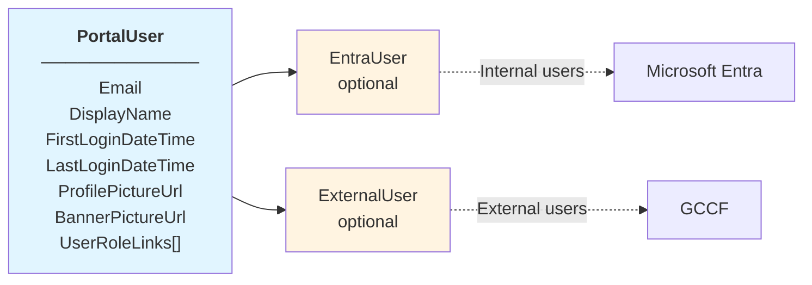
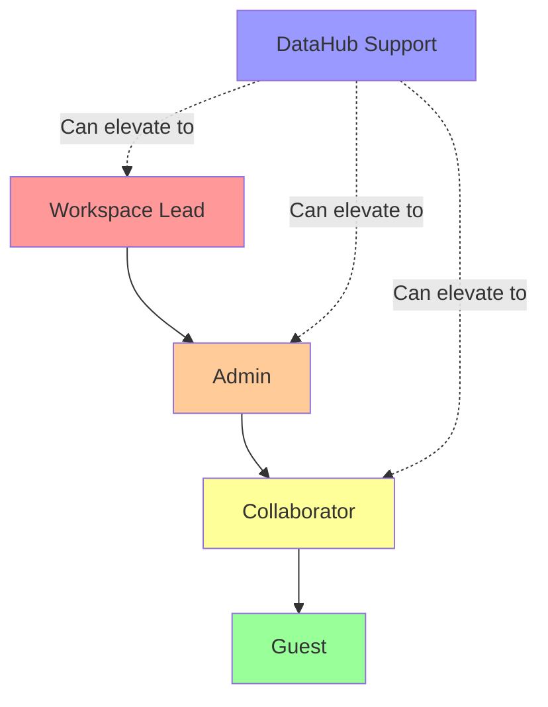
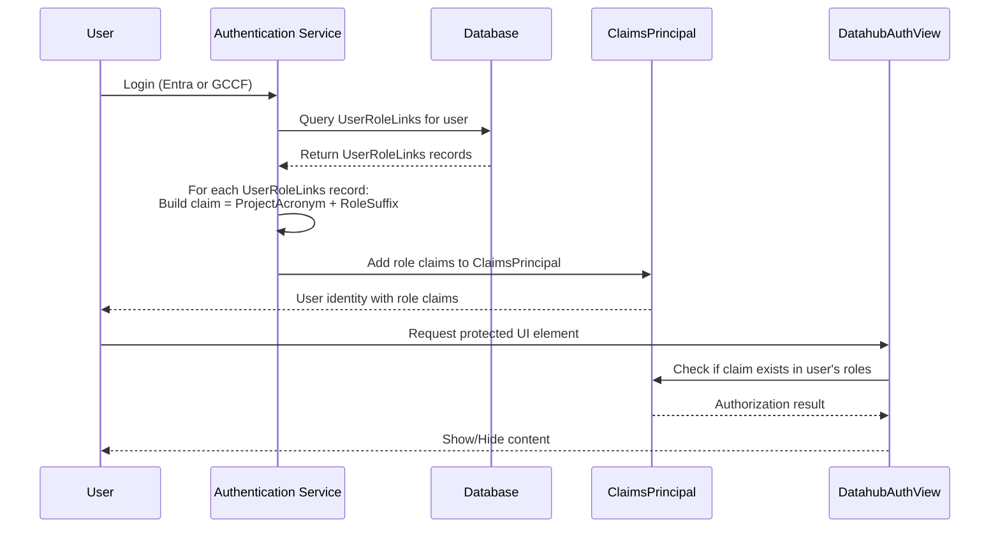

# Blazor Portal Role-Based Access Control (RBAC) for Entra and External Users

## Overview

DataHub implements a flexible Role-Based Access Control (RBAC) system that supports both Microsoft Entra ID (formerly Azure AD) users and external users outside the organization. The system uses the [`UserRoleLinks`](https://github.com/ssc-sp/datahub-portal/blob/develop/Portal/src/Datahub.Core/Model/Workspaces/UserRoleLinks.cs) class to establish the relationship between users, roles, and workspaces (projects).

## Architecture

### User Types

DataHub supports two distinct user types through the [`PortalUser`](https://github.com/ssc-sp/datahub-portal/blob/develop/Portal/src/Datahub.Core/Model/Users/PortalUser.cs) class:

#### 1. **Entra Users**

- Users authenticated via Microsoft Entra ID (Azure AD)
- Represented by the [`EntraUser`](https://github.com/ssc-sp/datahub-portal/blob/develop/Portal/src/Datahub.Core/Model/Users/EntraUser.cs) class
- Identified by a unique **Graph GUID** from Microsoft Graph
- Typically internal organizational users
- Properties:
  - `GraphGuid`: Unique identifier from Microsoft Graph
  - `PortalUserId`: Reference to the associated [`PortalUser`](https://github.com/ssc-sp/datahub-portal/blob/develop/Portal/src/Datahub.Core/Model/Users/PortalUser.cs)
  - `Timestamp`: Concurrency control field

#### 2. **External Users**

- Users outside the organization (vendors, partners, contractors)
- Represented by the [`ExternalUser`](https://github.com/ssc-sp/datahub-portal/blob/develop/Portal/src/Datahub.Core/Model/Users/ExternalUser.cs) class
- Identified by an **External Subject (OID)** from GCCF (Government Cloud Collaboration Framework)
- Additional metadata tracking:
  - `FirstName`, `LastName`: User identity information
  - `Email`: Contact information
  - `Organization`: User's home organization
  - `Affiliation`: User's role/group within their organization
  - `FirstLoginDateTime`: Initial login timestamp
  - `LastLoginDateTime`: Most recent login timestamp
  - `CreatedAt`, `UpdatedAt`: Record timestamps
  - `UserDeactivatedAt`: Timestamp when user was deactivated (if applicable)
  - `DeactivatedByUserId`: Reference to admin who deactivated the user
  - `DeactivationReason`: Reason for deactivation

### PortalUser Model

The `PortalUser` class serves as the central hub for user information:



**Validation Rule**: Every `PortalUser` must be associated with either an `EntraUser` OR an `ExternalUser` (mutually exclusive relationship).

## Role Links and Permissions

### Project_Role Class

The [`Project_Role`](https://github.com/ssc-sp/datahub-portal/blob/develop/Portal/src/Datahub.Core/Model/Workspaces/Project_Role.cs) class and associated table are fundamental to FSDH RBAC system, defining different permission levels and distinguishing between roles for internal (Entra) users and external users.

#### Role Properties

| Property         | Type   | Description                                                     |
| ---------------- | ------ | --------------------------------------------------------------- |
| `Id`             | int    | Unique identifier for the role                                  |
| `Name`           | string | Display name of the role                                        |
| `Description`    | string | Detailed description of the role's purpose and permissions      |
| `IsExternalRole` | bool   | Indicates if this role can be assigned to external users (GCCF) |

#### Internal User Roles (IsExternalRole = false)

These roles are assigned to Entra users within the organization:

| Role ID | Name           | Description                                                                  | Access Level        |
| ------- | -------------- | ---------------------------------------------------------------------------- | ------------------- |
| 2       | Workspace Lead | Head of the workspace with business responsibility                           | Full administrative |
| 3       | Admin          | Management authority with direct supervision over cloud resourcing and users | Administrative      |
| 4       | Collaborator   | Contributor to workspace objectives and deliverables                         | Read/Write          |
| 5       | Guest          | View-only access to workspace contents                                       | Read-only           |
| 6       | Disabled User  | No privileges within the workspace                                           | None                |

#### External User Roles (IsExternalRole = true)

These roles are specifically designed for external users (vendors, partners, contractors) authenticated through GCCF:

| Role ID | Name                        | Description                                                    | Access Scope                       |
| ------- | --------------------------- | -------------------------------------------------------------- | ---------------------------------- |
| 1       | Disabled                    | Revoke user's access to the workspace                          | None (removal marker for auditing) |
| 7       | Web Application Access      | Limited access to the web application interface only           | Web UI only                        |
| 8       | Storage                     | Limited access to storage upload and download                  | Storage resources only             |
| 9       | Web Application and Storage | Access to both web application interface and storage resources | Web UI + Storage                   |

#### Role-Based Access Differentiation

The `IsExternalRole` property enables the system to:

1. **Restrict Role Assignment**: Prevent external users from being assigned internal roles (e.g., Admin, Workspace Lead)
2. **UI Filtering**: Show only appropriate roles when inviting external vs. internal users
3. **Permission Scoping**: Apply different permission sets based on user type and role
4. **Audit Compliance**: Track which roles are assigned to external collaborators

### UserRoleLinks table

The [`UserRoleLinks`](https://github.com/ssc-sp/datahub-portal/blob/develop/Portal/src/Datahub.Core/Model/Workspaces/UserRoleLinks.cs) class establishes the mapping between users, roles, and workspaces. It is the core entity for RBAC.

#### Key Properties

| Property               | Type      | Description                                                                  |
| ---------------------- | --------- | ---------------------------------------------------------------------------- |
| `ProjectUser_ID`       | int       | Unique identifier for the workspace user record                              |
| `PortalUserId`         | int?      | Reference to the user                                                        |
| `RoleId`               | int?      | Reference to the assigned role                                               |
| `Project_ID`           | int       | Reference to the workspace (project)                                         |
| `ApprovedPortalUserId` | int?      | Reference to the admin who approved this assignment                          |
| `Approved_DT`          | DateTime? | Timestamp of approval                                                        |
| `IsDataSteward`        | bool      | Flag indicating if the user is a data steward for the workspace              |
| `ExternalUserNotes`    | string?   | Optional notes or comments about collaboration objectives with external user |

#### Navigation Properties

- [`PortalUser`](https://github.com/ssc-sp/datahub-portal/blob/develop/Portal/src/Datahub.Core/Model/Users/PortalUser.cs): The user assigned to the role
- `ApprovedPortalUser`: The administrator who approved this assignment
- `Role`: The [`Project_Role`](https://github.com/ssc-sp/datahub-portal/blob/develop/Portal/src/Datahub.Core/Model/Workspaces/Project_Role.cs) assigned (defines permissions)
- `Project`: The workspace ([`Datahub_Project`](https://github.com/ssc-sp/datahub-portal/blob/develop/Portal/src/Datahub.Core/Model/Workspaces/Datahub_Project.cs)) where the role is assigned

## User Type Considerations

### Entra Users

- **Authentication**: Handled by Microsoft Entra ID
- **Identification**: Graph GUID maintained in `EntraUser.GraphGuid`
- **Access Control**: Typically granted through organizational groups or direct assignment
- **Available Roles**: Can be assigned any internal role (Workspace Lead, Admin, Collaborator, Guest)
- **Audit Trail**: Leverages Azure AD audit logs plus DataHub records
- **Deactivation**: Managed through Azure AD and optionally reflected in external user deactivation

### External Users

- **Authentication**: Handled by GCCF 
- **Identification**: GCCF Object ID (OID) maintained in `ExternalUser.ExternalSubject`
- **Available Roles**: Limited to external roles only (Web Application Access, Storage, Web Application and Storage)
- **Role Restrictions**: Cannot be assigned internal administrative roles for security and compliance
- **Approval Workflow**: Often requires explicit admin approval via `UserRoleLinks.Approved_DT`
- **Collaboration Notes**: Optional context stored in `UserRoleLinks.ExternalUserNotes`
- **Audit Trail**: Full history maintained:
  - Creation timestamp: `ExternalUser.CreatedAt`
  - Last update: `ExternalUser.UpdatedAt`
  - First and last login: Tracked separately
  - Deactivation: Full audit trail with deactivating user and reason
- **Lifecycle Management**: Supports deactivation with reason tracking

### Role Assignment Matrix

The following matrix illustrates valid role assignments based on user type:

| User Type         | Internal Roles (1-6) | External Roles (7-9) |
| ----------------- | -------------------- | -------------------- |
| **Entra User**    | ✅ Allowed            | ✅ Not Allowed        |
| **External User** | ❌ Not Allowed        | ✅ Allowed            |

**Enforcement**: The `IsExternalRole` property on `Project_Role` combined with the user type (EntraUser vs ExternalUser) ensures that:

- External users cannot escalate privileges by requesting internal roles
- Internal users maintain full flexibility with organizational roles
- The system maintains clear separation of concerns between internal and external collaboration

## Fine grained UI Authorization with DatahubAuthView

The [`DatahubAuthView`](https://github.com/ssc-sp/datahub-portal/blob/develop/Portal/src/Datahub.Core/Components/AuthViews/DatahubAuthView.razor) component is the primary mechanism for enforcing RBAC in the DataHub web application UI. It wraps UI elements and conditionally renders content based on the user's role and permissions.

### Component Purpose

`DatahubAuthView` provides declarative authorization in Razor components, allowing developers to:

- Show/hide UI elements based on user roles
- Enforce workspace-level permissions
- Differentiate between internal (Entra) and external users
- Support elevated workspace access for DataHub administrators

### Authorization Levels

The component defines several `AuthLevels` that map to the `Project_Role` hierarchy:

| Auth Level              | Description                     | Required Roles                             | Typical Use Case                 |
| ----------------------- | ------------------------------- | ------------------------------------------ | -------------------------------- |
| `Authenticated`         | Any authenticated user          | Default role                               | Public workspace content         |
| `Personal`              | User's own content              | User's unique ID                           | Personal settings, profile       |
| `WorkspaceGuest`        | Read-only workspace access      | Guest, Collaborator, Admin, Workspace Lead | View workspace resources         |
| `WorkspaceCollaborator` | Read/write workspace access     | Collaborator, Admin, Workspace Lead        | Edit workspace content           |
| `WorkspaceAdmin`        | Administrative workspace access | Admin, Workspace Lead                      | Manage users, configure settings |
| `WorkspaceLead`         | Full workspace control          | Workspace Lead only                        | Business decisions, budget       |
| `DatahubSupport`        | System administrator            | DataHub Admin role                         | System-wide operations           |
| `DatahubApprover`       | Workspace approver              | DataHub Approver role                      | Approve workspace creation       |

### User Type Filtering

The component includes a `AllowedUsers` parameter to filter by user authentication type:

```csharp
public enum UserType
{
    AllUsers,           // Both Entra and External users
    TrustedEntraOnly,   // Only internal Entra users
    ExternalOnly,       // Only external GCCF users
}
```

### Role Hierarchy and Permission Cascading

The component implements role hierarchy where higher roles automatically inherit permissions from lower roles:



**Permission Cascade Example:**

- A user checking `WorkspaceGuest` level will pass if they have Guest, Collaborator, Admin, or Workspace Lead roles
- A user checking `WorkspaceAdmin` level requires Admin or Workspace Lead role
- A user checking `WorkspaceLead` level requires specifically the Workspace Lead role

### Elevated Workspace Access

The component supports the `ElevatedWorkspaceAccessEnabled` parameter which allows DataHub administrators to temporarily elevate their access to any workspace:

```razor
<DatahubAuthView AuthLevel="AuthLevels.WorkspaceAdmin" 
                 ProjectAcronym="@workspace"
                 ElevatedWorkspaceAccessEnabled="@enableElevatedAccess">
    <SensitiveWorkspaceConfiguration />
</DatahubAuthView>
```

When enabled, users with the `DatahubSupport` role can access workspace-level controls as if they were admins, without formally being assigned to the workspace.

### Integration with Project_Role

The component translates `Project_Role` IDs into claims-based roles using the `RoleConstants` class. This translation happens during the authentication process and creates role claims that are attached to the user's `ClaimsPrincipal`.

## Claims-Based Authorization Flow

The role-to-claim translation follows this process:



### RoleClaimTransformer Implementation

The [`RoleClaimTransformer`](https://github.com/ssc-sp/datahub-portal/blob/develop/Portal/src/Datahub.Application/RoleManagement/RoleClaimTransformer.cs) class is the core component responsible for mapping database role assignments to authentication claims. This class implements ASP.NET Core's `IClaimsTransformation` interface, which automatically runs during the authentication pipeline for every request.

**Key Responsibilities:**

1. **Extract User Identity** - Retrieves the user's object identifier (OID) from the authentication token
2. **Query User Roles** - Calls `IServiceAuthManager.GetUserAuthorizations(userId)` to fetch all `UserRoleLinks` records from the database
3. **Generate Role Claims** - Transforms each `UserRoleLinks` record into a role claim using the pattern: `{ProjectAcronym}{RoleConstants.GetRoleConstants(role)}`
4. **Add User Type Claims** - Calls `VerifyTrustedEntraLogin()` to determine if the user is an internal Entra user or external user, adding either `trusted-entra-login` or `external-login` claims
5. **Handle Special Roles** - Processes DataHub admin, approver, and CBR owner roles with special claim formats
6. **WebApp Access** - If a workspace has `WebAppEnabled = true`, adds an additional `-webapp` claim for reverse proxy authorization

This transformation happens transparently on every authenticated request, ensuring the user's `ClaimsPrincipal` always reflects their current role assignments from the database.

### Claim Format Construction

The claim format is constructed by combining three elements:

1. **Project Acronym** - From `Datahub_Project.Project_Acronym_CD` (e.g., "PROJ1")
2. **Role Suffix** - From `RoleConstants` class constants (e.g., "-collaborator")
3. **User Type Identifier** - Additional claims for distinguishing user types

**Construction Pattern:**
```
Claim = {ProjectAcronym} + {RoleSuffix}
```

**User Type Claims:**
- Entra users receive: `trusted-entra-login` (from `RoleConstants.TRUSTED_ENTRA_LOGIN`)
- External users receive: `external-login` (from `RoleConstants.EXTERNAL_LOGIN`)

### Internal User Roles

| Project_Role ID | Role Name      | Claim Suffix      | Full Claim Format                 | RoleConstants Reference |
| --------------- | -------------- | ----------------- | --------------------------------- | ----------------------- |
| 2               | Workspace Lead | `-workspace-lead` | `{ProjectAcronym}-workspace-lead` | `WORKSPACE_LEAD_SUFFIX` |
| 3               | Admin          | `-admin`          | `{ProjectAcronym}-admin`          | `ADMIN_SUFFIX`          |
| 4               | Collaborator   | `-collaborator`   | `{ProjectAcronym}-collaborator`   | `COLLABORATOR_SUFFIX`   |
| 5               | Guest          | `-guest`          | `{ProjectAcronym}-guest`          | `GUEST_SUFFIX`          |

### External User Roles

External roles are also translated into claims-based roles:

| Project_Role ID | Role Name                   | Claim Suffix      | Full Claim Format                 | RoleConstants Reference |
| --------------- | --------------------------- | ----------------- | --------------------------------- | ----------------------- |
| 7               | Web Application Access      | `-webapp`         | `{ProjectAcronym}-webapp`         | `WEBAPP_SUFFIX`         |
| 8               | Storage                     | `-storage`        | `{ProjectAcronym}-storage`        | (Custom)                |
| 9               | Web Application and Storage | `-webapp-storage` | `{ProjectAcronym}-webapp-storage` | (Custom)                |

The component then passes this comma-separated list to ASP.NET Core's `AuthorizeView` component, which checks if the user's `ClaimsPrincipal` contains **any** of the specified role claims.

## Related Classes

- [`Project_Role`](https://github.com/ssc-sp/datahub-portal/blob/develop/Portal/src/Datahub.Core/Model/Workspaces/Project_Role.cs): Defines the permissions associated with a role
- [`Datahub_Project`](https://github.com/ssc-sp/datahub-portal/blob/develop/Portal/src/Datahub.Core/Model/Workspaces/Datahub_Project.cs): Represents a workspace
- [`PortalUser`](https://github.com/ssc-sp/datahub-portal/blob/develop/Portal/src/Datahub.Core/Model/Users/PortalUser.cs): Core user entity
- [`EntraUser`](https://github.com/ssc-sp/datahub-portal/blob/develop/Portal/src/Datahub.Core/Model/Users/EntraUser.cs): Entra ID integration
- [`ExternalUser`](https://github.com/ssc-sp/datahub-portal/blob/develop/Portal/src/Datahub.Core/Model/Users/ExternalUser.cs): External user (GCCF) integration
- [`WorkspaceInvitation`](https://github.com/ssc-sp/datahub-portal/blob/develop/Portal/src/Datahub.Core/Model/Users/WorkspaceInvitation.cs): Invitation mechanism for external users
