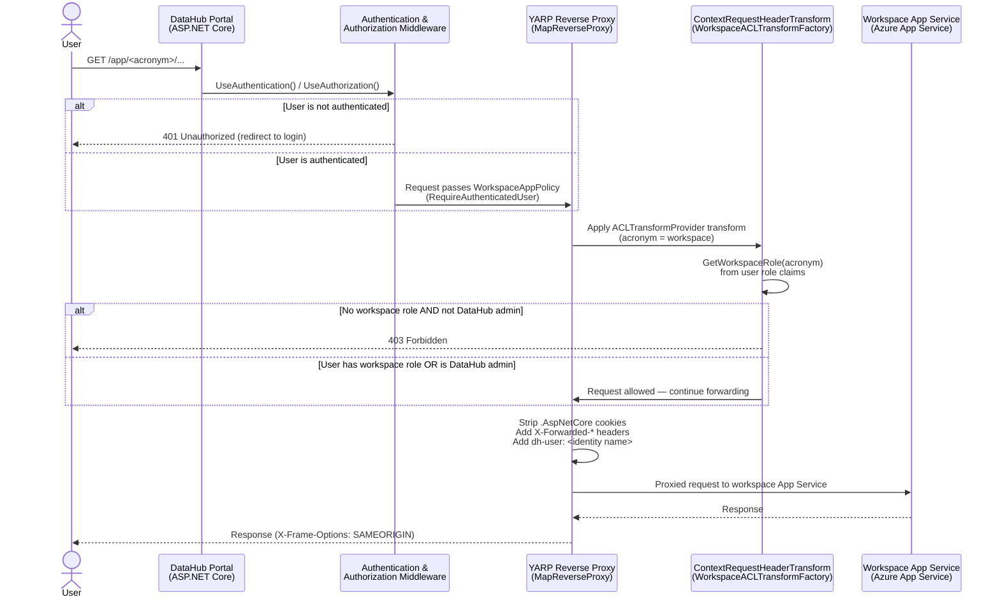

# Web Application Proxy (YARP)

DataHub uses [YARP](https://microsoft.github.io/reverse-proxy/) (Yet Another Reverse Proxy) to publish workspace web applications behind the portal domain.

Instead of exposing each workspace app directly, the portal maps workspace-specific proxy paths (for example `/app/<acronym>/...`) to each workspace App Service host.

## Request flow

## Quick architecture summary

- Reverse proxy support is enabled from `ReverseProxy:Enabled` configuration.
- `AddDatahubReverseProxyServices()` registers:
	- `IReverseProxyConfigService` (`ReverseProxyConfigService`)
	- `IProxyConfigProvider` (`ProxyConfigProvider`)
	- `IReverseProxyManagerService` (`ReverseProxyManagerService`)
- The request pipeline maps YARP endpoints via `endpoints.MapReverseProxy()` when proxying is enabled.

References:

- [ConfigureReverseProxyServices.cs](https://github.com/ssc-sp/datahub-portal/blob/develop/Portal/src/Datahub.Infrastructure/Services/ReverseProxy/ConfigureReverseProxyServices.cs)
- [Startup.cs](https://github.com/ssc-sp/datahub-portal/blob/develop/Portal/src/Datahub.Portal/Startup.cs)

## How workspace proxy configuration is built

`ReverseProxyConfigService` dynamically builds route and cluster configuration from workspace records in `DatahubProjectDBContext`.

### 1. Workspace filtering

`GetAllConfigurationFromProjects()` selects only projects where:

- `WebAppEnabled == true`
- `WebApp_URL != null`

### 2. Target URL normalization

`SanitizeWebAppURL()` ensures each destination URL:

- ends with `/`
- has an `http` scheme (defaults to `https://` if missing)

### 3. Route path per workspace

`BuildWebAppURL(acronym, routeInfo)` builds the public route prefix from the configured `ReverseProxy.WebAppPrefix` (default `app`):

- route prefix form: `/app/<acronym>`
- public app URL form: `/app/<acronym>/`

`BuildRoute()` then creates a YARP route with:

- `Path = "{prefix}/{**catch-all}"`
- `AuthorizationPolicy = WorkspaceAppPolicy`
- response/header transforms (`X-Frame-Options`, forwarded headers)
- custom ACL transform metadata (`ACLTransformProvider = <acronym>`)
- optional `PathRemovePrefix` when URL rewriting is enabled

### 4. Cluster per workspace

`BuildCluster()` creates one cluster per workspace and points it to the workspace web app destination URL.

### 5. Runtime refresh

`ProxyConfigProvider` loads the generated routes/clusters into in-memory proxy config. `ReverseProxyManagerService.ReloadConfiguration()` can refresh this at runtime (for example after workspace web app configuration changes).

Primary reference:

- [ReverseProxyConfigService.cs](https://github.com/ssc-sp/datahub-portal/blob/develop/Portal/src/Datahub.Infrastructure/Services/ReverseProxy/ReverseProxyConfigService.cs)

Supporting references:

- [ProxyConfigProvider.cs](https://github.com/ssc-sp/datahub-portal/blob/develop/Portal/src/Datahub.Infrastructure/Services/ReverseProxy/ProxyConfigProvider.cs)
- [ReverseProxyManagerService.cs](https://github.com/ssc-sp/datahub-portal/blob/develop/Portal/src/Datahub.Infrastructure/Services/ReverseProxy/ReverseProxyManagerService.cs)

## How credentials are validated

Credential and access validation happens in layers.

### Layer 1: authenticated user requirement

The proxy route policy `WorkspaceAppPolicy` requires an authenticated user (`policy.RequireAuthenticatedUser()`).

Effect:

- unauthenticated requests do not pass proxy authorization

### Layer 2: workspace ACL validation

Each route adds transform metadata with the workspace acronym (`ACLTransformProvider`).

`WorkspaceACLTransformFactory` injects `ContextRequestHeaderTransform`, which validates workspace access per request by checking the current user claims:

- `GetWorkspaceRole(acronym)` parses role claims for that workspace
- `IsDatahubAdmin()` allows DataHub admins across workspaces
- if neither condition is true, response is forced to `403 Forbidden`

Effect:

- authenticated users still need workspace-specific authorization (or DataHub admin role)

### Layer 3: identity forwarding to downstream app

For allowed requests, proxy transforms add `dh-user` with the authenticated portal identity name. Downstream apps can use that header for auditing or app-level identity logic.

Security note: this header is contextual identity forwarding, not a standalone authorization decision. Access control is enforced by the portal policy and ACL transform before forwarding.

References:

- [ConfigureReverseProxyServices.cs](https://github.com/ssc-sp/datahub-portal/blob/develop/Portal/src/Datahub.Infrastructure/Services/ReverseProxy/ConfigureReverseProxyServices.cs)
- [WorkspaceACLTransformFactory.cs](https://github.com/ssc-sp/datahub-portal/blob/develop/Portal/src/Datahub.Infrastructure/Services/ReverseProxy/WorkspaceACLTransformFactory.cs)
- [ContextRequestHeaderTransform.cs](https://github.com/ssc-sp/datahub-portal/blob/develop/Portal/src/Datahub.Infrastructure/Services/ReverseProxy/ContextRequestHeaderTransform.cs)
- [HttpRequestTools.cs](https://github.com/ssc-sp/datahub-portal/blob/develop/Portal/src/Datahub.Infrastructure/Services/ReverseProxy/HttpRequestTools.cs)

> This document was developed with the assistance of generative AI tools to support drafting, diagram generation and structuring activities. No Protected B or sensitive Government of Canada information was entered into these tools. All content has been reviewed, validated, and approved by the author to ensure accuracy, completeness, and compliance with Government of Canada security policies, standards, and applicable Treasury Board guidance.