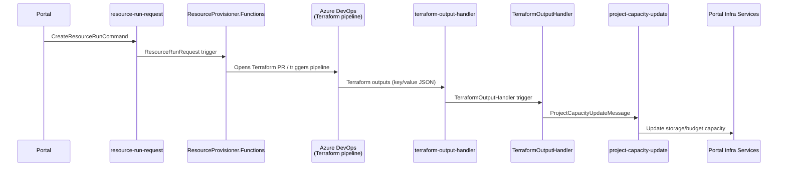
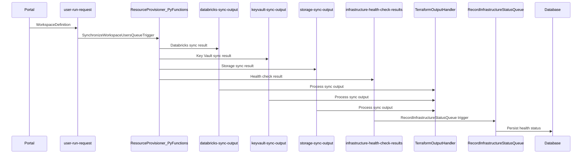
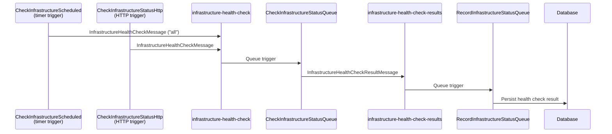
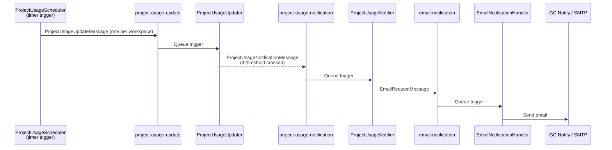
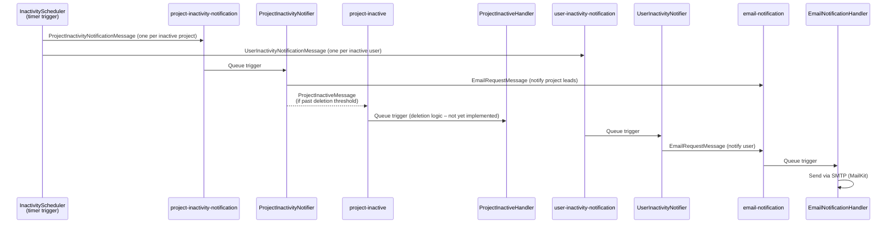
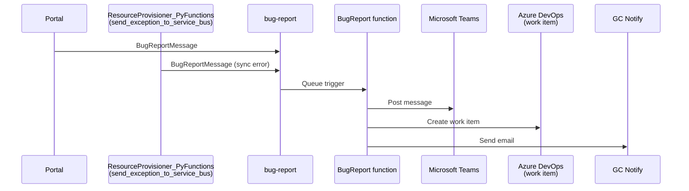
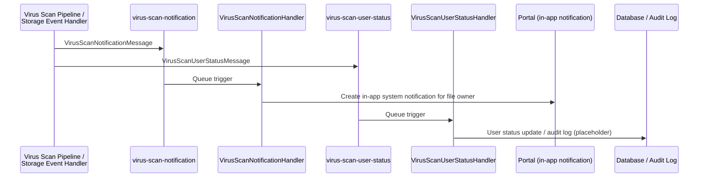
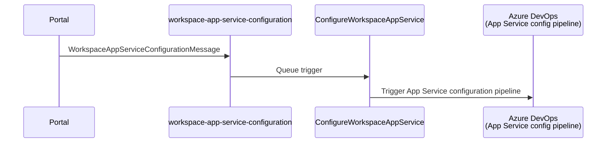
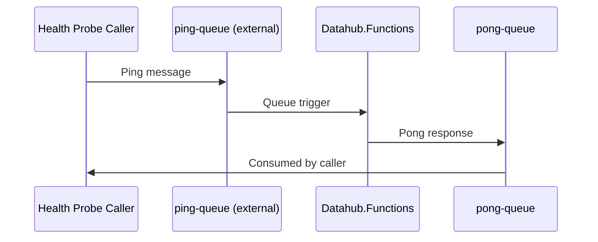
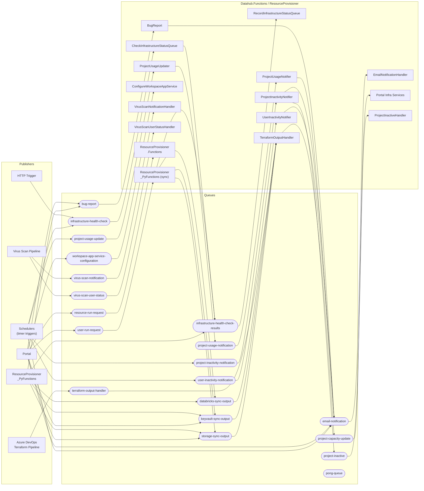

# Message Bus Overview

DataHub uses **Azure Service Bus queues** to decouple its components. The three main participants are:

| Participant | Role |
|---|---|
| **Portal** | ASP.NET Core web application; publishes requests and consumes capacity updates |
| **Datahub.Functions** | Azure Functions app; the primary consumer of most queues |
| **ResourceProvisioner\_PyFunctions** | Python Azure Functions app; provisions/syncs workspace infrastructure |

---

## Queue Reference

| Queue name | Message type | Publisher(s) | Consumer(s) |
|---|---|---|---|
| `pong-queue` | pong response | Datahub.Functions | Health-probe callers |
| `bug-report` | `BugReportMessage` | Portal, ResourceProvisioner\_PyFunctions | `BugReport` function |
| `email-notification` | `EmailRequestMessage` | Various functions & services | `EmailNotificationHandler` |
| `infrastructure-health-check` | `InfrastructureHealthCheckMessage` | `CheckInfrastructureScheduled` (timer), HTTP trigger | `CheckInfrastructureStatusQueue` |
| `infrastructure-health-check-results` | `InfrastructureHealthCheckResultMessage` | `CheckInfrastructureStatusQueue`, ResourceProvisioner\_PyFunctions | `RecordInfrastructureStatusQueue` |
| `project-capacity-update` | `ProjectCapacityUpdateMessage` | `TerraformOutputHandler` | Portal infrastructure services |
| `project-inactive` | `ProjectInactiveMessage` | `ProjectInactivityNotifier` | `ProjectInactiveHandler` |
| `project-inactivity-notification` | `ProjectInactivityNotificationMessage` | `InactivityScheduler` (timer) | `ProjectInactivityNotifier` |
| `project-usage-notification` | `ProjectUsageNotificationMessage` | `ProjectUsageUpdater` | `ProjectUsageNotifier` |
| `project-usage-update` | `ProjectUsageUpdateMessage` | `ProjectUsageScheduler` (timer) | `ProjectUsageUpdater` |
| `user-inactivity-notification` | `UserInactivityNotificationMessage` | `InactivityScheduler` (timer) | `UserInactivityNotifier` |
| `terraform-output-handler` | Terraform key/value JSON | Azure DevOps Terraform pipelines | `TerraformOutputHandler` |
| `workspace-app-service-configuration` | `WorkspaceAppServiceConfigurationMessage` | Portal / resource provisioning flow | `ConfigureWorkspaceAppService` |
| `virus-scan-notification` | `VirusScanNotificationMessage` | Virus scan pipeline | `VirusScanNotificationHandler` |
| `virus-scan-user-status` | `VirusScanUserStatusMessage` | Virus scan pipeline | `VirusScanUserStatusHandler` |
| `databricks-sync-output` | Databricks sync result | ResourceProvisioner\_PyFunctions | `TerraformOutputHandler` |
| `keyvault-sync-output` | Key Vault sync result | ResourceProvisioner\_PyFunctions, Portal | `TerraformOutputHandler` |
| `storage-sync-output` | Storage sync result | ResourceProvisioner\_PyFunctions, Portal | `TerraformOutputHandler` |
| `resource-run-request` | `CreateResourceRunCommand` | Portal (`ResourceMessagingService`) | `ResourceProvisioner.Functions.ResourceRunRequest` |
| `user-run-request` | `WorkspaceDefinition` | Portal (`ResourceMessagingService`) | ResourceProvisioner\_PyFunctions |

---

## Message Flows by Domain

### 1. Workspace Resource Provisioning

When a workspace resource is created or updated, the Portal sends a `CreateResourceRunCommand` to `resource-run-request`. The ResourceProvisioner clones the infrastructure repo, renders Terraform templates, and opens an ADO pull request. After the Terraform pipeline runs successfully, it posts outputs to `terraform-output-handler`, which then fans out capacity and sync update messages.

### 2. Workspace User Synchronisation

When workspace membership changes, the Portal enqueues a `WorkspaceDefinition` to `user-run-request`. The Python provisioner syncs users across Databricks, Key Vault, and Storage, then publishes results and a health-check status.

### 3. Infrastructure Health Checks

Health checks can be triggered on a schedule or via HTTP. The checker publishes results, which are persisted by a dedicated handler.

### 4. Project Usage & Budget Notifications

A timer scheduler enqueues one update message per workspace. The updater fetches cost and storage data; if a budget threshold is crossed it enqueues a notification message, which is sent as an email via GC Notify.

### 5. Inactivity Notifications

A shared timer (`InactivityScheduler`) fans out messages for both inactive projects and inactive users. Each notifier sends emails and may trigger further actions such as workspace deletion or account disabling.

### 6. Bug Reporting

Both the Portal (user-submitted reports) and the Python provisioner (workspace sync errors) publish to the `bug-report` queue. The handler posts to Microsoft Teams, creates an ADO work item, and sends a GC Notify email.

### 7. Virus Scanning

After a file is scanned, two messages are published: one for the user notification and one for a status/audit update.

### 8. Workspace App Service Configuration

When an App Service needs to be configured for a workspace, the Portal enqueues a message that triggers an ADO pipeline.

### 9. Ping / Pong Health Probe

A simple round-trip probe used to verify connectivity between services.

---

## Full Queue Topology

The diagram below shows every queue and its connections at a glance.

> This document was developed with the assistance of generative AI tools to support drafting, diagram generation and structuring activities. No Protected B or sensitive Government of Canada information was entered into these tools. All content has been reviewed, validated, and approved by the author to ensure accuracy, completeness, and compliance with Government of Canada security policies, standards, and applicable Treasury Board guidance.
