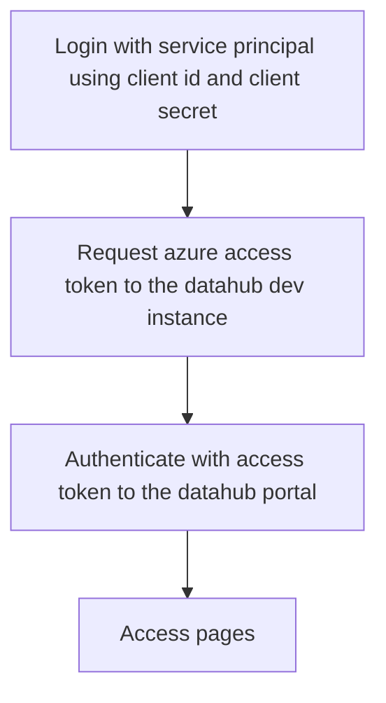

# End to End Testing

This document summarized the workflow for automated end to end testing.

## Objective

Run a series of automated tests from Azure Devops pipelines against the dev instance in Azure to validate key use 

## Authentication

The pipeline will be running as service principal. 

The current authentication of the application is leveraging [MS Identity](https://learn.microsoft.com/en-us/azure/active-directory/develop/v2-app-types#web-apps)

- [ ] Can the current MS Identity platform be used with Service Principal
- [ ] Are there parameters that can be added to the current MS Identity Platform that enable the service principal authentication
- 

[Microsoft OAuth flow](https://learn.microsoft.com/en-us/azure/active-directory/develop/v2-oauth2-implicit-grant-flow#suitable-scenarios-for-the-oauth2-implicit-grant)

## Authentication steps

1. Login with service principal using client id and client secret
1. Request azure access token to the datahub dev instance
1. Authenticate with access token to the datahub portal
1. Access pages

## Resources

[Daemon app that calls web APIs](https://learn.microsoft.com/en-us/azure/active-directory/develop/scenario-daemon-app-registration)

[Service Principal authentication](https://learn.microsoft.com/en-us/azure/developer/java/sdk/identity-service-principal-auth)

[Blazor custom AuthenticationStateProvider](https://learn.microsoft.com/en-us/aspnet/core/blazor/security/server/?view=aspnetcore-7.0&tabs=visual-studio)

[Call Web API from Daemon](https://learn.microsoft.com/en-us/azure/active-directory/develop/scenario-daemon-call-api?tabs=dotnet)

[Add roles to applications](https://learn.microsoft.com/en-us/azure/active-directory/develop/howto-add-app-roles-in-azure-ad-apps#declare-roles-for-an-application)

[Implement RBAC for applications](https://learn.microsoft.com/en-us/azure/active-directory/develop/howto-implement-rbac-for-apps)

[Protected Web API Registration](https://learn.microsoft.com/en-us/azure/active-directory/develop/scenario-protected-web-api-app-registration#if-your-web-api-is-called-by-a-service-or-daemon-app)