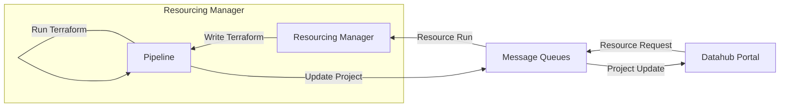

There are two queues that are used in the resourcing process.

1. [`resource-run-request`] is used to trigger the resourcing request process. This queue is used to trigger the resourcing process when a new workspace or resource module is requested. The message that is sent to this queue must contains the workspace id and the name of the template that is to be used to run.

1. [`terraform-output`] is used to update the status of the resourcing process. This queue is used to update the status of the resourcing process when a new workspace or resource module is requested. The message that is sent to this queue must contains the workspace id and the status of the resourcing process.

The possible status values for a project's resource run are:

- `Requested` when a user requests a new workspace in the portal
- `Pending Approval` when the resourcing manager has created a pull request
- `Complete` when the pull request has been approved and the pipeline has run
- `Error` when an error occurs

At a glance, here is a diagram of the resource run process:

