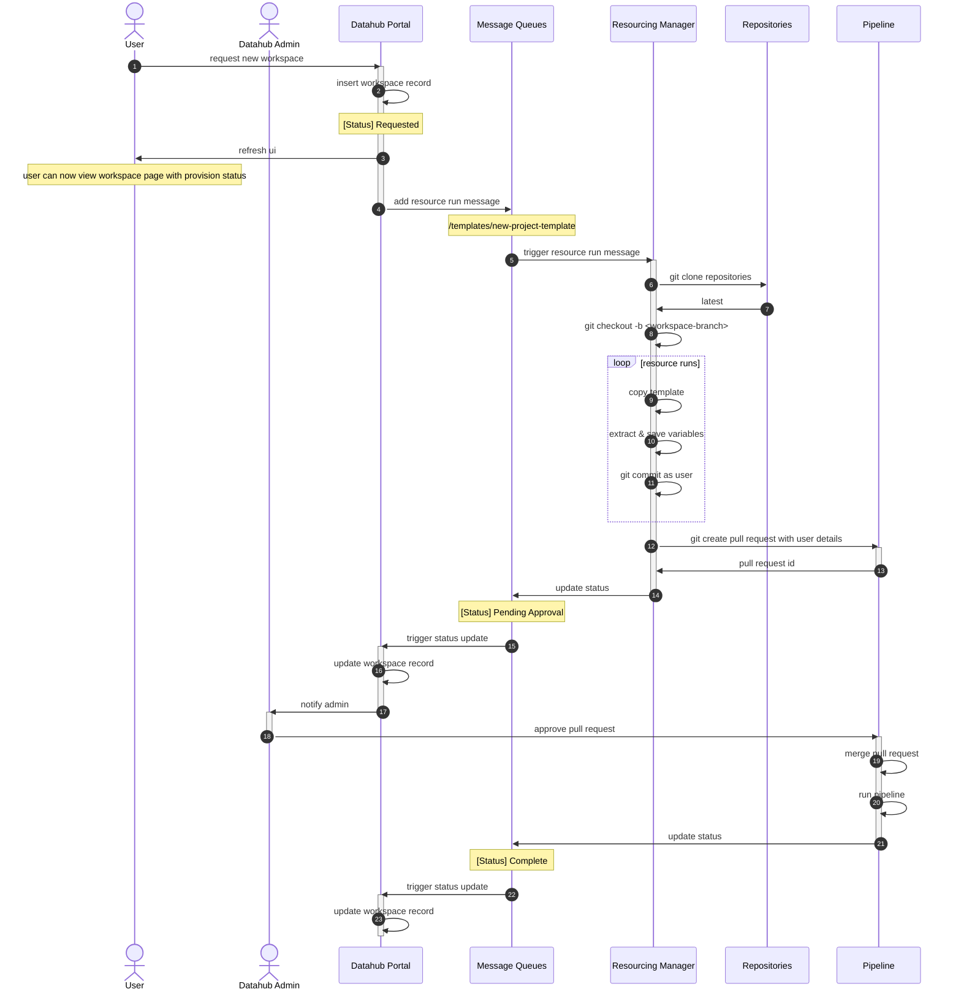

## Sequence Diagram

This sequence diagram shows the steps involved in creating a new workspace.



# Message Examples

## New Project Template

Here is an example message from the Datahub Portal put on the `resource-run-request` queue to trigger the creation of a new project.

```json
{
  "modules": [
    {
      "name": "templates/new-workspace-template",
      "version": "latest"
    }
  ],
  "workspace": {
    "name": "<workspace-name>",
    "acronym": "<workspace-acronym>",
    "organization": {
      "name": "<organization-name>",
      "code": "<organization-code>"
    },
    "users": []
  },
  "requestingUserEmail": "<user-email>"
}
```

## Pull Request Status Update Message

Here is an example message from the infrastructure puts on the queue to update the status of a workspace after a pull request has been created.

```json
{
  "project_cd": {
    "sensitive": false,
    "type": "string",
    "value": "<workspace-acronym>"
  },
  "new_project_template": {
    "sensitive": false,
    "type": "string",
    "value": "Pending Approval"
  }
}
```

## Pipeline Status Update Message

Here is an example message from the infrastructure puts on the queue to update the status of a workspace after a pipeline has run.

```json
{
  "project_cd": {
    "sensitive": false,
    "type": "string",
    "value": "<workspace-acronym>"
  },
  "new_project_template": {
    "sensitive": false,
    "type": "string",
    "value": "Complete"
  }
}
```
