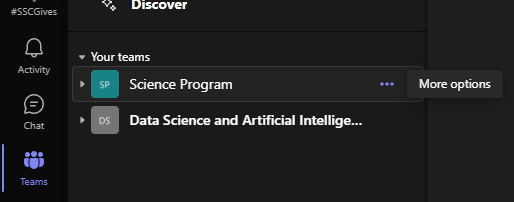
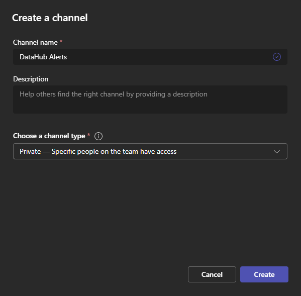
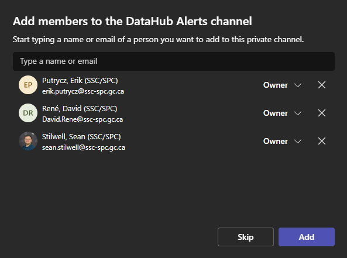
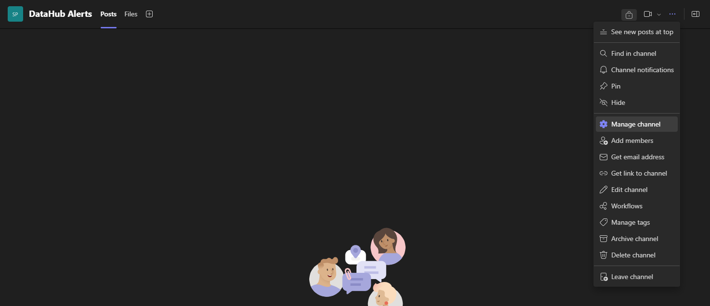
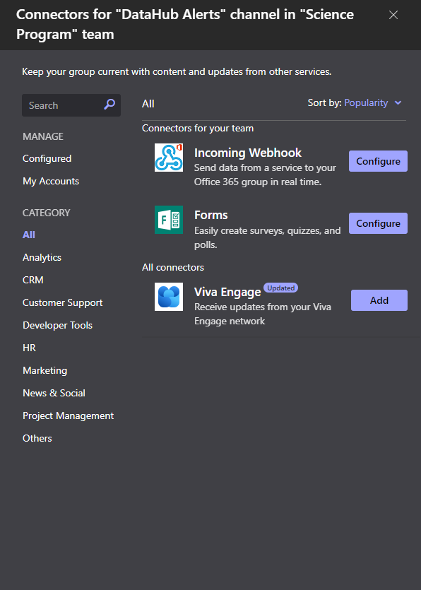
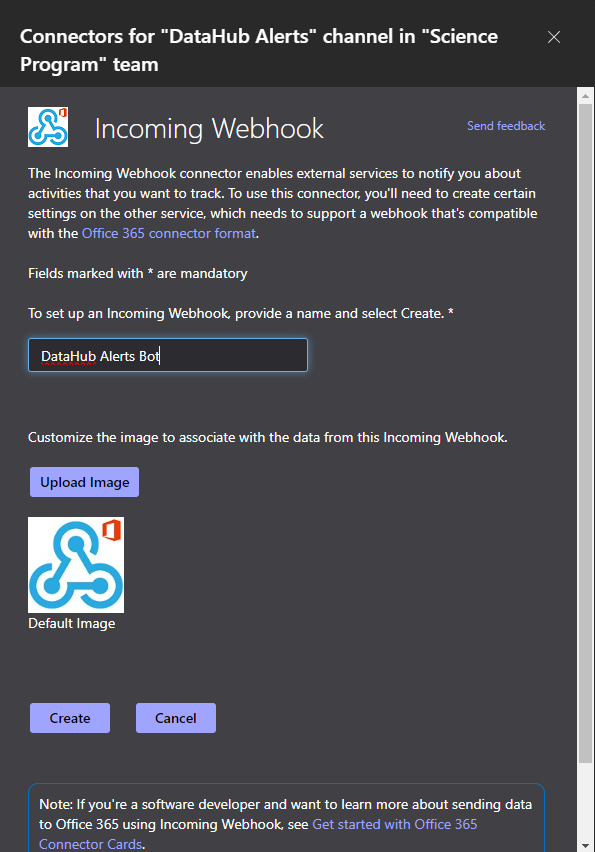
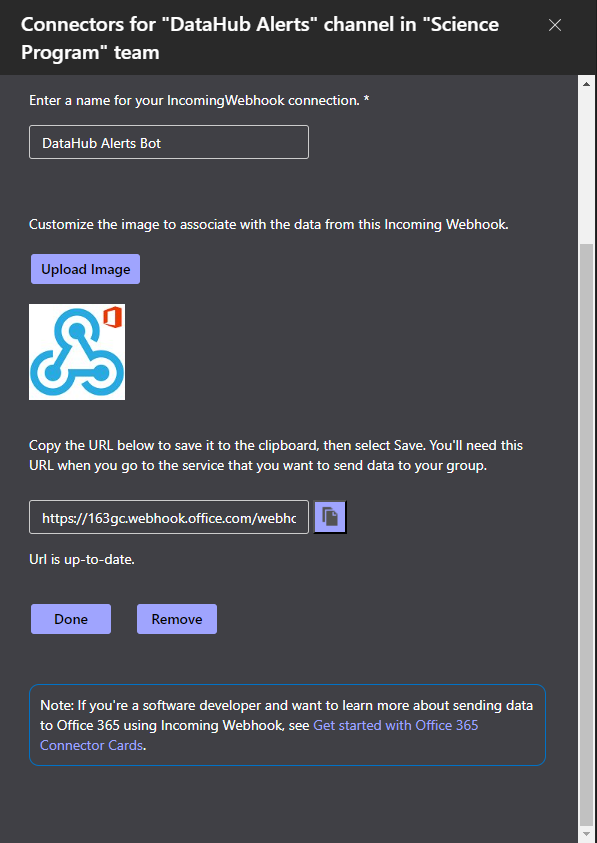
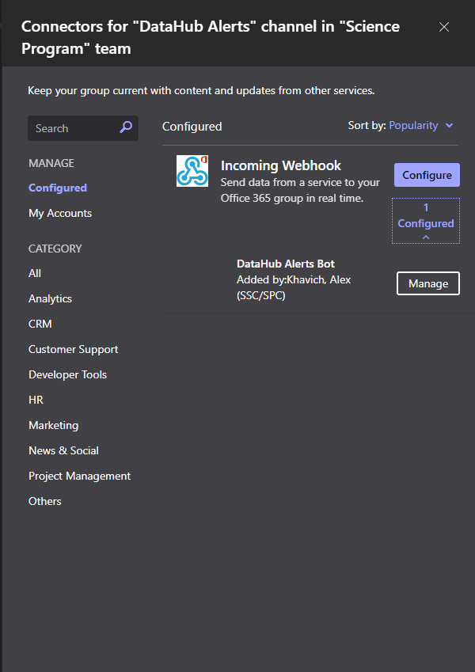

# Teams Channel Setup

In order to receive alerts through Teams, a Teams channel must be setup with an Incoming Webhook connector. Then, the service (e.g. health alert function) needs to be configured with the webhook URL.

## Creating the Channel

1. Select the **Teams** tab from the menu on the left.
	
1. Click the **More options** (three dots) menu next to the desired team.
	
1. From the menu, select **Add channel**.
	
1. Enter the information for the new channel, and click **Create** when finished.
	
1. (optionally) Add more members to the channel. Members with the **Owner** role will have more privileges in the channel, including adding other members and managing connectors.
	

## Setting up the Webhook Connector
1. From either the **More options** (three dots) menu next to the channel name in the left menu, or **More channel options** at the top right of the window with the channel, select **Manage channel** to bring up the channel management screen.
	 
1. In the **Settings** tab, expand the **Connectors** category and click **Edit**
	
1. Find "**Incoming Webhook**" in the list of available connectors, and click **Configure**. If your list contains too many items to easily find it, you can filter it by entering "webhook" in the search box on the left.
	
1. Enter a name and optionally upload a picture for the webhook connector, and click **Create** to create the connector. This will be the "author" of the alerts that will be posted to the channel.
	
1. After a few moments, the connector will be created and a textbox with its URL will be shown near the bottom of the dialog. The URL can be copied from there. For the health check alerts, it will need to be entered in the function app configuration with the key **BugReportTeamsWebhookUrl**.
	

## Configuring an Existing Webhook Connector
1. Open the Connectors list by going to the channel management screen as above, and clicking Edit under the Connectors category in the Settings tab. On this screen, select "**Configured**" under the Manage heading on the left.
	
1. Expand the *(n) Configured* (1 in this case) list under the Incoming Webhook connector to see a list of existing webhook connectors in this channel. Click **Manage** next to the one you want to configure.
	
1. This will bring up the settings for that connector. From here you can update the name and picture, find the URL for incoming messages, or remove the connector.
	
