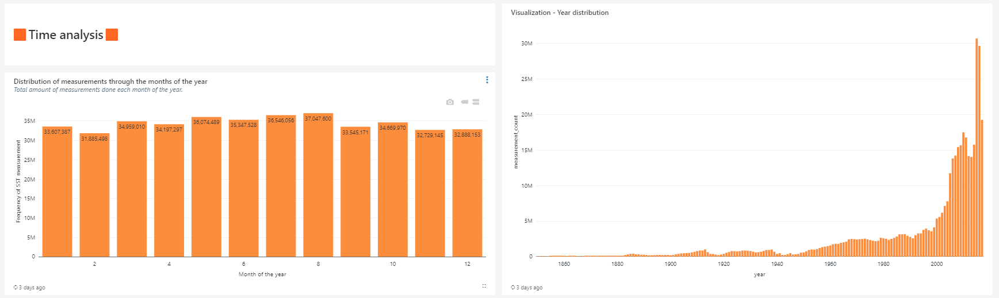
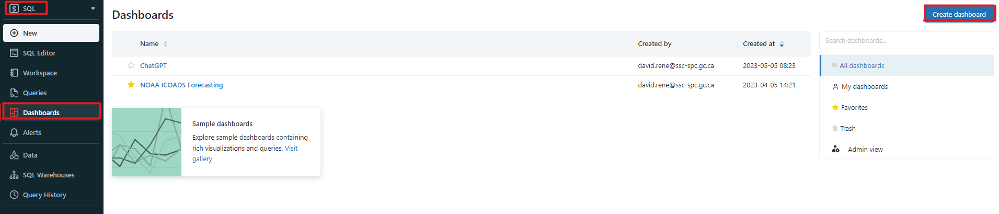

# How to Dashboard in Databricks

<video width="600" height="350" controls>
    <source src="/api/media/dashboard.mp4" type="video/mp4">
    Your browser does not support the video tag.
</video>

## Prerequisites

- Basic knowledge of Structured Query Language (SQL)
- Your data being stored as a table(s) within Databricks

## Why create dashboards?

- They are a great way to visualize your data in a way that is easy to understand
- They allow you to easily share your data with others (within your workspace)
- They can be exported as PDF files to be easily shared to anyone
- They are dynamic and can be used to monitor your data in real-time
- They can be used to create an interactive user interface for your data

## Sample Dashboard

Here is a sample dashboard created using Databricks' built-in dashboarding tool for the analysis of the [National Oceanic and Atmospheric Administration's International Comprehensive Ocean-Atmosphere DataSet](https://icoads.noaa.gov/).




This sample dashboard can also be seen as an [exported PDF](https://github.com/ssc-sp/datahub-docs/blob/main/UserGuide/Databricks/SampleDashboard.pdf).

As part of this tutorial, we will be going through the process of creating one block of this dashboard. All blocks follow a similar process.

## 1. Preparing your data

Before you can create a dashboard, you need to have your data stored as a table within Databricks. If you have not done so already, you can follow the steps in the [Databricks documentation](https://docs.databricks.com/data/tables.html#create-a-table) to create a table from your data.

Your data should visible in the "Data" tab of your workspace:


## 2. Creating a dashboard

After setting your environment to "SQL" in the top left corner of your workspace, click on the "Dashboard" tab. Then click on the "Create dashboard" button to create a new dashboard:



Select a proper name for your dashboard and click "Save". Dashboards in Databricks are made up of "blocks". Each block is either a visualization, a text box or a filter. You can add a new block by clicking on the "Add" button on the top right corner of your dashboard.

- Visualizations are used to display your data in a visual format. You can choose from a variety of different visualizations such as bar charts, line charts, pie charts, etc.
- Text boxes are used to display text. You can use them to add titles, subtitles, descriptions, etc. These text blocks can be formatted using Markdown and support embedding pictures.
- Filters are used to filter your data. You can use them to filter your data based on a specific column or a specific value.

At the core of each block is a SQL query. This query is used to retrieve the data that will be displayed in the block. In essence, each block is a dynamic representation of your data that is updated in real-time as your data changes.

## 3. Creating an SQL query

On the navigation bar, click on the "Queries" tab and then click on the "Create" button to create a new query:


This will open the SQL editor. Here you can write your SQL query. For this tutorial, we will be creating a bar chart that displays the number of observations for each year. The query for this is as follows:

```sql
SELECT YEAR(date) AS year, COUNT(sea_surface_temp) AS measurement_count
FROM noaa_icoads
WHERE YEAR(date) > YEAR(DATE("1849-01-01"))
GROUP BY year
ORDER BY year
```

Notice that we are using the `noaa_icoads` table that we created earlier. We are also using the `YEAR()` function to extract the year from the `date` column. This is because the `date` column contains the date in the format `YYYY-MM-DD`. We are also using the `DATE()` function to create a date object from the string `"1849-01-01"`. This is because the `YEAR()` function only works with date objects. We are using the `GROUP BY` clause to group the data by year and the `ORDER BY` clause to order the data by year. We are using data from 1849 onwards because the data before that is not necessarily reliable. This query will return the following table:

| year | measurement_count |
| ---- | ----------------- |
| 1850 | 27736             |
| 1851 | 22490             |
| 1852 | 25061             |
| 1853 | 39143             |
| ...  | ...               |

Now that we have our query, let us save it by pressing the "Save" button. This will open a dialog box where you can enter a name for your query. Enter a proper name and click "Save".

## 4. Creating a visualization

Navigate back to the dashboard you created earlier, click the 3 dots at the top right and click "Edit". This will open the dashboard editor. Click on the "Add" button and select "Visualization". This will prompt you to select a saved query: select the query you created earlier and click "Select". This will open the visualization editor. Here you can select the type of visualization you want to create. For this tutorial, we will be creating a bar chart. Select "Bar chart" and click "Select". This will open the bar chart editor. Here you can select the columns you want to use for the x-axis and the y-axis. For this tutorial, we will be using the `year` column for the x-axis and the `measurement_count` column for the y-axis. Select the appropriate columns and click "Apply". This will create a bar chart visualization. You can click on the "Preview" button to see a preview of your visualization. You can also click on the "Edit" button to edit your visualization. Once you are satisfied with your visualization, click "Save". This will save your visualization and add it to your dashboard.

There are tons of different visualization options available in Databricks. You should explore them to find the ones most suited for you. The visualization editor also offers tons of customization options such as changing the color of the bars, changing the title, etc. You can also add visualizations from different tables to a single dashboard, allowing you to compare data from different tables.

## 5. Finalizing your dashboard

You may add as many blocks as you want and you can arrange them and resize them in any way you want. You can also add text boxes and filters to your dashboard, as well as color themes. Once you are satisfied with your dashboard, click on the "Done editing" button.

By clicking on the 3 dots at the top right, you may also export your dashboard to PDF, share it with others, or delete it.

Here is another fun example of a dashboard created using Databricks' built-in dashboarding tool:


This is a word cloud visualization of the most common words used in tweets containing the word "ChatGPT" on twitter on a given day. Data taken from [Kaggle datasets](https://www.kaggle.com/datasets/edomingo/chatgpt-1000-daily-tweets).

## [More information on Databricks Dashboards](https://learn.microsoft.com/en-us/azure/databricks/lakehouse/data-objects)
