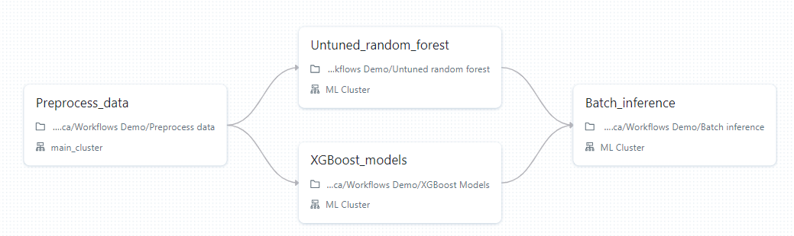
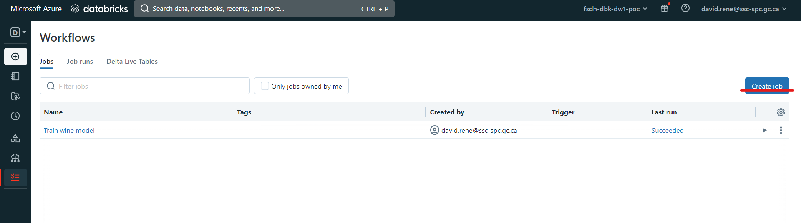
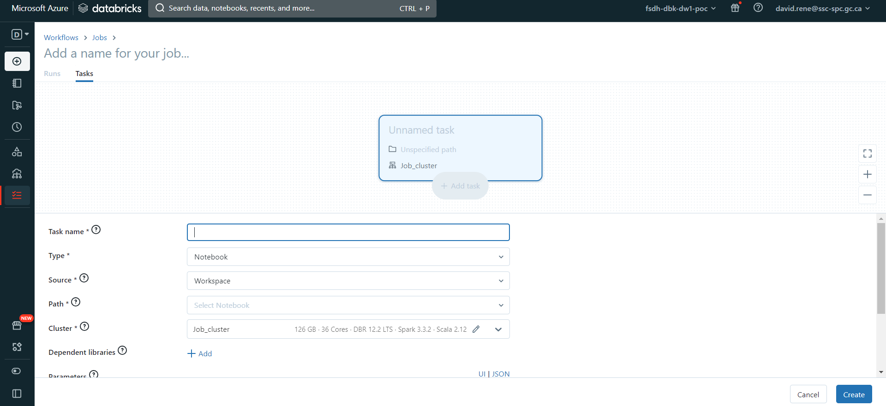
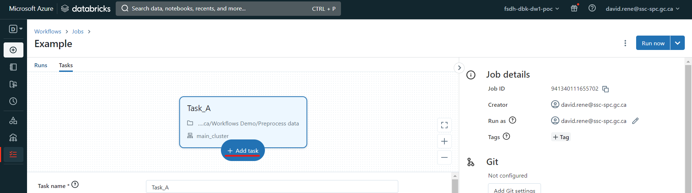
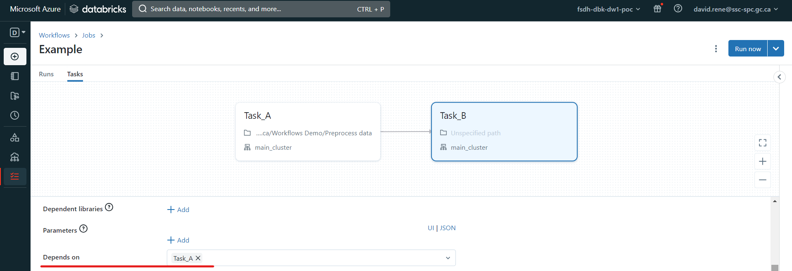

# Databricks Workflows

Workflows in Databricks are a way to orchestrate notebooks in your environment. They provide you with a high-level interface that allows you to design end-to-end workloads, such as machine learning.

In Databricks Workflows, you create _jobs_. _Jobs_ are a list of _tasks_ that you customize the order and linearity of. Here is an example _job_ that contains 4 _tasks_, two of which are run in parallel:

_Tasks_ are the building blocks of jobs, they can be of any of the following type:

- **Notebook**: A notebook task runs a notebook in your workspace. You can pass parameters to the notebook task, and the notebook can return a result that can be used by other tasks.
- **Python script**: this task can run a Python script in your workspace using any parameters.
- **Python wheel**: this task will allow you to install Python packages on a selected cluster, in case normal installation methods are not optimal.
- **Spark SQL**: A Spark SQL task runs a SQL query on a Spark cluster. You can pass parameters to the SQL query, and the query can return a result that can be used by other tasks.
- **Delta live tables**: This task will allow you to run a delta live tables pipeline. Delta live tables are special data flow pipeline, which you can read more about [here](https://www.databricks.com/product/delta-live-tables).
- **DBT**: DBT (Data Build Tool) is an open-source command-line tool that allows you to build, test, and deploy data pipelines. It is often used in conjunction with Databricks to build data pipelines that transform and load data into a data warehouse. DBT allows you to define data transformations in SQL, and it provides a way to test and document your data pipelines. You can use DBT to build data pipelines that run on Databricks, and you can also use DBT to deploy your data pipelines to other environments.
- **JAR files**: This task allows you to run a Java archive file on a Spark cluster.
- **Spark Submit**: You can submit any Java, Scala, Python or R files as a `spark-submit` task, which will run those files on a Spark cluster.

## **Creating a job**

To create a job, make sure you are in "Data Science & Engineering" mode, then click on the `Workflows` icon on the navigation tab on the left, and then click on `Create Job`:

This will bring you to the Job creation page, where you will be setting up your first task:

You can define the name, type and cluster of the task. This is a great feature as this allows you to optimize your cluster usage. Once you have created your first task, you will be given the opportunity to create new tasks:

Once you have created a second task, you will be given the opportunity to define which other tasks it depends on:

Tasks run only when all tasks it depends on are done running. Several tasks can depend on a single task, which creates parallel workflows, and a single task can depend on several tasks.

Once you are done designing your job, you can test out your job, by clicking "Run now" and clicking on "Runs" in the top left:

This will trigger your job, and from the "runs" screen, you will be able to monitor each run of your job as well as each task of your runs.

## **Monitoring a job**

From the "Runs" menu, you can easily monitor each run and each task of your jobs:

The bar diagrams correspond to each run and their size corresponds to the time taken. Under each bar is a list of squares which corresponds to the individual tasks if your jobs. For each element, the colors indicate the state: green for completed, red for failure and grey for canceled.

In the table at the bottom, you can see and inspect every previous and ongoing run.

## **Job configuration and scheduling**

While a job is open, from either of the "runs" tab or the "tasks" tab, you can open the right side panel, which makes many configurations available to you:

From this panel, you can:

- **See Job details**, such as the Job ID, the job creator, which user is it run as and job tags.
- **Configure Git**: this allows you to create tasks using scripts and notebooks from remote repositories.
- **Schedule jobs**: you can select manual triggers (job will only run when triggered from the UI), scheduled trigger (job will run when triggered from the UI and on the schedule provided) or continuous trigger (job will be triggered whenever the previous job ran into an error or succeeded).
- **View Compute details**: you can view all clusters involved in the job
  , see their details, swap which cluster is being used, etc.
- **Notifications**: set notifications (through emails or other providers) for when a job encounters an issue, succeeds, or starts.
- **Permissions**: select who can view, run, manage your jobs.
- **Maximum concurrent runs**: this allows you to define the maximum amount of runs that can be executed at the same time. By default, it is set to 1.

Using these configurations, you can customize your jobs however you like and need them.

## **Single notebook scheduling**

As part of Databricks Workflows, you can also easily schedule a notebook. In order to do so, navigate to the notebook of your choice, and click "Schedule":

This will pop up a menu that will allow you to schedule this notebook to be run as a single-task job:

From there, you can easily configure a schedule as well as alerts for your notebook runs. Once your job is created, you can access it from the Workflows menu as any other job:

## **[Learn more about Databricks Workflows](https://docs.databricks.com/workflows/index.html)**
