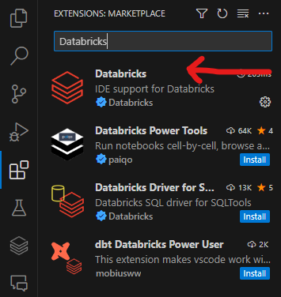
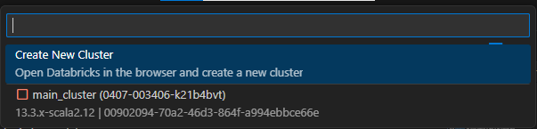
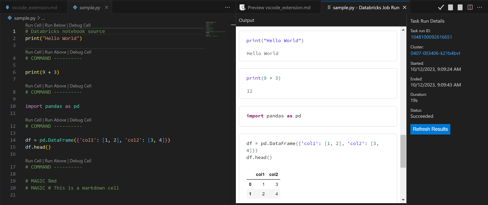

# Databricks VS Code Extension

Using the Databricks VS Code extension, you can connect to a Databricks workspace from within VS Code. This allows you to:

* Write your code locally in VS Code, and then run it remotely on a Databricks cluster.
* Run SQL queries on a Databricks cluster and see the results directly in VS Code.
* Manage your Databricks clusters.

## Why use it?

Visual Studio Code is an extremely popular code editor. As an open source system, it has a large community of contributors and users. It is also highly extensible, allowing users to install a wide variety of extensions to support for different programming languages, debugging, and more.

## Prerequisites

* [Visual Studio Code](https://code.visualstudio.com/).
* A Databricks workspace on the Federal Science DataHub.

## Install the extension

1. Open Visual Studio Code.
1. Click the **Extensions** icon in the left navigation bar.
1. Search for **Databricks**.
1. Click **Install**. The correct extension is shown in the screenshot below.


## Connect to a Databricks workspace

1. Click the **Databricks** icon in the left navigation bar.
1. Click **Configure**.
1. Enter the URL of your Databricks workspace in the space shown below, up until `.net/`. For example, if your workspace URL is `https://sample.azuredatabricks.net/?o=111111111111#`, enter `https://sample.azuredatabricks.net/`.

1. On the next screen, select **Edit Databricks profiles**
1. On the screen that opens, complete the following and save the file: 
```
[DEFAULT]
host = https://sample.azuredatabricks.net/
token = your_token
jobs-api-version = 2.1
```
* **[DEFAULT]** is the name of the profile. You can change it to anything you want.
* **host** is the same that you entered in the previous step.
* **token** is your personal access token. To generate a token, see [Databricks personal access token authentication](https://docs.databricks.com/en/dev-tools/auth.html#databricks-personal-access-token-authentication)
* **jobs-api-version** should remain unchanged.

After completing these steps, click **Configure** again and access your saved **[DEFAULT]** profile. Databricks will connect automatically.

## Run Local Code

> **NOTE:** You must open a folder to use this part of the extension. To do so, click File > Open Folder and select the folder where you keep your code.

### Attach a Cluster

Before running code, you must attach a cluster.

1. Open the **Databricks** icon in the left navigation bar.
1. If no cluster is attached, hover over the **Cluster** bar and click **Configure Cluster**, as shown in the screenshot below.

1. From the dropdown, select the cluster you want to attach, as shown in the screenshot below.

1. You can now start the cluster from the extension.

> **NOTE:** You cannot create a cluster in the extension. You must create it in Databricks itself.

### Writing Your Code

Any `.py` file works, but you can format them to leverage the notebook functionality of Databricks.

To use a notebook, put `# Databricks notebook source` at the top of your `.py` file. This tells Databricks to treat the file as a notebook. You can then use the following commands to control the notebook:

* `# COMMAND ----------` creates a new cell.
* `# MAGIC %md` creates a markdown cell.
* `# MAGIC %sql` creates a SQL cell.
* `# MAGIC %scala` creates a Scala cell.
* `# MAGIC %r` creates an R cell.
* `# MAGIC %python` creates a Python cell.

> **NOTE:** You should ensure that any libraries you import are installed on the cluster. You can do this by including the `pip install` command in your code or by installing the libraries on the cluster itself.

### Run Local Code on a Cluster

1. Open the **Explorer** menu in the left navigation bar.
1. Navigate to the file you want to run. You can use any time of file that you can run in Databricks (R, Python, etc).
1. Ensure the cluster is started, then right-click the file and select **Run File as Workflow in Databricks**, as shown in the screenshot below.

1. The file will run on the cluster. You can see the results in the **Output** window.


> **NOTE:** Your code will get copied to Databricks under the `.ide` folder in your workspace.

