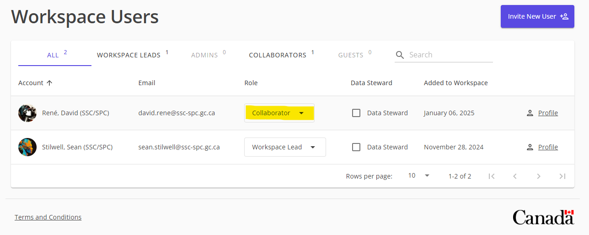
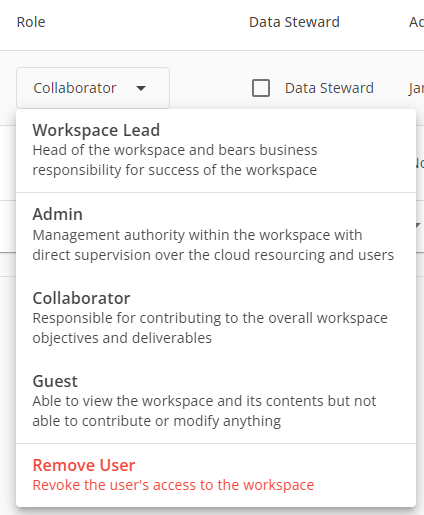

# Change a user role

> *Note:* Only users with the `Admin` or `Lead` roles can change another user's role.

1. Navigate to your workspace
1. Click on the `View Members` link in the top right corner of the page
    
1. Click on the dropdown role of the user whose role you want to change
    
1. Select the new role from the dropdown
    
1. Click `Save Changes` at the top of the page
    