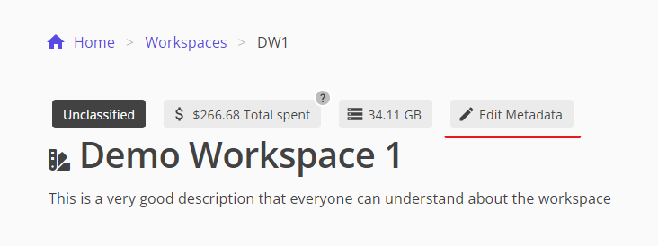
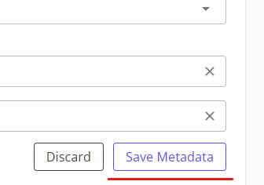

# Complete metadata

> **Note:** Only users with the `Admin` or `Lead` roles can complete metadata.

1. Navigate to your workspace
1. Click on the `Edit Metadata` button above the workspace title
    
1. Complete all the fields, including both English and French fields.
    > *Note:* The auto-translation tool is only a suggested translation. It is the responsibility of the user to ensure that the translation is correct before submitting the metadata
1. Click `Save Metadata` at the bottom of the page
    