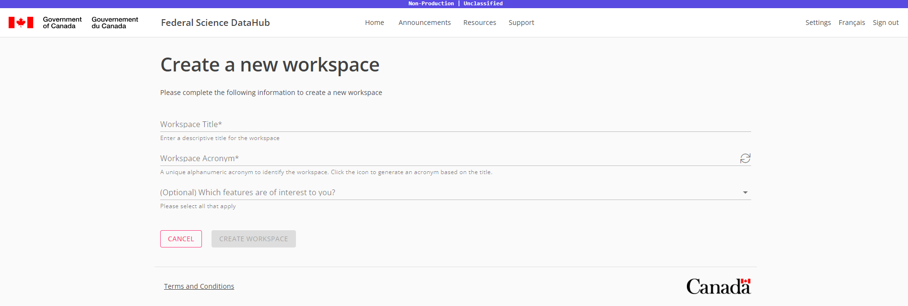

# Create a workspace

This guide will cover how to create a workspace.

> *Note:* You may only lead up to three workspaces. If you are already leading three workspaces, you will not be able to create a new workspace. You can, however, request to be added as a lead to an existing workspace. 

1. Navigate to the `Home` or `Profile` page.
1. Click on the `Create Workspace` button.
    
1. Enter a name for your workspace.
1. Use the generated acronym or enter your own.
    > *Note:* The acronym must be unique across all workspaces.
1. (Optional) Select which features are of interest to you.
1. Click `Create Workspace`.
    

The page will redirect you to your new workspace. You will be the `Lead` of this workspace. You can now add members to your workspace.