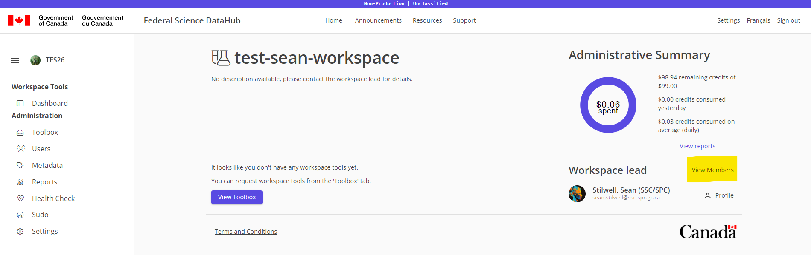

# Invite a user

This guide will cover how to invite a user to your workspace.

> *Note:* Only users with the `Admin` or `Lead` roles can invite another collaborator.

1. Navigate to your workspace
1. Click on the `View Members` link in the top right corner of the page
    
1. Click on the `Invite New User` button
    
1. Enter the Government of Canada email address of the user you want to invite and click on the dropdown.
    

    > *Note:* If the user already has an FSDH account they will show up in the dropdown and you can select them.

1. Click on the `Add New Users` button once you have entered all the users you want to invite.
    

    > *Note:* If you want to invite more users, you can always click on the `Invite New User` button again and repeat the process.

1. Click on the dropdown role of the user you will be inviting into your workspace.
    

1. Select the new role from the dropdown
    

1. Click `Save Changes` at the top of the page
    